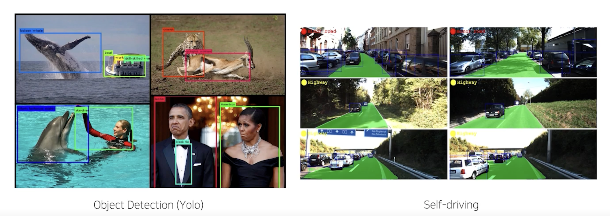
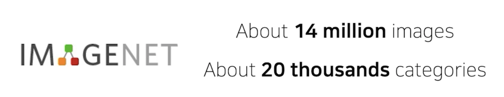
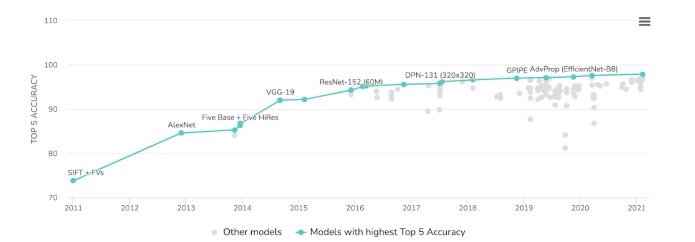
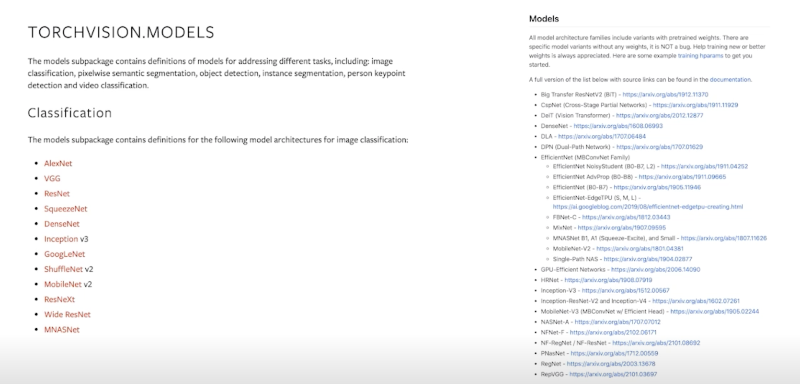
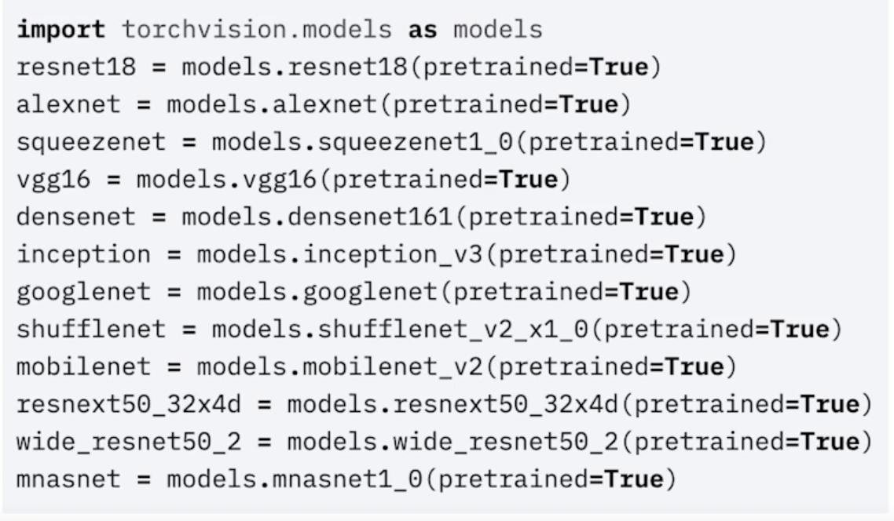
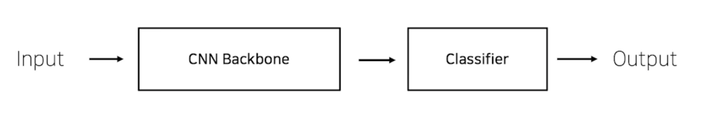
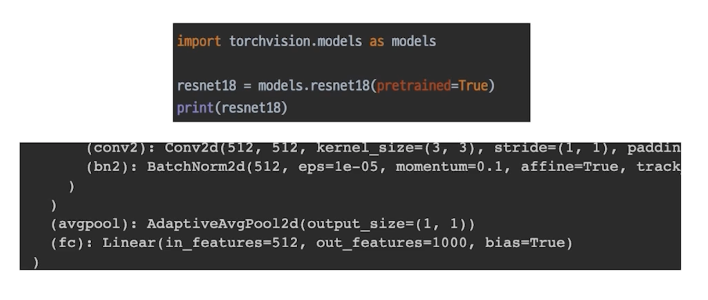
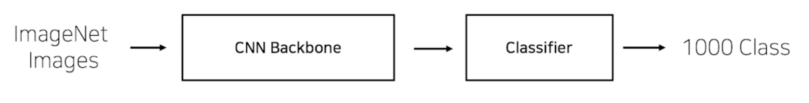
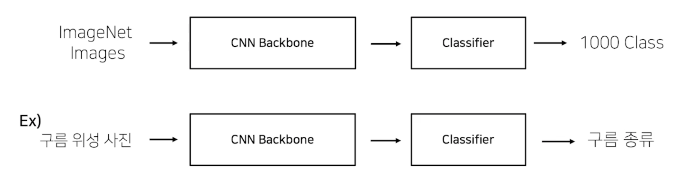

# Model 2 - Pretrained Model

## Computer Vision 의 발전

- Computer Vision 의 발전으로 현재 상당히 많은 일을 자동화 할 수 있음

    

- 발전을 가능케 한 원동력이 하나가 있다고 생각하는데 바로 ImageNet 이라는 데이터셋이 만들어진 것

### ImageNet

- 획기적인 알고리즘 개발과, 검증을 위해 높은 품질의 데이터 셋은 필수적임

    

- 2006년 부터 Stanford 대학에서 만들어서 대회를 열게 됨

### Computer Vision 의 발전

- ImageNet 이 만들어지고 나서

    

## Pretrained Model

### Pretrained Model 의 배경

- 모델 일반화를 위해 매번 수 많은 이미지를 학습시키는 것은 까다롭고 비효율적

> 좋은 품질, 대용량의 데이터로 미리 학습한 모델 -> 이 모델을 바탕으로 내 목적에 맞게 다듬어서 사용

### 이미 공개되어 있는 수 많은 Pretrained Model

- 미리 학습된 좋은 성능이 검증되어 있는 모델을 사용하면 시간적으로 매우 효율적

    

### torchvision.models

- 너무나도 손쉽게 모델 구조와 Pretrained Weight 를 다운로드 할 수 있음

    

## Transfer Learning

### CNN base 모델 구조 (simple)

- Input + CNN Backbone + Classifier -> Output

    

### Code Check

- Torchvision model 구조
  - fc == fully connected layer == classifier

  

### 내 데이터, 모델과의 유사성

- Ex) ImageNeet Pretraining
  - 실생활에 존재하는 이미지를 1000개의 다른 Class 로 구분
    - Ex) 강아지, 고양이, 사과, 휴대폰, 의자, 화분, 안경, 컵, etc.

  

- 내가 설정한 문제와 비교
  - Pretraining 할 때 설정했던 문제와 현재 문제와의 유사성을 고려

  

### Case by Case

- Case 1. 문제를 해결하기 위한 학습 데이터가 충분한 경우
  - Feature Extraction : CNN Backbone 을 Freeze 하고 Classifier 만 바꿔서 Output 의 형태만 변경하는 방식
    - Feature는 고정적이고 Classifier 만 바꾼것이기 때문
  - Fine Tuning : CNN Backbone 까지 하나하나 조정하는 방식(미세조정)

  

- Case 2. 학습 데이터가 충분하지 않은 경우
  - 데이터가 충분하지 않고 Pretrained Model 의 목적과도 유사하지 않으면 추천하지 않음

    

