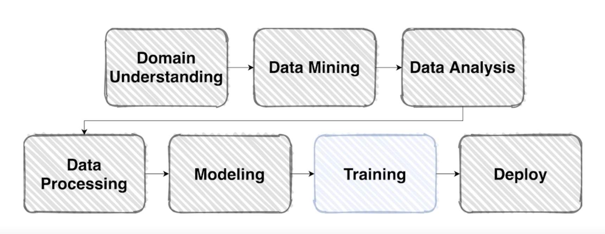
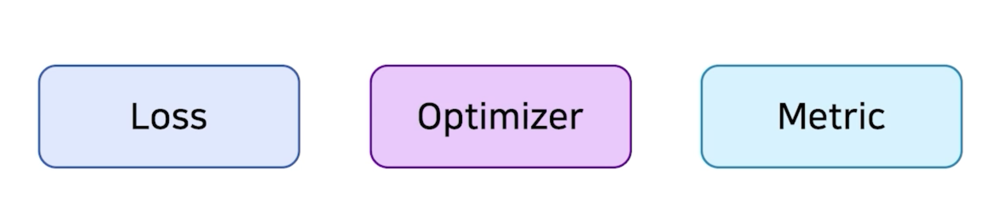
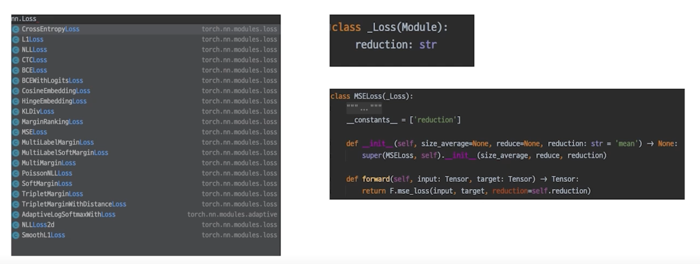
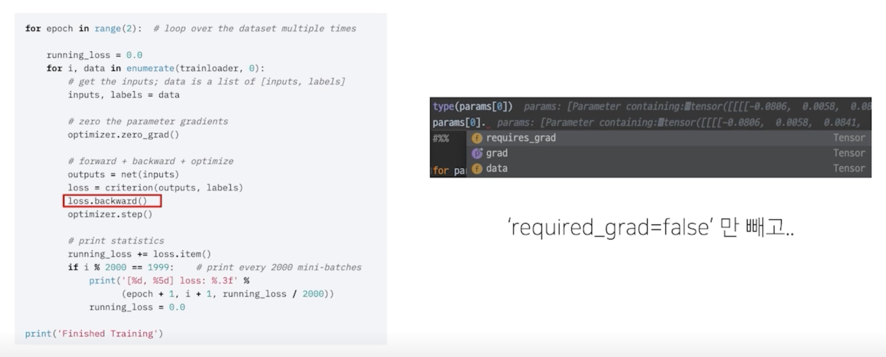
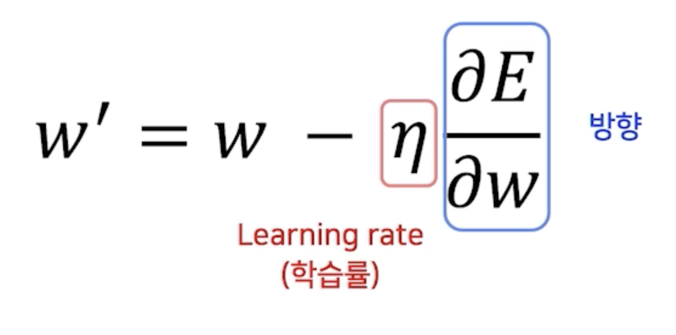
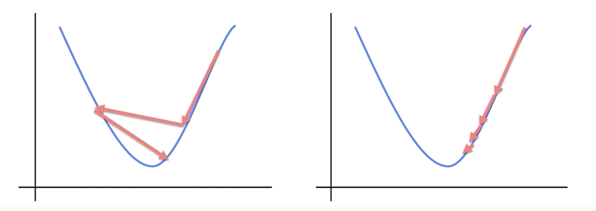
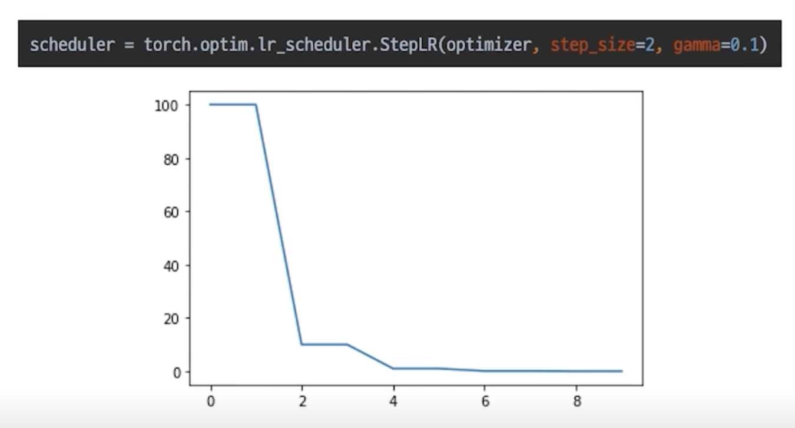
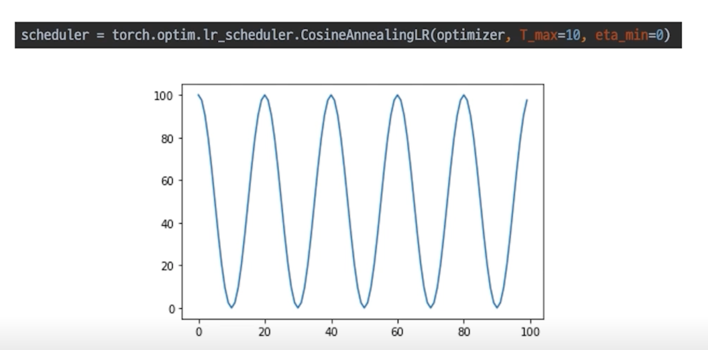
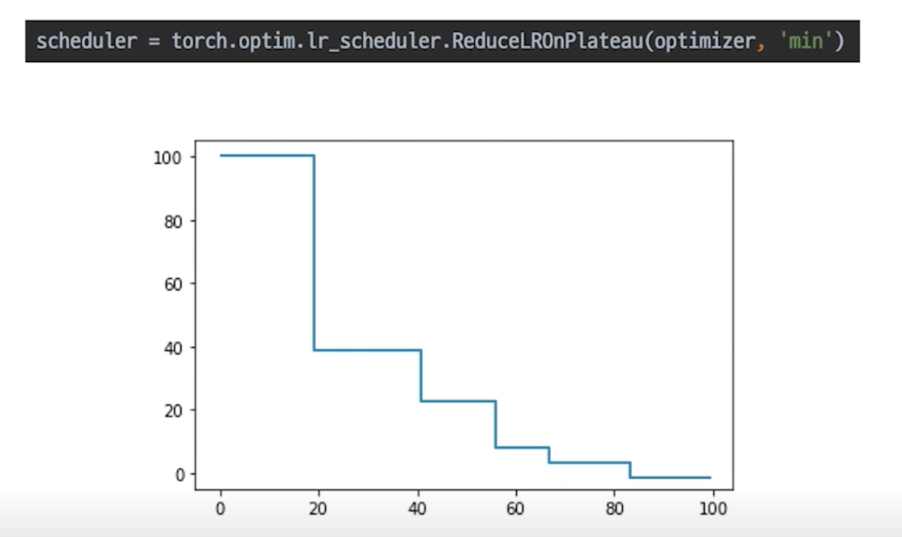
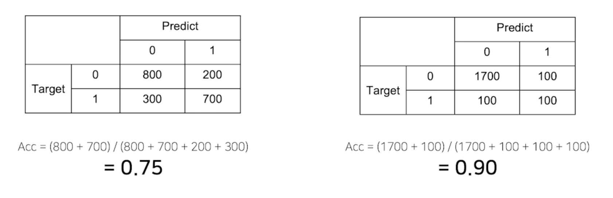

# Training & Inference 1 - Loss, Optimizer, Metric

## Overview

- 본격적으로 모델 학습을 진행해봅시다.

    

- 학습 프로세스에 필요한 요소를 크게 아래와 같이 나눌 수 있음

    

## Loss

### 복습: (오차) 역전파

- Error Backpropagation

    

- Loss 함수 = Cost 함수 = Error 함수

### Loss 도 사실은 nn.Module Family

- nn 패키지에서 찾을 수 있음

    

### loss.backward()

- 이 함수가 실행되면 모델의 파라미터의 grad 값이 업데이트 됨

    

- loss.backward() 함수는 loss 라는 객체를 backpropagation 하고 있음
- 이것만 봐서는 모델의 파라미터가 어떻게 업데이트 되는지 궁금
  - 모델을 정의할 때 Class 가 nn.Module 을 상속하고 있고
  - loss 를 정의할 때도 nn.Module을 상속하고 있음
  - 결국 같은 family
  - loss function 인 criterion에 output을 집어넣었을 때 output은 model 의 forward를 거치고
  - 나온 결과이므로 criterion 에서도 model 과의 연결점이 생김
  - model 로 input이 만들어진 시작점부터 loss 까지의 연결된 chain 이 생김
  - 이미 model 과 loss 가 연결되어서 backward 하면 연결된 상태에서 진행 됨

- loss.backward() 를 실행하면 parameter 들 중 `requires_grad=True` 인 parameter 들만 gradient 가 계산되고 업데이트 됨

### Example: 조금 특별한 loss

- 쉽게 말해서 Error 를 만들어내는 과정에 양념을 치는 것
  - Focal Loss
    - Class Imbalance 문제가 있는 경우, 맞춘 확률이 높은 Class 는 조금의 loss 를 부여
    - 맞춘 확률이 낮은 Class 는 Loss 를 훨씬 높게 부여
  - Label Smoothing Loss
    - Class target label 을 Onehot 표현으로 사용하기 보다는 ex) [0, 1, 0, 0, 0, ...]
    - 조금 Soft 하게 표현해서 일반화 성능을 높이기 위함 ex) [0.025, 0.9, 0.025, 0.025, ...]

## Optimizer

### 어느 방향으로, 얼마나 움질일 지?

- 영리하게 움직일 수록 수렴은 빨라짐

    

- $W$ : weight parameter
- $\eta$ : learning rate (학습률)
- 실제로 loss 값을 업데이트 하는 역할

### LR scheduler

- 학습 시에 Learning rate 를 동적으로 조절할 수는 없을까?

    

### StepLR

- 특정 Step 마다 LR 감소

    

### CasineAnnealingLR

- Cosine 함수 형태처럼 LR 을 급격히 변경

    

### ReduceLROnPlateau

- 더 이상 성능 향상이 없을 때 LR 감소

    

## Metric

- 객관적인 지표를 만들어서 모델이 일반적인 성능을 낼 수 있음을 나타냄

### 모델의 평가

- 제 점수는요
    - Classification
      - Accuracy, F1-score, precision, recall, ROC&AUC
    - Regression
      - MAE, MSE
    - Ranking (추천 시스템)
      - MRR, NDCG, MAP

- 학습에 직접적으로 사용되는 것은 아니지만 학습된 모델을 객관적으로 평가할 수 있는 지표가 필요

### Metric 의 허와 실

- 제가 만든 모델은 정확도가 90% 입니다

    

- 데이터가 imbalance 한 경우에 accuracy 가 무조건 옳은 지표가 아님

### 올바른 Metric 의 선택

- 데이터 상태에 따라 적절한 Metric 을 선택하는 것이 필요
    - Class 별로 밸런스가 적절히 분포
      - Accuracy
    - Class 별 밸런스가 좋지 않아서 각 클래스 별로 성능을 잘 낼 수 있는지 확인 필요
      - F1-Score

