# Training & Inference 2 - Process

## Overview

- 학습과 추론 프로세스의 과정을 이해하는 것이 목표

    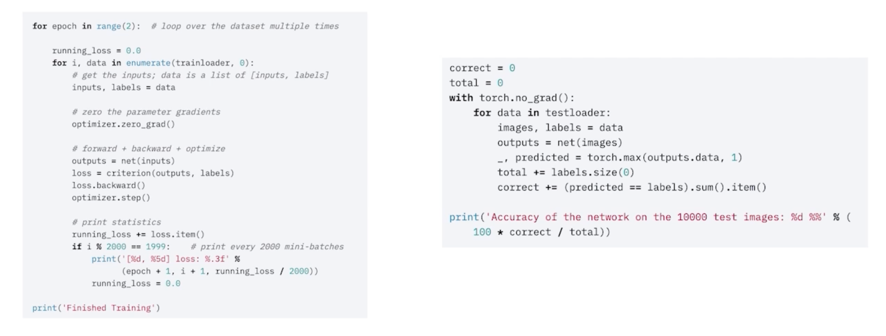

## Training Process

### Training 준비

- 학습 한번 하기 위해 지금까지 만든 결과물

    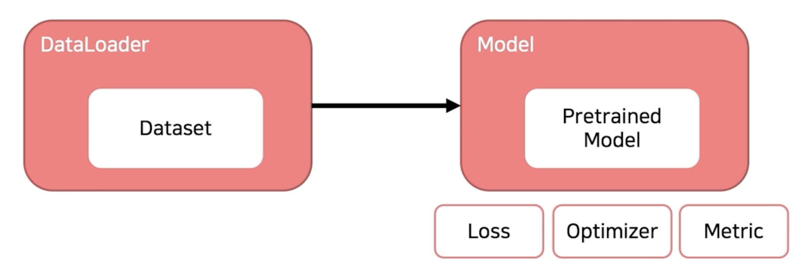

### Training 프로세스의 이해

> model.train()
    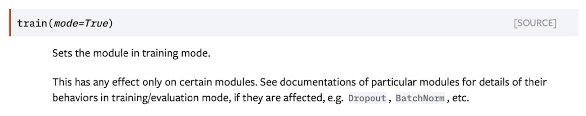

- 모델을 trainable 하게 만들어 줌
- Dropout 과 BatchNorm 을 조절할 수 있음

> optimizer.zero_grad()
    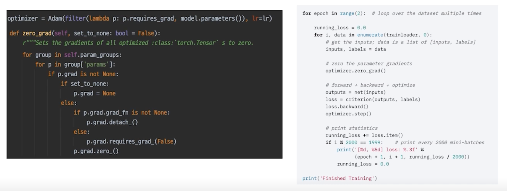

- 통상적으로 각각의 mini-batch 에서 발생한 gradient만 업데이트 하는데 활용하고 이전 gradient는 사용하지 않음
- 모델이 가지고 있는 모듈 각각의 parameter 들이 가지고 있는 grad 를 초기화 시켜주면서 이 Loss 를 지금 현재 batch 의 결과로 만들어진것만 활용하겠다 라는 의미
  - 기본적으로 loss 가 그대로 있으면 loss 를 중첩시켜서 더하는게 기본 값
  - 이전 배치에서 loss 를 만들어서 파라미터의 grad 가 없데이트 됐으면 다음 iteration 돌았을 때 따로 처리를 해주지 않으면 loss 가 대치되는게 아니라 loss 가 더해짐
  - 이걸 컨트롤하기 위해서 grad 를 zero로 바꿔주는 이 작업을 training batch 마다 해주게 됨

- 일반적으론 이렇게 하고 이렇게 사용하지 않을 수도 있음

> loss = criterion(outputs, labels)
    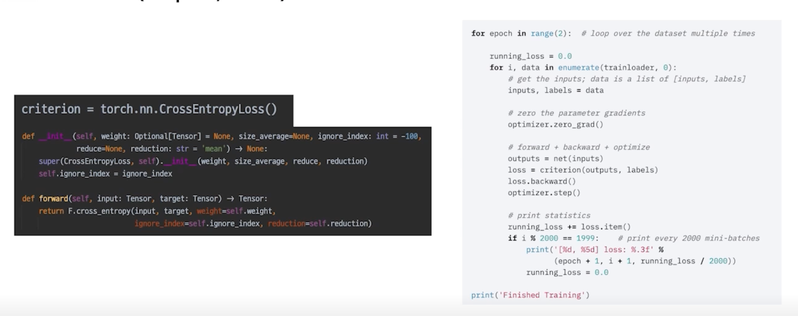

> loss 를 마지막으로 chain 생성
    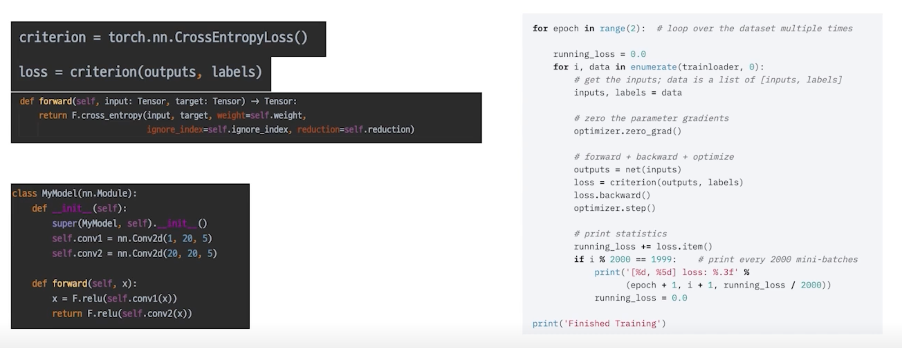

- model 에도 forward 함수가 존재하고 criterion 에도 forward 함수가 존재해서 chain 이 만들어짐
- 하나의 엮여진 chain 으로 생각할 수 있고 loss 를 control 하는 것만으로 전체적인 parameter 들을 건드릴 수 있음

> loss 의 grad_fn chain -> loss.backward()
    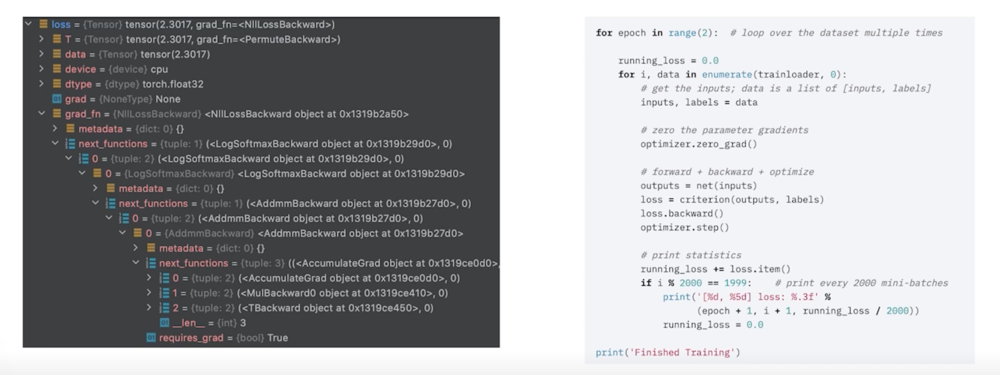

> optimizer.step()
    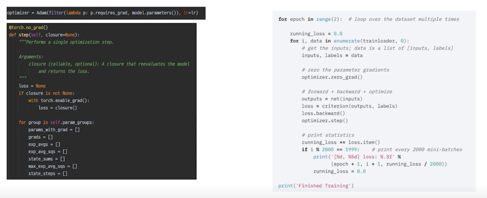

## More: Gradient Accumulation

- 지금까지의 모든 과정을 이해했다면 이를 응용하는 것도 가능

    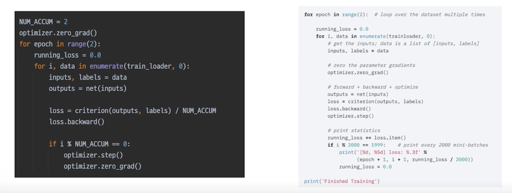

- GPU memory 는 한정적이지만 작은 배치가 아니라 큰 배치안에서 모델을 돌려야 하는 경우가 있는데 배치사이즈를 늘리는 효과랑 비슷한 결과를 줄 수 있는게 예를 들어 4번의 배치동안 Skip 하다가 한번 optimizer 를 업데이트 함

## Inference Process

### Inference 프로세스 이해

> model.eval()
    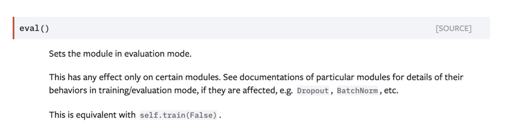

- model.train(False) 와 동일
- Dropout, BatchNorm 을 Inference 에 맞게 작업해줌

> with torch.no_grad():
    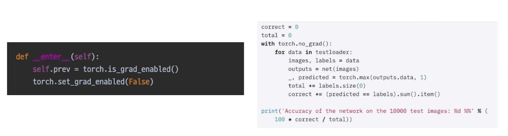

### Validation 확인

- 추론 과정에 Validation 셋이 들어가면 그게 검증

    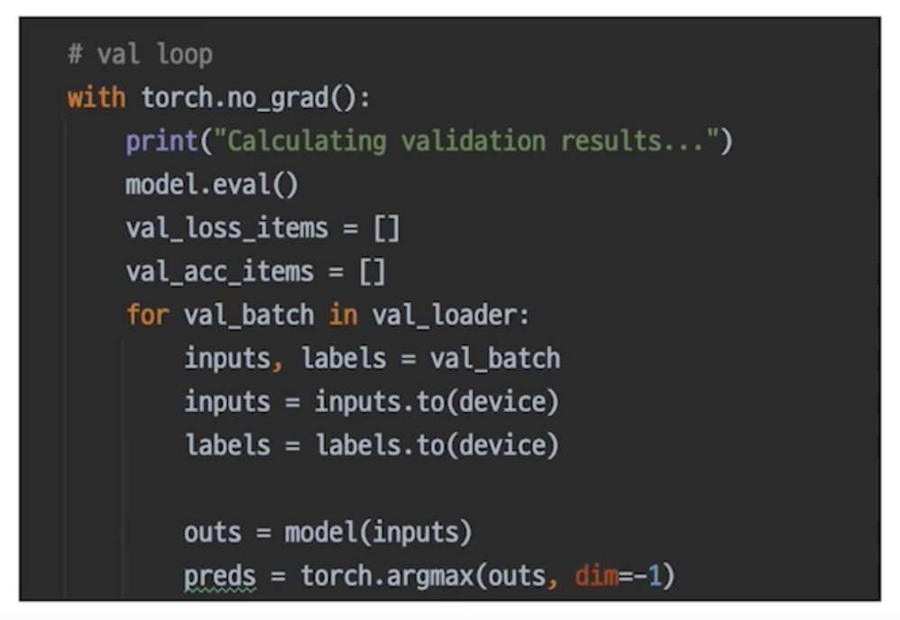

### Checkpoint

- 그냥 직접 짜면 됨

    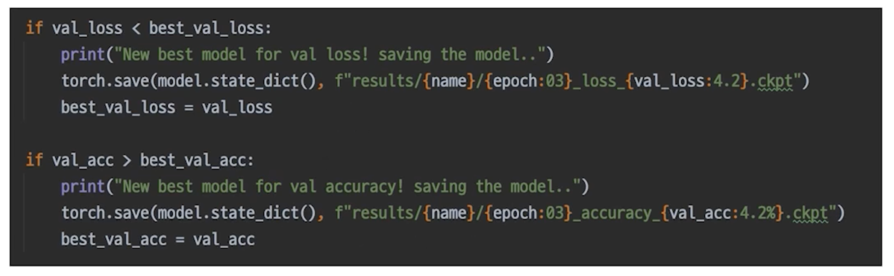

### 최종 Output, Submission 형태로 변환

- 최종 Submission 스펙을 확인 후 변환하여 제출

    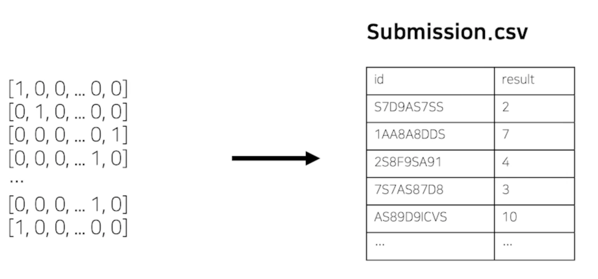

## Appendix: Pytorch Lightning

### Pytorch Lightning

- Keras 코드를 보는 듯

    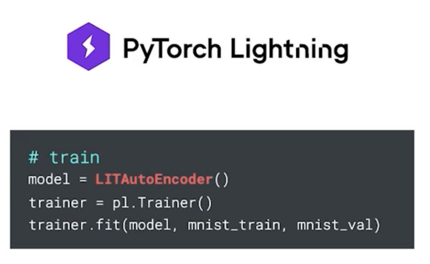
    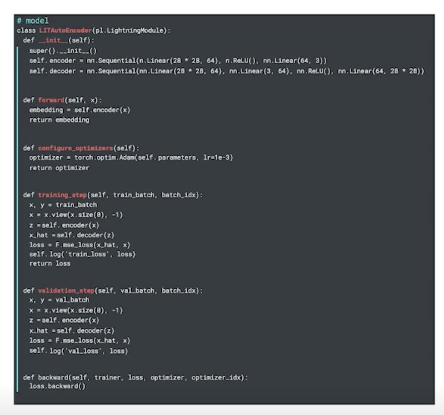

### 그래도 공부는 Pytorch 로 했으면 해요

- 충분한 이해가 바탕이 되지 않은 상태에서는 오히려 독이 될 수 있습니다.

    

- 코드로 부터 머신러닝 프로세스를 배울 수 있고 자유롭게 응용할 수 있음

