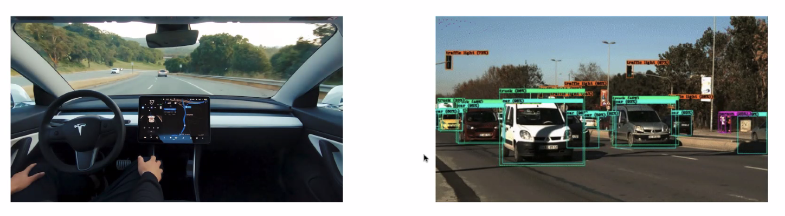
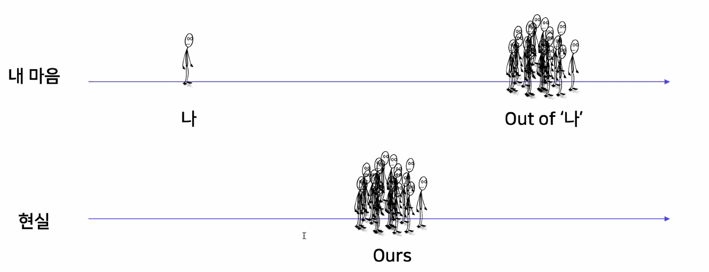
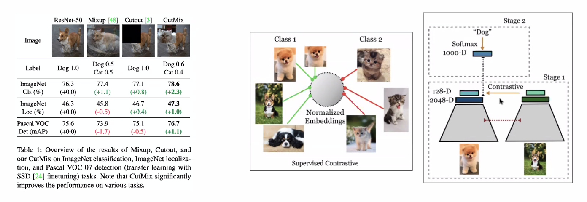
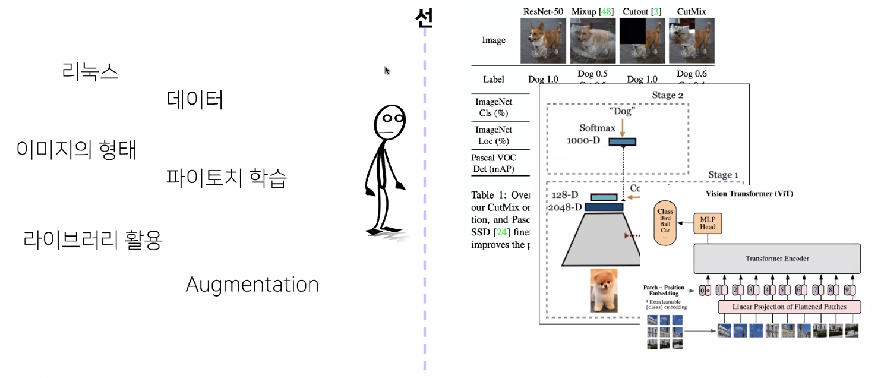
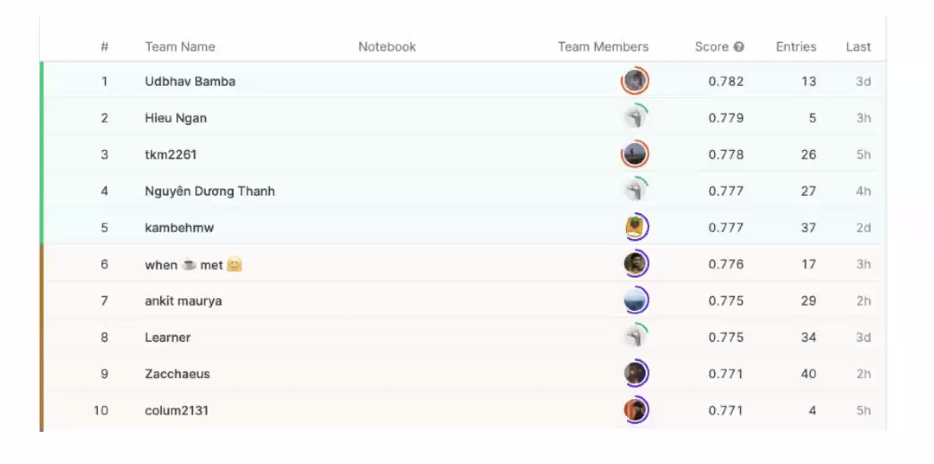
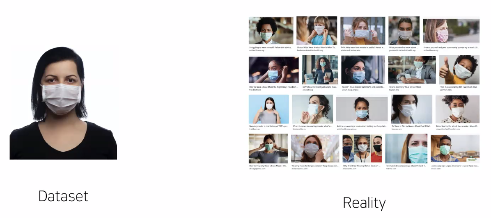
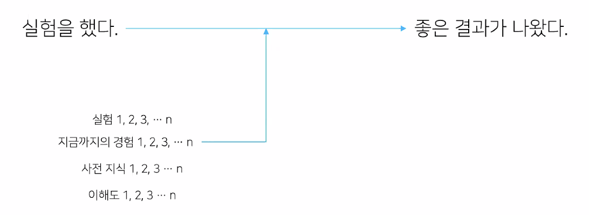

# [마스터클래스] 김태진 마스터

## Stage 도중 Stage 설명하는 Stage

### Stage 설계 의도

- 저의 Mission
  - 데이터 사이언스 - 이미지 분류
  - 컴피티션
  
- 이미지 분류 강의라면서요?
  - 이상한 게 만들어져 버림
  - 이미지 분류에 대한 설명이 많이 없음

- 밖에서 본 이상
  - 너도 나도 AI
  
    

  - 현실에서 체감하고 있는 요즘

    

- 현실
  - 당신은 과거에 무슨 잘못을 저질렀기에 여기까지 오게 되었습니까?
    - 컴퓨터는 접속하셨는지요?
    - 리눅스 명령어는 알고 계십니까?
    - 데이터는 확인 해보셨는가요?
    - 파이토치는 고사하고 파이썬을 알고 계시는지?
    - 마우스 커서가 왜 없냐구요? 거 참..

- 우리 모두 각자의 시작점이 다릅니다.

    

- 방향만 알 수 있다면
  - 제가 입이 마르고 닳도록 얘기한 것이 있었죠
  - 시작점이 다르더라도 동기 부여를 할 수 있는 목표를 만들 수 있을까?

#### Problem Definition (문제 정의)

- 내가 지금 풀어야 할 문제가 무엇인가?
- 이 문제의 Input과 Output은 무엇인가?
- 이 솔루션은 어디에 적용 될 수 있을까?

- 최상위 목표!
  - Data로 Value를 만들어 내는 일

- 이미지 분류 강의라고 해서 찾아왔습니다.
  - 이런걸 기대하셨습니까?
    
    

- U stage 복습 및 확장의 발판
  - 기본과 실전 그 어디 쯤

    

  - 줄타기를 하는 중

- 다음 레벨은 얄짤없습니다 ^^
  - level2, level3 은 굉장히 어려울 것

- Competition Top 10 = 취업?
  - 나머지는 들러리입니까?

    

  - 1등 모델이 객관적으로 좋은 모델일까요?

    

  - 추천 모델을 만들 때도 정말 올바른 추천이 뭘까? 라는 생각을 하게 됨
  - 과거의 클릭을 바탕으로 미래의 클릭을 만들면 성능은 좋겠지만 실제로 비즈니스에서 원하는 건가? 이건 다른 얘기임

- Competition을 잘한다는 것
  - 지금까지의 많은 시행착오와 경험이 있을 확률이 높고, 문제해결의 기댓값이 높다.

    

  - 스코어가 좋다는 건 
    - 운좋게 잘 되는 경우

  - 실험을 어떻게 했는지가 중요
  - 어떤 가설을 세우고 어떤 결론을 냈는가?
  - 어떤걸 활용했음을 보여주면 활용능력을 보여주고

- 뭘해도 안오른다고 느껴질 때, 어떤 문제냐에 따라서 스코어가 안오르는 것에 끄덕일줄 알아야 함

- Competition = Compete + Share
  - Competition 이 주는 긍정적 효과만 가져가도록 해요

- Competition 의 의의
  - 뭐가 어떻든 간에 본인의 성장이 최우선입니다.
