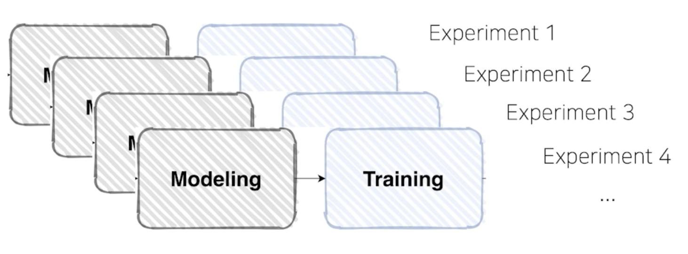
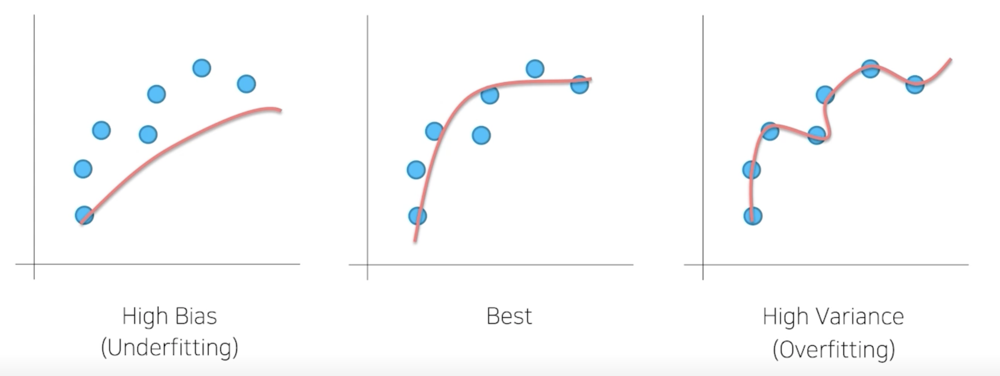
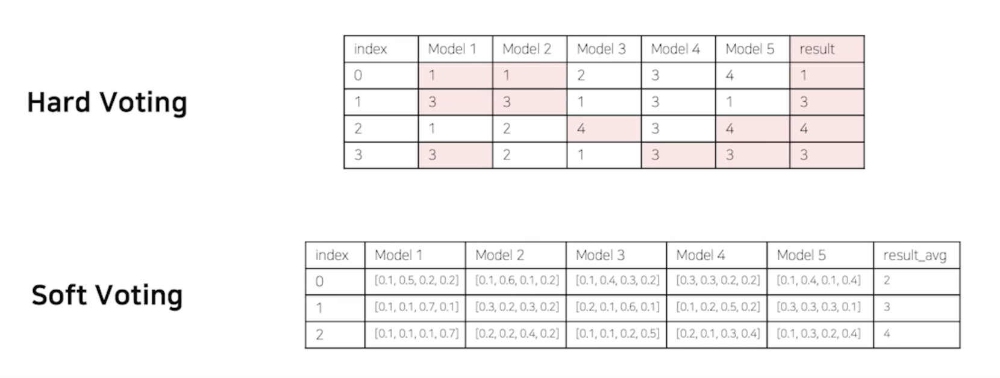
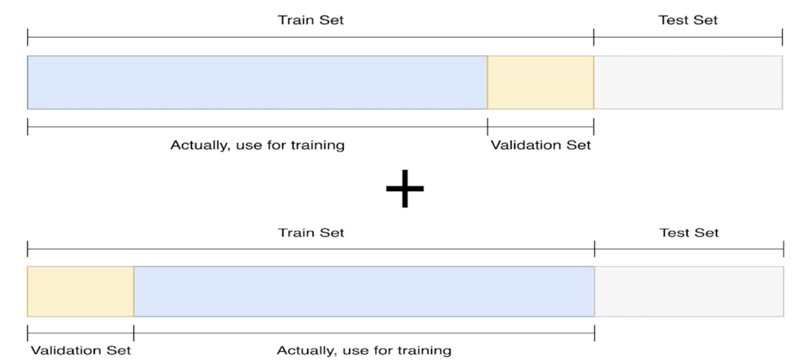
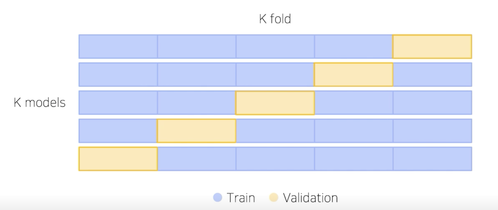
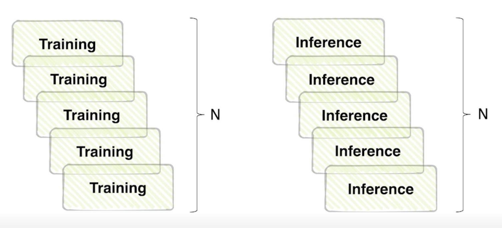
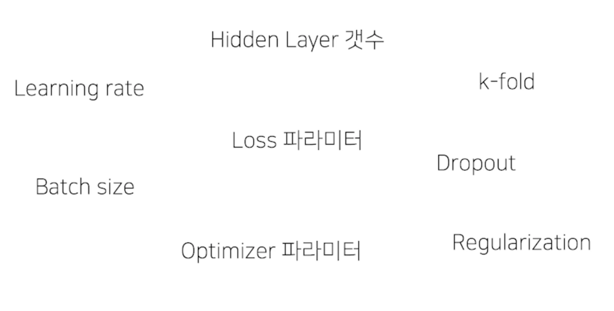
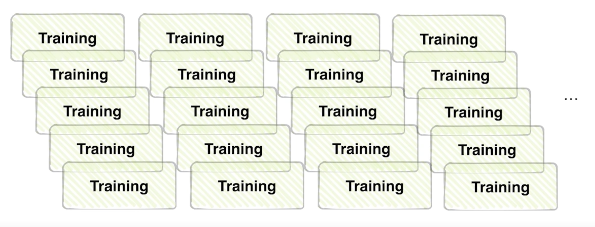
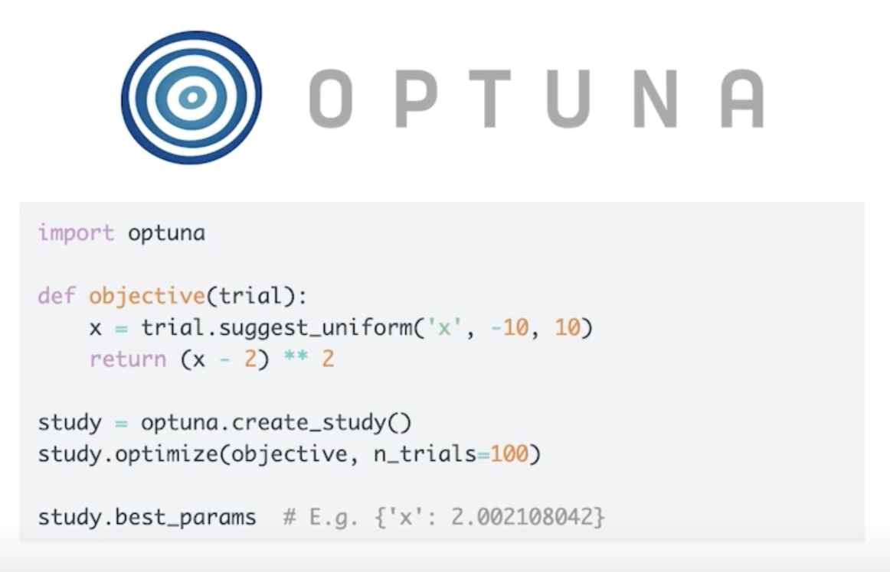

# Ensemble

## Overview

- 여러 실험을 하다 보면 여러가지 모델로 여러 결과를 만들었을 겁니다.

    

## Ensemble

- 현업에서는 실제로 많이 쓰이진 않음
  - 성능이 중요하지만 효율적인 측면에서 바라보기 때문에 

### Ensemble(앙상블)

- 싱글 모델보다 더 나은 성능을 위해 서로 다른 여러 학습 모델을 사용하는 것

### Ensemble of Deep NN

- Low Bias, High Variance -> Overfitting

    

- Bias 가 높은 쪽에 있는 모델들을 앙상블 하는 기법이 Boosting
  - Boosting : 모델을 조금씩 조금씩 순차적으로 학습하는 과정을 깊게 깊게 거쳐가면서 모델들이 나은 방향으로 fitting 되도록 하는 과정
  - 잘 되는 과정이 정형데이터에서 사용하는 Boosting 알고리즘 ex) XGBoost, LGBM

- High Variance 같은 경우에는 Bagging 이라는 방식으로 많이씀
  - 데이터 샘플을 만들어서 데이터 샘플을 하나하나 나눠가지고 각각을 다 학습시킨 하나의 모델들을 바탕으로 취합해서 평균을 내는 과정
  - 대표 알고리즘 ex) RandomForest

### Model Averaging (Voting)

- The reason that model averaging works is that different models will usually not make all the same errors on the test set.

    

- Hard Voting : 다수결 
  - 단점은 모델들의 클래스별 확률값이 고려되지 않음
- Soft Voting : 각각의 모델이 각각의 클래스가 가질 확률을 보고 판단

- 일반적으로 Soft Voting 방식이 성능이 더 좋다라고 생각되서 많이 씀
  - 일반적일 뿐 항상 그렇지는 않음

### Cross Validation

- 훈련 셋과 검증 셋을 분리는 하되, 검증 셋을 학습에 활용할 수는 없을까?

    

- train 데이터 셋에서 validation 셋을 따로 만드는 과정에서 Bias 가 발생할 수 있지만 Cross Validation 을 통해서 좀 줄일 수 있다.

### Stratified K-Fold Cross Validation

- 가능한 경우를 모두 고려 + Split 시에 Class 분포 까지 고려

    

### TTA (Test Time Augmentation)

- 테스트 할 때 Augmentation을 어떻게 한단 거야?

    

- 여기서 굳이 왜 Augmentation 을 하는거야?
  - 하나의 Test set 을 여러가지 다른 상태에서의 값을 넣어도 똑같은 결과를 낼까?

- 테스트 이미지를 Augmentation 후 모델 추론, 출력된 여러가지 결과를 앙상블

    

### 성능과 효율의 Trade-off

- 앙상블 효과는 확실히 있지만 그 만큼 학습, 추론 시간이 배로 소모됨

    

## Hyperparameter Optimization

### Hyperparameter?

- 시스템의 매커니즘에 영향을 주는 주요한 파라미터

    

### 파라미터를 변결할 때 마다 학습을 해야하니..

- 시간과 장비가 충분하다면.. 해볼 수 있겠으나

    

- 일반적으로 딥러닝에선 많이 하지 않음

- 베이지안 옵티마이제이션이 가상의 fucntion 을 만들어서 데이터의 분포와 비슷하게끔 만드는 ....
  - 더 알아보자..

### Optuna

- 파라미터 범위를 주고 그 범위 안에서 trials 만큼 시행

    

