# Experiment Toolkits & Tips

## Overview

- 드디어어어 마지막 챕터!!

    

## Training Visualization

### Tensorboard

- 학습 과정을 기록하고 트래킹 하는 것도 중요합니다.

    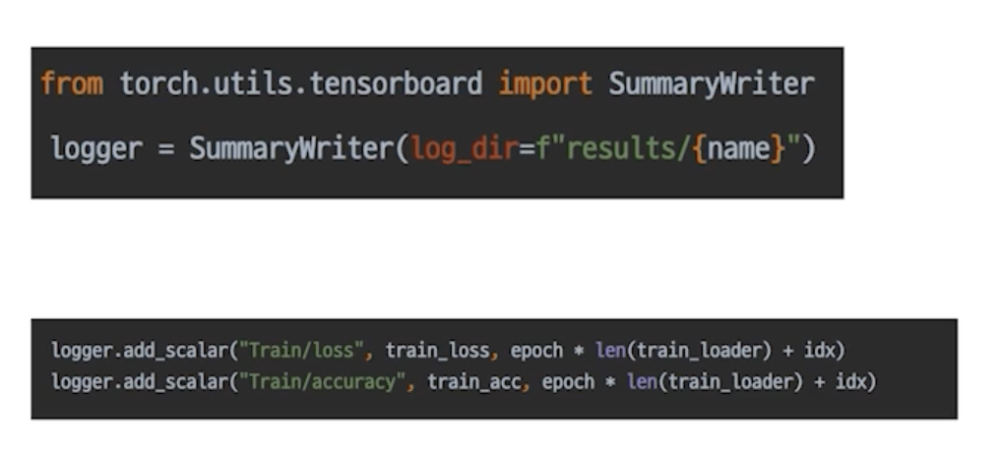
    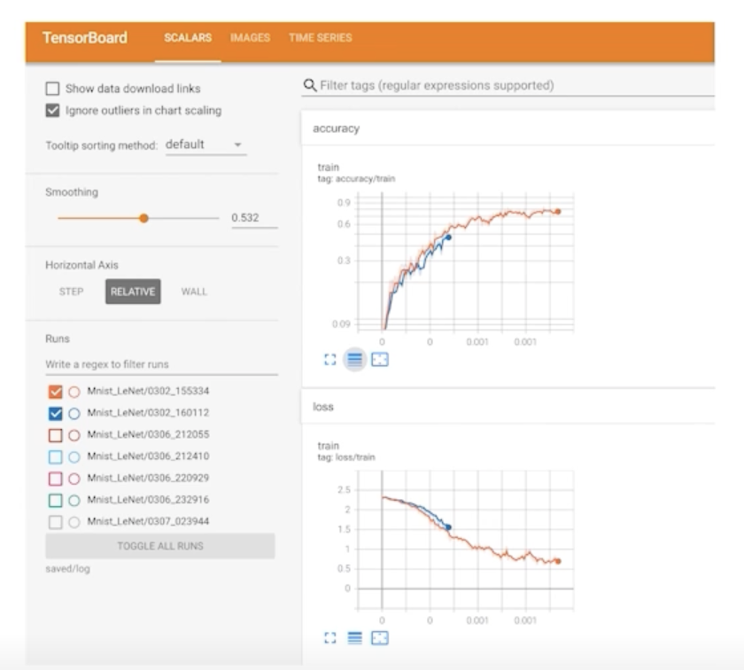

- Tensorboard 의 좋은 기능 중 하나
  - 어떤 이미지들이 학습이 되어서 학습이 되는지를 보고 싶을 때 grid 라는 걸 추가해서 볼 수 있음
    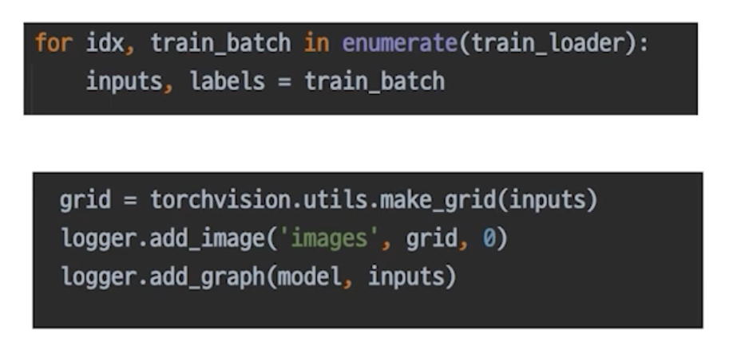
    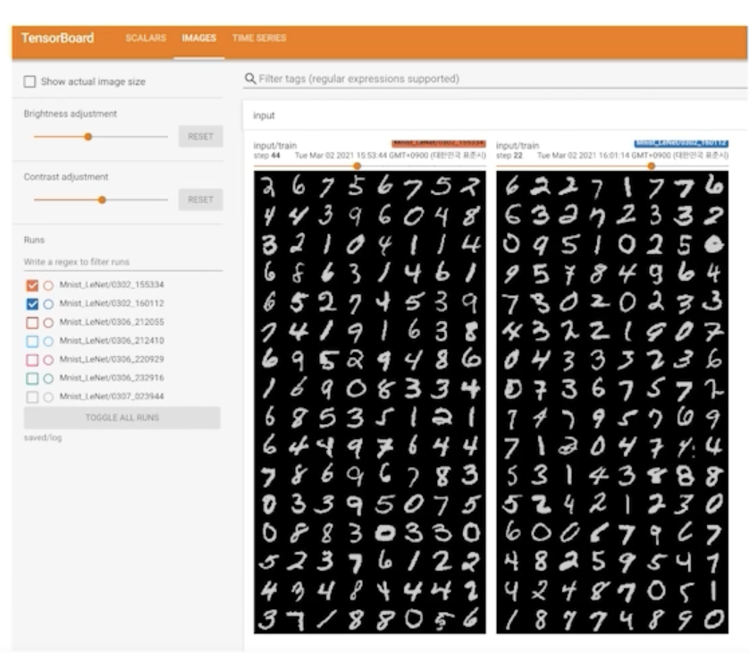

- 사용법

```
tensorboard 
    --logdir PATH     log가 저장된 경로
    --host ADDR       원격 서버에서 사용 시 0.0.0.0 (default: localhost)
    --port PORT       포트 번호
```

### Weight and Bias (wandb)

- 딥러닝 로그의 깃허브 같은 느낌

    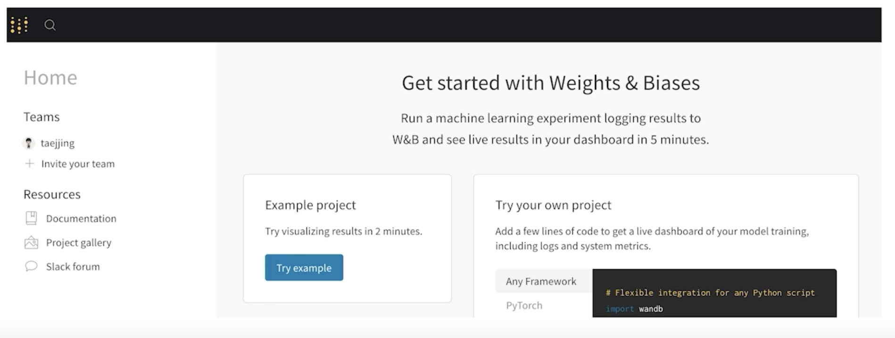

- wandb login

    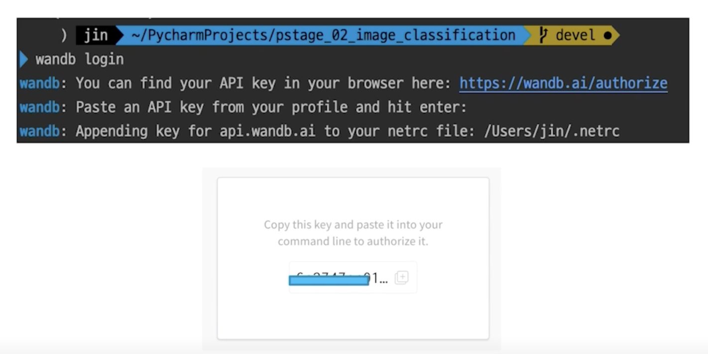

- wandb init, log 설정

    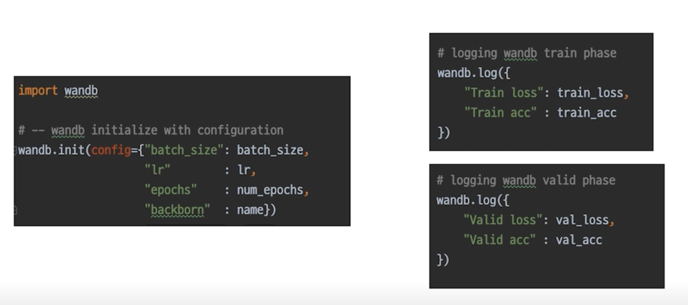

- 페이지에서 로그 확인

    

## Machine Learning Project

### Jupyter Notebook

- 코드를 아주 빠르게 Cell 단위로 실행해볼 수 있는 것이 장점

    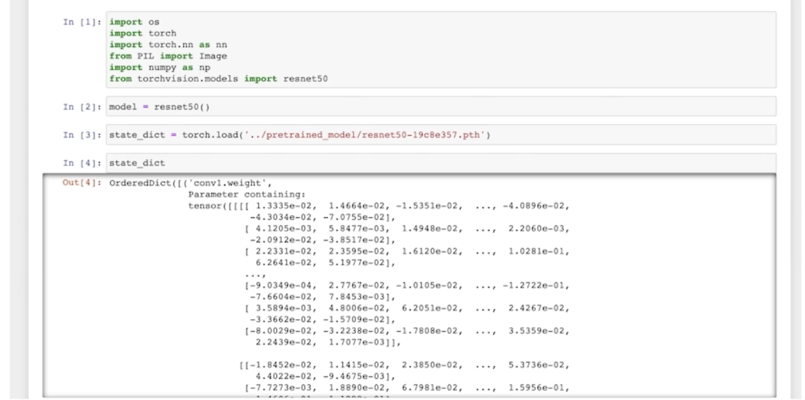

- 보통 EDA를 할 때 사용하면 매우 편리합니다.

    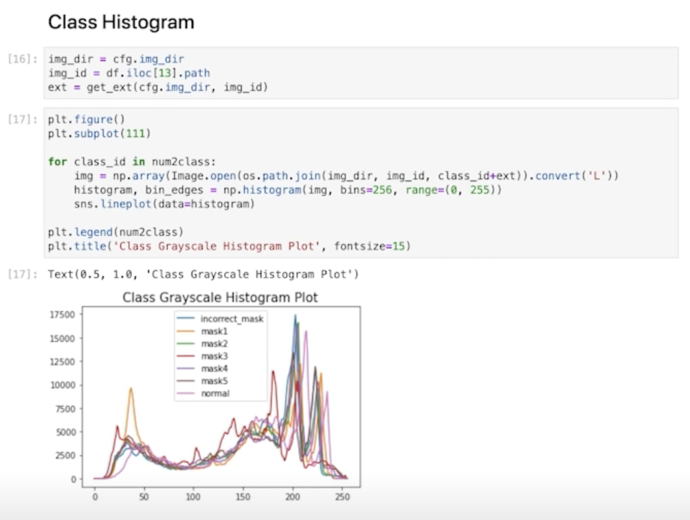

- 바로바로 결과를 확인할 수 있다는 장점!

- 학습 진행 도중 노트북 창이 꺼지면? 못 돌아감

    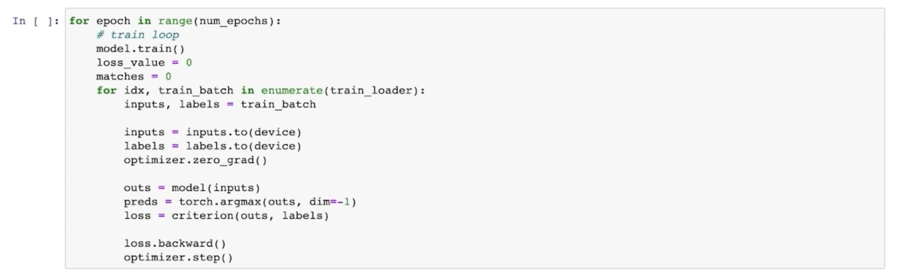

### Python IDLE

- 구현은 한번만, 사용은 언제든, 간편한 코드 재사용

    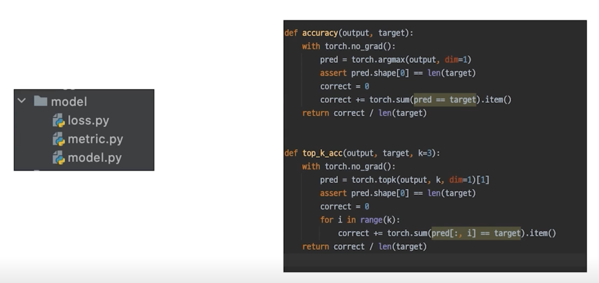

- 사용할 줄 알면, 어떤 코드도 무섭지 않게 된다는 "디버깅"

    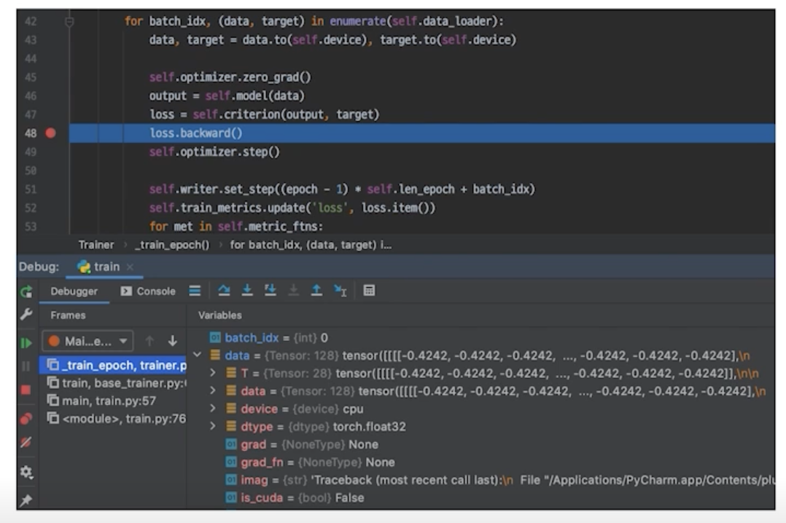

- 자유로운 실험 핸들링

    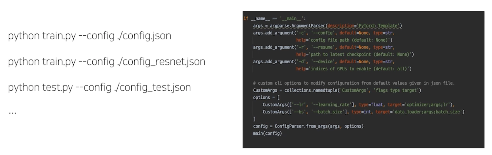

## Some Tips..

### 분석 코드 보다는 설명글을 유심히 보세요

- 필자가 생각하고 있는 흐름을 읽을 수 있습니다.

    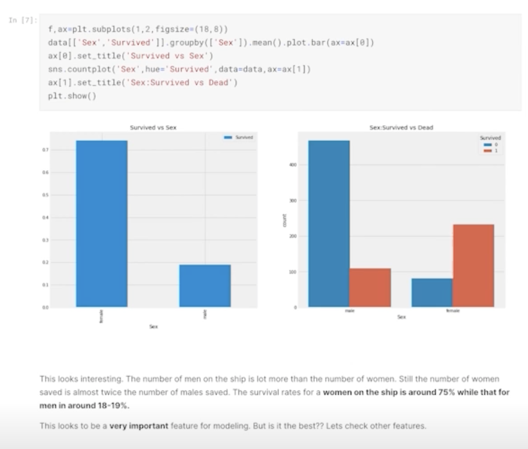

### 코드를 볼 때는 디테일한 부분까지

- 언제든 활용할 수 있을 정도로..

    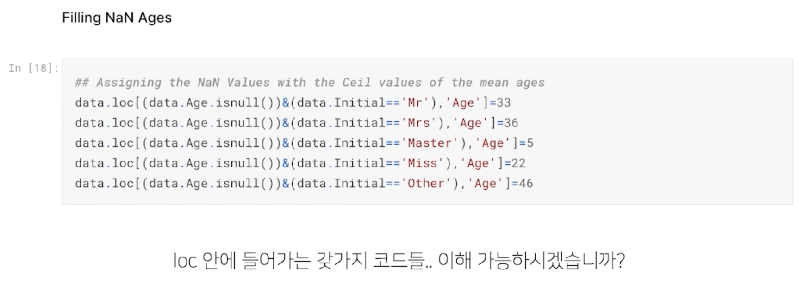

### Paper with Codes

- 최신 논문과 그 코드까지

    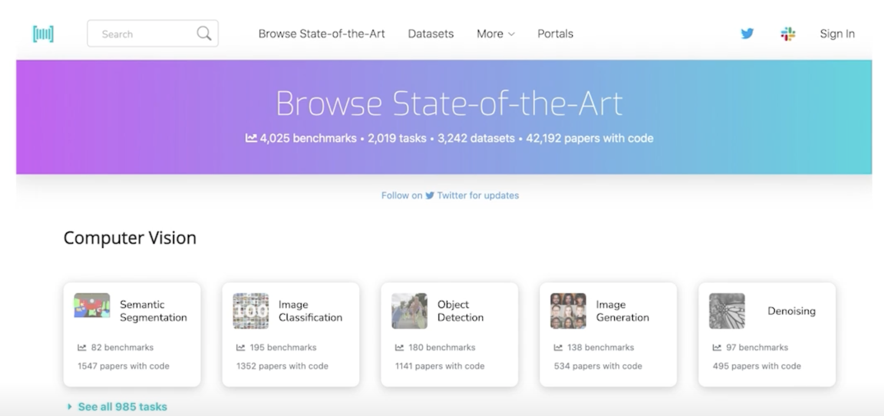

### 공유하는 것을 주저하지 마세요

- 새로운 배움의 기회가 될 수 있습니다.

    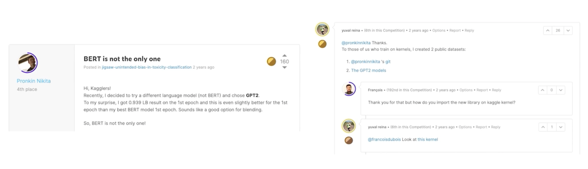

