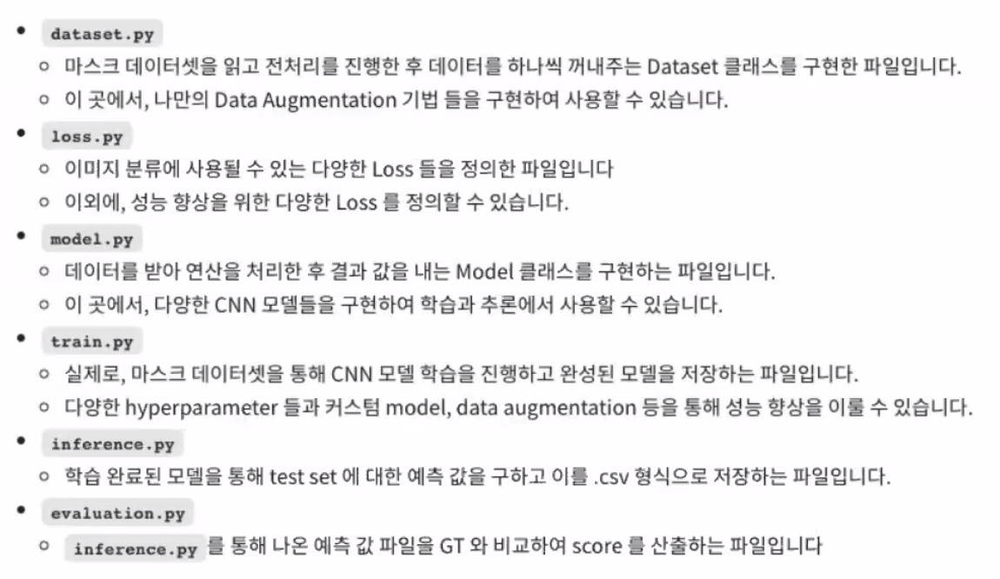
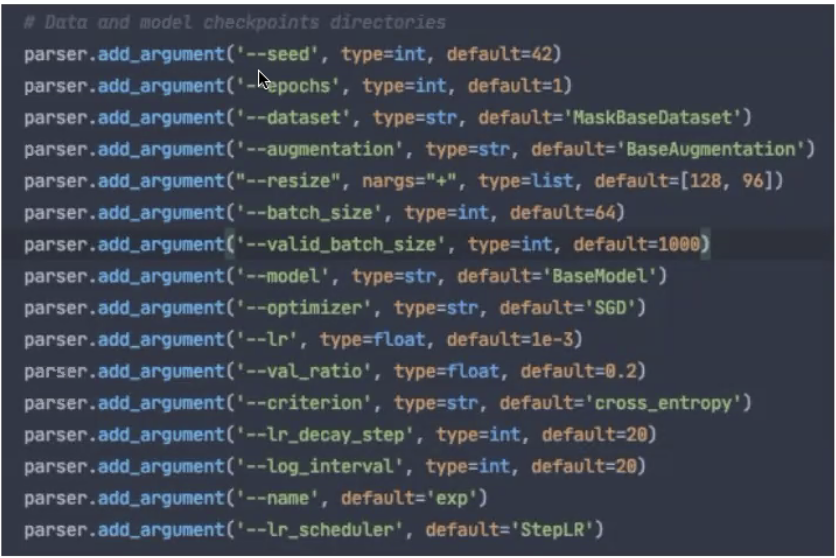
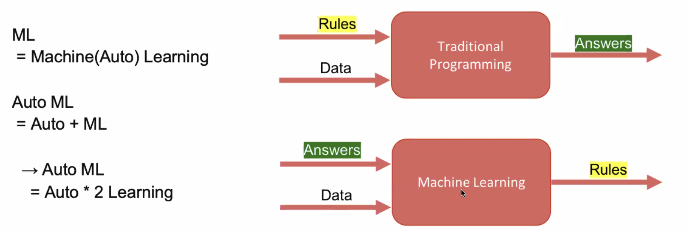
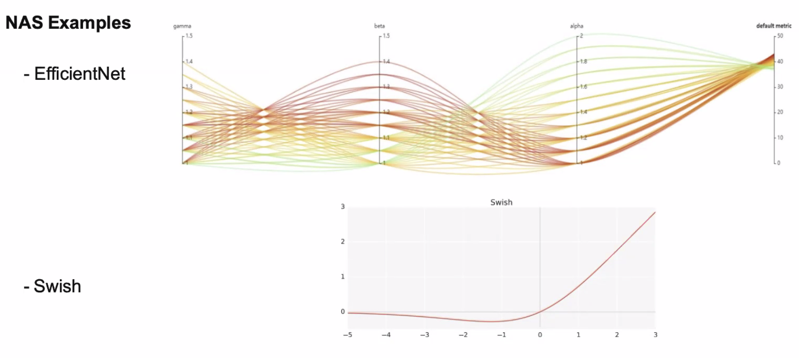
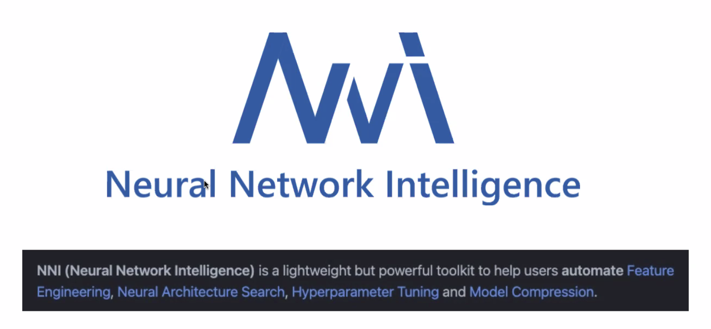

# [오피스아워] Baseline code 및 Auto ML 실습 세션

## 1. Baseline code 설명

### 1.1 Notebook vs Python Project

- Notebook
  - line by line 실행이 가능하여 값을 직접 확인하면서 코딩이 가능
  - visualization 결과를 눈으로 확인하기 편리
  - 대용량의 I/O 작업은 메모리에 올려두고 런타임으로 계속 사용할 수 있음

- Python Project
  - IDE 들의 (Pycharm, VS Code) 너무나 강력하 ㄴ기능들
    - (navigation, refactoring, code template, debugger, remote interpreter etc..)
  - 파일들을 구조화하여 관리하기 편함 -> 확장성과 재사용성, 가독성에 유리
  - CLI (Command Line interface) 사용에 용이
  - 다양한 실험 세팅 및 결과 versioning 에 용이

### 1.2 Baseline Code 기본 구성

- Components

    

- 기본 사용 방법
  - 다양한 하이퍼 파라미터 세팅으로 학습을 진행해봅니다.
  - 텐서보드를 통해 학습 양상을 실시간으로 확인 및 점검하고, 실험간 결과를 비교합니다.
  - Custom Module 들을 추가하여 성능을 더 끌어 올려봅니다.

    

---

## pycharm 생산성 높이는 기능

- Template 사용
- 자동 import
- 단축키에 익숙해지는게 생산성 높일 수 있음

---

## 2. Auto ML 실습

### 2.1 Auto ML 이란?

- Auto ML?

  

### 2.2 Auto ML Tasks

- Hyperparameter Optimization (HPO)
- Neural Architecture Search (NAS)
- Model Compression
  
    

### 2.3 Auto ML Tasks - NAS

### 2.4 Auto ML 실습

- Hyperparameter Optimization (HPO)
  - Ray-Tune, Optuna, W&B Sweeps, nni etc..
    
    

