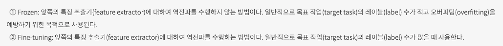

# [Week4] 이미지 분류 - 김태진 강사 & [Special] Data Viz - 안수빈 강사

### [[Day15] 이미지 분류 1 ~ 2강 & 시각화 4-1 ~ 4-2강](https://github.com/raki-1203/boostcamp_note/tree/main/Week_4/Day_15)

- Competition with AI Stages!
- Image Classification & EDA
- Seaborn 소개
- Seaborn 기초
- 마스크 착용 상태 분류 대회 - EDA & Train

### [[Day16] 이미지 분류 3 ~ 4강 & 시각화 4-3강](https://github.com/raki-1203/boostcamp_note/tree/main/Week_4/Day_16)

- Dataset
- Data Generation
- Seaborn 심화
- 마스크 착용 상태 분류 대회 - EDA & Dataset & DataLoader & Train

### [[Day17] 이미지 분류 5 ~ 6강](https://github.com/raki-1203/boostcamp_note/tree/main/Week_4/Day_17)

- Model 1
- Model 2
- 마스크 착용 상태 분류 대회 - EDA & Dataset & DataLoader & Train

### [Week4 피어세션 정리](https://github.com/raki-1203/Boostcamp_2st_Hot6/tree/main/Meetup-log/week4)

---
### 학습회고

> [Day15]

기본적인 EDA를 진행해보고자 하는데 Train Data Image & Test Data Image 시각화 해보고

train_info 데이터를 이용해서 라벨링을 진행했고

Pretrained ResNet Model 을 사용해 학습을 진행하고 있다.

학습진행이 잘 됐으면 좋겠다.

> [Day16]

EDA 샘플 코드가 주어졌다.

t-SNE, PCA 분석 등 여러가지를 하던데 저렇게 해서 뭘 얻는지 잘 모르겠다.

생각지도 못했던 이미지에서 라벨링이 잘 못된 데이터가 있는걸 확인했고

일일히 모든 데이터를 확인해봤다.

실제로 남자인데 여자로 라벨링 된 데이터 또는 실제 여자인데 남자로 라벨링 된 데이터

사람의 눈으로 봐도 확인이 어려운 것도 있었다. 임의로 바꿨는데 어떤 역할을 할지 모르겠다.

ResNet 보다 EfficientNet 의 성능이 더 좋다는 얘기를 들었다.

구글링을 통해 EfficientNet-B4 모델을 사용해서 테스트를 진행해 볼 예정이다.

정답 class 간의 불균형을 해결할 방법도 찾아야 할텐데

SMOTE 를 사용할지 생각 해봐야 겠다.

오늘은 데이터 확인하는데 굉장히 많은 시간이 흐른 것 같다.

데이터는 꽤 수정했다고 생각하고 이제 Dataset, DataLoader, Model 관련해서 더 집중해봐야 겠다.

> [Day17]

Image augmentation library 인 `albumentations` 를 사용해보려 구글링을 했다.

[이 블로그](https://hoya012.github.io/blog/albumentation_tutorial/)를 보면서 사용법을 익혔다.

`albumentations.pytorch.transforms.ToTensorV2` 이거 찾느라 고생했다. 하...

데이터셋 만드는 과정에서 albumentations 를 사용하도록 코드 교체했다.

더 빠르다고 하니 resource를 더 잘 쓸 수 있겠지?

VIT 모델도 사용해보고 있다.

확실히 배치사이즈를 줄여야 돌아가고 num_workers 도 줄여야 돌아간다.

이렇게 모델만 바꾸지 말고 하이퍼파라미터 튜닝도 해야하나 싶다.

다들 어떻게 저렇게 잘 하는지 신기하다.

[fine tuning vs feature extractor](https://ndb796.tistory.com/552) 이 블로그에서 설명하기를 feature extractor로써 사용하는 방식이 학습은 빠를 수 있으나 클래스가 많은 경우 성능이 안좋을 수 있다고 한다.

성능이 오르기가 쉽지 않은 것 같다.

내가 모르는 방법이 있는 것 같은데 단순히 fine-tuning 으로는 한계가 있는 느낌이다.

더 찾아봐야겠다.