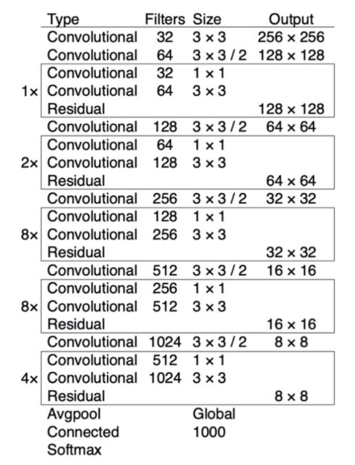

# Mission



1. 위 테이블의 예시를 보고 해당하는 스펙에 맞게 모델 직접 구현해보세요. 그리고 현재 우리 문제 정의에 맞게 Classifier도 설계해보세요.

Input Image 의 Shape 은 (3, 256, 256) 이라고 생각하고 진행하겠다.

> 참고 Convolution layer 의 output size 계

- 각각 기호를 아래와 같이 정의
  - $O$: Size(width) of output image
  - $I$: Size(width) of input image
  - $K$: Size(width) of kernels used in the Conv layer
  - $N$: Number of kernels
  - $S$: Stride of the convolution operation
  - $P$: Padding size
- $O$(Size(width) of output image)는 다음과 같이 정의 됨

$$ O = \frac{I - K + 2P}{S} + 1 $$

- 출력 이미지의 채널 수는 커널의 갯수($N$) 와 같음

---
## 구현

1. 첫번 째 Convolutional layer 를 지날 때 filter 의 개수가 32개로 늘어나고 kernel_size 는 (3, 3) 이고 Output 의 shape 은 (32, 256, 256) 이 나와야 한다.

    ```python
    nn.Conv2d(in_channels=3, out_channels=32, kernel_size=3, stride=1, padding=1)
    ```

2. 두번 째 Convolutional layer 를 지날 때 filter 의 개수가 64개로 늘어나고 kernel_size 는 (3, 3) 이고 Stride 는 2를 주고 결과 Output 의 shape 은 (64, 128, 128) 이 된다.

      - 이 때 PyTorch 로 구현한 코드에서는 Padding 사이즈와 Stride 사이즈가 정확히 맞아 떨어지지 않더라도 소수점을 버리게 구현이 되어 있어서 우리가 원하는 사이즈로 나오게 된다.

    ```python
    nn.Conv2d(in_channels=32, out_channels=64, kernel_size=3, stride=2, padding=1)
    ```

3. 첫번 째 Residual Block 을 지날 때 bottleneck 구조를 사용한다. input shape 이 중간에서 한번 channel 이 반으로 줄었다가 다시 복구가 되면서 bottle neck 구조가 들어간 Residual Block 을 사용한다. 결국 input shape 이 유지되는 하나의 모듈이라고 볼 수 있다.

    ```python
    class ResidualBlock(nn.Module):
        def __init__(self, in_channels):
            super(ResidualBlcok, self).__init__()

            reduced_channels = int(in_channels // 2)

            self.layer1 = nn.Conv2d(in_channels, reduced_channels, kernel_size=1, stride=1, padding=1)
            self.layer2 = nn.Conv2d(reduced_channels, in_channels, kernel_size=3, stride=1, padding=1)

        def forward(self, x):
            residual = x

            out = self.layer1(x)
            out = self.layer2(out)
            out += residual
            return out

    ResidualBlock(64)
    ```

4. 세번 째 Convolutional layer 를 지날 때 filter 의 개수가 128개로 늘어나고 kernel_size 는 (3, 3) 이고 Stride 는 2를 주고 결과 Output 의 shape 은 (128, 64, 64) 이 된다.

    ```python
    nn.Conv2d(64, 128, 3, 2, 1)
    ```

5. 두번 째 Residual Block 을 지나는데 2개의 Block 을 지나게 된다.

    ```python
    ResidualBlock(128)
    ResidualBlock(128)
    ```

6. 네번 째 Convolutional layer 를 지날 때 filter 의 개수가 256개로 늘어나고 kernel_size 는 (3, 3) 이고 Stride 는 2를 주고 결과 Output 의 shape 은 (256, 32, 32) 이 된다.

    ```python
    nn.Conv2d(128, 256, 3, 2, 1)
    ```

7. 세번 째 Residual Block 을 지나는데 8개의 BLock 을 지나게 된다.

    ```python
    ResidualBlock(256)
    ResidualBlock(256)
    ResidualBlock(256)
    ResidualBlock(256)
    ResidualBlock(256)
    ResidualBlock(256)
    ResidualBlock(256)
    ResidualBlock(256)
    ```

8. 다섯번 째 Convolutional layer 를 지날 때 filter 의 개수가 512개로 늘어나고 kernel_size 는 (3, 3) 이고 Stride 는 2를 주고 결과 Output 의 shape 은 (512, 16, 16) 이 된다.

    ```python
    nn.Conv2d(256, 512, 3, 2, 1)
    ```

9. 네번 째 Residual Block 을 지나는데 8개의 BLock 을 지나게 된다.

    ```python
    ResidualBlock(512)
    ResidualBlock(512)
    ResidualBlock(512)
    ResidualBlock(512)
    ResidualBlock(512)
    ResidualBlock(512)
    ResidualBlock(512)
    ResidualBlock(512)
    ```

10. 다섯번 째 Convolutional layer 를 지날 때 filter 의 개수가 1024개로 늘어나고 kernel_size 는 (3, 3) 이고 Stride 는 2를 주고 결과 Output 의 shape 은 (1024, 8, 8) 이 된다.

    ```python
    nn.Conv2d(256, 512, 3, 2, 1)
    ```

11. 다섯번 째 Residual Block 을 지나는데 4개의 BLock 을 지나게 된다.

    ```python
    ResidualBlock(1024)
    ResidualBlock(1024)
    ResidualBlock(1024)
    ResidualBlock(1024)
    ```

12. AvgPool layer 를 거치면서 CNN Block 이 끝나게 되고 (1024, 8, 8) 의 input 값이 (1024, 1, 1) 로 변하게 된다.

    ```python
    nn.AdaptiveAvgPool2d((1, 1))
    ```

13. 마지막 Fully Connected Layer 를 통과하면서 마무리 된다. 이 때, (1024, 1, 1) 의 shape 을 (-1, 1024) 의 형태로 변경해야 하고 Fully Connected Layer 를 통과하면서 마지막 output 의 shape 은 우리가 원하는 18개의 Class로 나와야 하므로 이렇게 적용한다.

    ```python
    nn.Linear(1024, 18)
    ```

마지막 softmax 는 학습을 시킬 때 CrossEntropyLoss() 를 사용하면 자동으로 계산되기도 하고해서 넣지 않았다.

넣고 싶으면 Model forward 부분에서 마지막에 F.softmax() 함수를 취해주면 될 것 같다.

과정은 이렇게 거치면 되고 이 과정을 깔끔하게 정리한 코드는 다음과 같다.

```python
import torch
import torch.nn as nn

def conv_batch(in_num, out_num, kernel_size=3, padding=1, stride=1):
    return nn.Sequential(
        nn.Conv2d(in_num, out_num, kernel_size=kernel_size, stride=stride, padding=padding, bias=False),
        nn.BatchNorm2d(out_num),
        nn.LeakyReLU(),
    )

# Residual Block
class DarkResidualBlock(nn.Module):
    def __init__(self, in_channels):
        super(DarkResidualBlock, self).__init__()
        
        reduced_channels = int(in_channels / 2)
        
        self.layer1 = conv_batch(in_channels, reduced_channels, kernel_size=1, padding=1)
        self.layer2 = conv_batch(reduced_channels, in_channels)
        
    def forward(self, x):
        residual = x
        
        out = self.layer1(x)
        out = self.layer2(out)
        out += residual
        return out

# darknet 53
class Darknet53(nn.Module):
    def __init__(self, block, num_classes):
        super(Darknet53, self).__init__()
        
        self.num_classes = num_classes
        
        self.conv1 = conv_batch(3, 32)
        self.conv2 = conv_batch(32, 64, stride=2)
        self.residual_block1 = self.make_layer(block, in_channels=64, num_blocks=1)
        self.conv3 = conv_batch(64, 128, stride=2)
        self.residual_block2 = self.make_layer(block, in_channels=128, num_blocks=2)
        self.conv4 = conv_batch(128, 256, stride=2)
        self.residual_block3 = self.make_layer(block, in_channels=256, num_blocks=8)
        self.conv5 = conv_batch(256, 512, stride=2)
        self.residual_block4 = self.make_layer(block, in_channels=512, num_blocks=8)
        self.conv6 = conv_batch(512, 1024, stride=2)
        self.residual_block5 = self.make_layer(block, in_channels=1024, num_blocks=4)
        self.global_avg_pool = nn.AdaptiveAvgPool2d((1, 1))
        self.fc = nn.Linaer(1024, self.num_classes)
        
    def forward(self, x):
        out = self.conv1(x)
        out = self.conv2(out)
        out = self.residual_block1(out)
        out = self.conv3(out)
        out = self.residual_block2(out)
        out = self.conv4(out)
        out = self.residual_block3(out)
        out = self.conv5(out)
        out = self.residual_block4(out)
        out = self.conv6(out)
        out = self.residual_block5(out)
        out = self.global_avg_pool(out)
        out = out.view(-1, 1024)
        out = self.fc(out)
        return out
        
    def make_layer(self, block, in_channels, num_blocks):
        layers = []
        for i in range(0, num_blocks):
            layers.append(block(in_channels))
        return nn.Sequential(*layers)
```

오늘은 8/25 일 내주신 Special Mission - Model 을 진행해 보았다.

이런 과정을 거치면서 논문 구현도 하게 될 수 있을거라고 믿는다.!!
