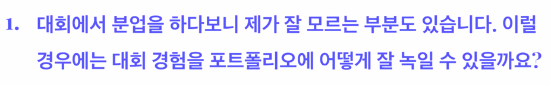
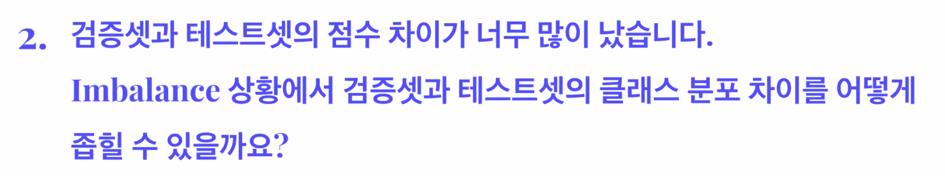
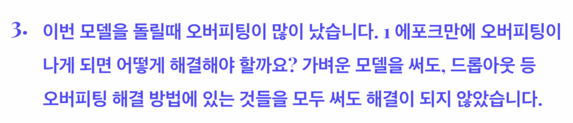
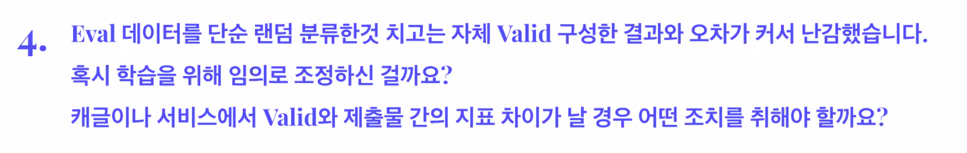
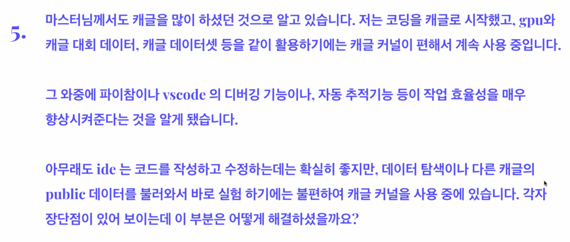
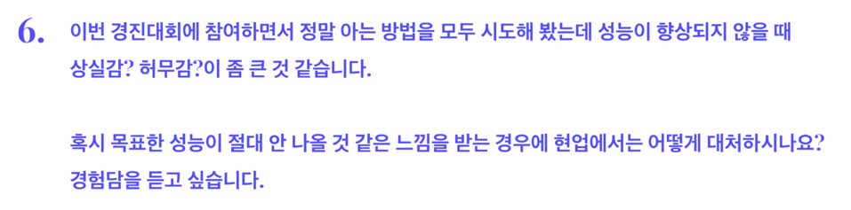
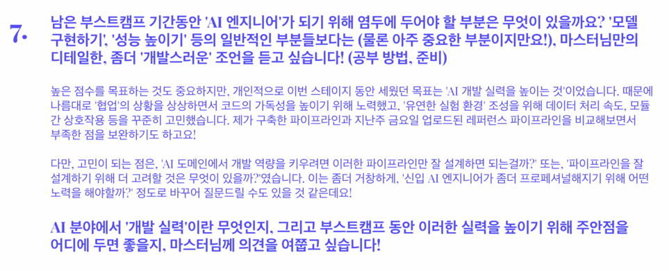

# [마스터클래스] 김태진 강사님

## 오재환

> 토론게시판 vote 수 가장 많이 받은 분

인간 지능

모든 이미지를 눈으로 확인해보자 라는 생각으로 진행

토론 게시판은 같이 공부하는 자리인 것 같아서 올렸던건데 도움이 되서 좋았다.

## 리더보드 솔루션

> 16조 SPAM 팀

잘못된 데이터를 찾는데 많은 시간을 투자

50대와 60대가 구별이 힘들다는 것을 깨닫고 여기가 점수의 갈림길이 될거라는 생각을 함

클래스 분포를 보고 딱 봐도 일정하지 않아서 이것을 해결하기 위해서 pytorch 에 있는 weighted random sampling 을 사용해서

최종적으로 균일하게 뽑아서 훈련시킬 수 있는 기능을 사용

augmentation 같은 경우에는 rand_augmentation 을 사용 필요없다고 생각한것들은 빼고 넣었고 cutout(size=100) 을 넣어줌

overfitting 을 감소시킬 수 있게 넣어줌

facenet 을 사용해서 crop 을 사용하지 않음

추가 데이터 사용을 고려했었는데 가지고 있는 데이터의 연령대에 비해서 나이가 드신분들이 많았어서 큰 효과를 보진 못함

모델은 ResNet18, 34, 50 을 사용해봤늗네 ResNet18이 가장 좋게 나옴

데이터셋이 적은편이고 분류문제가 크게 어려운 편이 아니기 때문에 너무 좋은 성능의 모델을 사용하면 overfitting 될 가능성이 커지면서

오히려 작은 모델을 쓰는게 낫다고 판단

작은 모델 중에 efficientnet-B0 를 사용해서 앙상블 함

loss 는 label_smoothing 을 사용함

optimizer 는 Adam

lr = 0.000006

모델은 각각의 항목에 대해서 3개의 모델을 만들었고 age, gender, mask 를 만들었고

age 에서 60대 이상의 데이터가 너무 적어서 분류하기 어려울거라고 생각

사진을 임베딩 시켜보자 임베딩 값의 가장 가까운 사람을 뽑아서 나이쪽에서 정확도가 오름

pseudo labeling 을 활용해서 성능이 오른 경험을 함

> 33조 BOOSTERSHOT

gender 와 mask 에 한해서는 성능이 잘나와서 age 에 초점을 맞춰서 모델링을 진행

train 과 valid 에 다른 사람이 들어가도록 csv 를 나눔

데이터셋에 age 클래스를 구분을 할 때

데이터에 60세 이상이 부족하다는 걸 감안해서 58세 이상을 60대 이상이라고 분류 

아시아인 데이터를 좀 더 활용

augmentation

vgg16, VIT 두개를 후보로 둠

VIT 는 vgg 보다는 약간 높게 나왔고 데이터가 많지 않아서 성능이 좋게 나오지 않음

최종적으로 resnet152 를 사용 vgg19 를 개선한 모델 답게 성능이 높게 나옴

어떤 loss 를 적용할 때 age 에만 label_smoothing 을 적용

middle 에만 smoothing 을 줄 수 있게끔 customizing 했음

semi-supervised learning 인 pseudo labeling 을 사용

마지막에 k-fold 랑 ensemble 을 사용하는 방법을 고려했지만 구현을 완료하지 못했고

k-fold 까지만 구현해서 진행했음

## 마스터 피드백 & 리뷰

1기와 다르게 2기에선 더 다양하고 다채로운 solution 이 나오고 있는 것 같다.

리더보드 관련 내용

마스크만 예측하는 모델은 DNN 으로도 잘 나옴

그래서 노이즈로 나이와 성별을 추가함

정답을 알지는 못하더라도 생각을 하게하자라는 취지로 시작

unbalance 할 때 어떻게 해결해야 할지?? 를 생각해보는 시간이었을 것

데이터셋의 신뢰도를 파악하는 것도 중요하다.

모델에 넣었을 때 사용이 가능한 품질인지를 판단해야함

1. 데이터가 문제가 있다라는 것을 인지하는게 첫번째다.

1, 2 등의 공통적인 부분이 모델을 3개로 나눴다!

모델을 나누는 접근 방법은 좋았지만 모델이 3개라고 하는게 부담이 될 수 있음

데이터를 확인하는 가장 좋은 방법은 데이터를 다 뜯어 보는 것이다.

이걸 토대로 데이터의 특징을 파악하는 것이 도움이 많이 된다.

pseudo labeling 을 썼는데 불편한 단점이 있다.

얘를 캐글에서도 많이 씀

그런데 허와 실을 알아야 함

테스트 데이터를 사용했음. 100% 좋은 방법이라고 보기에는 어렵다.

테스트 데이터를 최대한 쓰지 않는것이 중요

pseudo labeling의 가장 큰 장점은 label 되지 않은 데이터를 어떻게든 labeling 해서 feature 에 담을 수 있다라는 건데

훈련 결과로 만들어진 데이터고 label 의 정보량이 훈련데이터 이상으로 늘어나지 않는다는것이 가장 큰 단점이다.

실제로 위험한 방법이기도 함

표본이 작으면 test 를 어떻게 표현할 수 있을까? 라는 생각이 있음

현업에서는 앞으로 발생할 데이터가 test 이기 때문에 그것들을 사용하는 것 자체가 data leakage 라고 함

알고 쓰는 것이 선행되어야 한다는 것을 말씀드리고 싶었음

명확한 이해가 병행이 된다면 좋을 수 있음

사용하는 기법들의 허와 실을 명확하게 스터디를 하는 편이 나중에 가서 오류를 범하지 않을 수 있는 거라고 생각을 함

> 

기업이 원하는 걸 적으면 좋음

대기업은 이론을 보고 스타트업은 실무 기술을 봄

문제를 해결할 수 있다라는 것을 보여주는게 좋음

어떤걸 달성했다라는 것은 까보면 알게됨

나는 무엇을 할 수 있다라는 것을 명확하게 적는 것이 중요

간단하게만 요약해서 쓰고 링크를 걸어서 각 프로젝트마다의 ppt 를 만들어 놓음 (파이프라인 개요부터 ~ 결과 리포트까지)

문제 해결이 기업에서 가장 요구하는 것

> 

imbalance 를 좁히지 못한 것이 문제

결과 분석을 엄청 많이 할 것 같다.

어떤걸 맞추고 어떤걸 틀렸는지를 케이스 바이 케이스로 많이 볼 것 같음

data 도 좋은 quality 가 아니기 때문에 명확한 답을 줄수는 없지만 현업에서는 데이터를 더 보충하거나 함

이 문제에서는 모델을 여러개 만드는게 베스트

> 

전체적으로 학습률이 낮았기 때문인 것 같다.

학습률을 높이거나 augmentation 을 다양하게 해보는 것이 도움이 될 것 같다.

여러가지 경우 중 하나인데 코드가 잘 못 되었을 가능성이 있음

> 

made in china 라서 그런 경우가 있었을 것 같고

실제로 현업에서는 간단한 모델을 쓰는게 좋고 garbage in garbage out 이 명확함

다른 데이터를 찾거나 많이 함

> 

IDE 는 되게 빠르게 실험이 가능하다라는 장점

노트북은 메모리에 데이터를 올려놔서 여러가지 테스트를 할 수 있다는 장점

나중에 할 때는 다양하게 여러개를 활용할 수 있는게 좋음

실험을 많이해야하는데 노트북으로 하게되면 어려움이 있을 수 있음

본인만의 template 을 만드는 것을 추천

> 

현업에서는 돈을 쓸 수 있기 때문에 돈을 더 많이 써서 고칠 수 있음

데이터 품질이 문제 일수도 있지만 코딩의 문제 일 수 있>

> 

개발을 잘하고 못하고의 차이가 시험에 나올 것만 공부하는 사람과 시험에 안나오더라도 내가 궁금하면 사람의 차이가 있다고 생각함

누군가가 하는 거에 관심이 있고 해보는거가 개발에 도움이 됨

이쁘게 짠 코드를 내가 닮고 싶다라는 생각이 중요

스스로에게 많이 물어봤으면 좋겠음 스스로가 원하는 방식을 고집하는게 가장 좋은 방식이다.

되고 싶은 하나의 스타일을 명확하게 정해서 여러가지를 해보는게 중요

이것도 해보고 저것도 해보고 매력을 느끼게 되고 실제로 그렇게 해왔음

## 캠퍼분들에게 마지막으로 꼭 하고 싶은 이야기가 있다면?

우리가 공부하는 목적은 사실은 취업이다.

취업이라는 것은 기업에 돈을 벌어주는 것인데 

돈을 벌어다 주기 위해서 우리에게 요구하는 것은 문제를 해결하는 것이다.

기업에서는 문제를 해결해줄 사람을 뽑고 그런 사람이 필요하다

그런 과정에서 문제를 해결할 수 만 있으면 된다.

나는 어떤것을 해결할 수 있다라는 것을 보여주면 됨

데이터 분석이나 데이터 엔지니어링이나 자신이 주인이 되었으면 좋겠음

자신이 주인된다는 말은?

질문할 때 눈치를 보고 자기가 마음에 들고 분석을 하는데 있어서 그것을 배웠다는 생각이 들면

그것의 정도는 중요하지 않음

점수를 올리는 것보다 문제를 해결하는 것이고 문제를 해결하는 하나의 솔루션을 공부하는 것은

공유하면서도 할 수 있고 자기만의 해결방법을 찾는 능력을 쌓을 수 있음

스스로가 만들어내는 것에 집중을 하고 공부를 하는데 너무 상실감이 들고 허무하고 이런 경우라면

공부하는 목적을 자기를 위해서 자기가 공부했던 이해했던 그것을 검증하는 방향으로 공부를 하시는게 

더 좋다고 생각

누군가가 했던 길만 따라가는게 아니라 자기가 생각했던 것을 뱉는 그런것을 하는 것

공유 문화를 만들기 위해서 굉장히 많은 노력을 하고 있으므로 

점수 그 이상의 것들을 목표로 삼아서 자신의 성장을 최우선으로 생각해서 자기가 이루고자 하는 목표를

이루었으면 좋겠음

