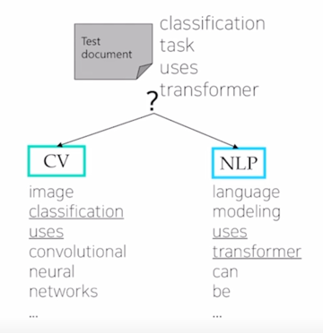
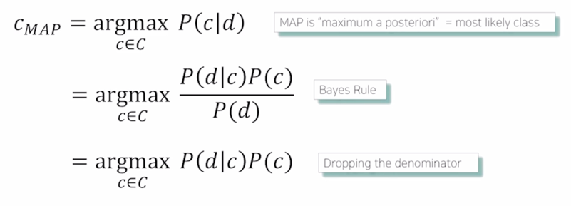
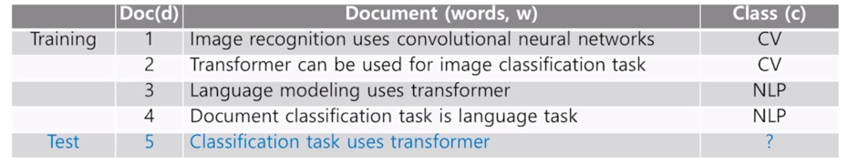
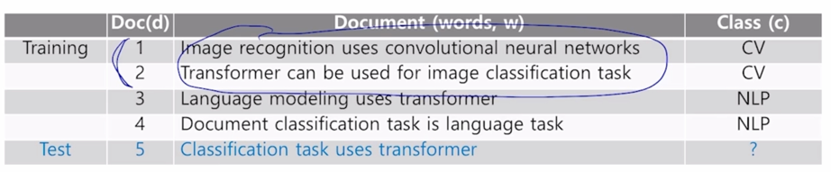
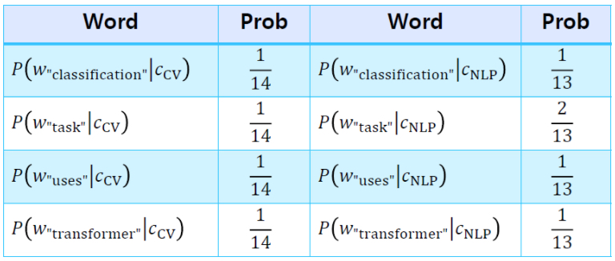

# Intro to NLP, Bag-of-Words

## Goal of This Course

- Natural language processing (NLP), which aims at properly understanding and generating human languages, 
emerges as a crucial application of artificial intelligence, with the advancements of deep neural networks.
- This course will cover various deep learning approaches as well as their applications such as language modeling,
machine tranlation, question answering, document classification, and dialog systems.

## 1. Intro to NLP

### Academic Disciplines related to NLP - NLP 와 관련된 학문 분야

- Natural language processing (major conferences: ACL, EMNLP, NAACL)
  - Include state-of-the-art learning-based models and tasks
  - Low-level parsing
    - Tokenization, stemming
    - 각 단어를 준비하기 위한 의미단위로 볼 때 가장 los-level task 라고 할 수 있음
  - Word and phrase level
    - Named entity recognition(NER), part-of-speech(POS) tagging, noun-phrase chunking,
    dependency parsing, coreference resolution
    - NER : New York Times 같은 경우 세 단어를 개별적으로 해석하면 안되고 이를 하나의 고유명사로서 인식해야 함
    - POS tagging : word 들이 문장 내에서 품사 성분이 무엇인지를 알아내는 task
  - Sentence level
    - Sentiment analysis, machine translation
  - Multi-sentence and paragraph level
    - Entailment prediction, question answering, dialog systems, summarization
    - Entailment prediction : 두 문장간의 논리적인 내포 또는 모순 관계를 예측
    - question answering : 질문에 있는 키워드들이 포함된 문서들을 검색을 하고 그 문서로부터 독해를 통해 주어진 질문에 대한
    정답을 알아내서 사용자에게 직접적으로 전달하는 시스템

### Text mining(major conferences: KDD, The WebConf (formely, WWW), WSDM, CIKM, ICWSM)
- 소위 빅데이터 분석과 많이 관련되어 있음
- Extract useful information and insights from text and document data
  - e.g., analyzing t he trends of AI-related keywords from massive news data
- Document clustering (e.g., topic modeling) - 문서 군집화
  - e.g., clustering news data and grouping into different subjects
- Highly related to computational social science
  - e.g., analyzing the evolution of people's political tendency based on social media data

### Information retrieval (major conferences: SIGIR, WSDM, CIKM, RecSys)
- 정보검색 분야
- 상대적으로 발전속도가 느림 (왜? 이미 많이 발전되어 있음)
- 추천시스템은 활발히 발전 중
- Highly related to computational social science
  - This area is not actively studied now
  - It has evolved into a recommendation system, which is still an active area of research

### Trends of NLP

- Text data can basically be viewed as a sequence of words, and 
each word can be represented as a vector
through a technique such as Word2Vec or Glove.
- RNN-family models (LSTMs and GRUs), which take the sequence of these vectors of words as input, 
are the main architecture of NLP tasks.
- Overall performance of NLP tasks has been improved since attention modules and Transformer models,
which replaced RNNs with self-attention, have been introduced a few years ago.
- As is the case for Transformer models, most of the advanced NLP  models have been originally developed
for improving machine tranlation tasks.

- 자연어처리 분야는 컴퓨터비전 혹은 영상처리 분야와 더불어 인공지능과 딥러닝 기술이 가장 활발히 적용되고 발전하는 분야라 할 수 있음
- 2~3년 전까지만 해도 새로운 구조의 convolution 과 GAN 으로 훨씬 더 빠르게 발전하고 있었음
- 이에비해 자연어처리 분야는 조금은 느리지만 꾸준히 발전해오고 있음
- 이러한 과정에서 대부분의 머신러닝 딥러닝 기술은 일반적으로 숫자로 이루어진 데이터를 입력과 출력의 형태로 필요로 하기 때문에
자연어처리 문제에 이러한 기술을 이용하기 위해서는 
주어진 텍스트 데이터를 보통 단어 단위로 분리하고 각 단어를 특정한 dimension(차원)으로 이루어진 벡터로 표현하는 고정을 거치게 됨
- 이를 우리는 word 를 벡터공간의 한 점으로 나타낸다는 그러한 뜻에서 워드임베딩이라고 부르게 됩니다.
- 가령 I love this movie 라는 문장이 주어진 경우에 이 문장내의 각 word 를 벡터로 나타내면 이 문장은 word 벡터들이 특정한 순서로 주어지는
하나의 sequence 로 볼 수 있음
- 이 sequence 는 당연히 순서 정보를 포함하기 때문에 this movie love I 라는 문장의 경우는 같은 단어들이 순서를 달리한 sequence 이기 때문에
그 뜻이 다르다는 것을 자연어처리 모델이 인식할 수 있어야함
- 이러한 sequence 데이터를 처리하는데에 특화된 모델 구조로서 Recurent Neural Network 혹은 RNN 이라고 하는 딥러닝 모델이 자연어처리 모델의 핵심
모델로 자리잡게 됨
- 이러한 RNN 모델의 계열중에서 Long short term memory (LSTM) 그리고 LSTM 을 단순화해서 계산 속도를 빠르게한 Gated recurent Unit (GRU) 등이 많이 사용됨
- 그러다가 Attention is all you need 라는 논문이 나오면서 기존의 RNN 기반의 자연어처리 모델 구조를 소위 self-attention 이라는 모듈로 완전히 대쳏할 수 있는
Transformer 라는 새로운 모델이 나오게 됨
- 자연어처리 분야에서 Transformer 모델은 큰 성능 향상을 가져오게 됨
- 대부분의 자연어처리 모델은 Transformer 모델을 기본구조로 하고 있음
- Transformer 모델은 원래는 기계번역 Task 를 위한 모델로 제안되었음
- 참고로 기계번역은 자연어처리 분야에서 지난 십수년간 딥러닝 기술뿐만 아니라 다양한 기술을 통해 연구자들이 성능향상을 위해서 노력하던 분야였음
- 이 Task 에서 딥러닝이 나오기 이전 시대에서는 언어간의 문장구조나 어순을 일일히 전문가가 고려해서 Rule 기반으로 번역을 수행하는 기법들이 많이 존재했음
- 가령 I love this movie 라는 문장에서 주어 동사 목적어 순서로 이루어져 있는 영어의 어순을 한글 문장으로 번역하기 위해서 
- 먼저 단어별로 번역을 수행한 후 한글의 문법을 고려해서 나는 영화를 사랑한 라는 것으로 번역하는 것처럼 이러한 각 언어별로의 문법과 여러 언어적인 지식을 활용해서
- 그 알고리즘을 구성하였음
- 그렇지만 이러한 Rule 기반의 방식은 너무나 많은 예외상황과 언어의 다양한 사용패턴을 일일히 대응하는 것이 불가능했고 그냥 영어 및 번역된 한글문장 쌍을 모아서
- 이를 학습데이터로 사용해서 특별한 언어학적인 룰을 사용하지 않는 단지 sequence 데이터를 잘 처리할 수 있는 RNN 기반의 딥러닝 모델을 학습하여 기계번역을 수행하였더니
- 번역성능이 월등히 좋아진 결과를 낳게 되었음
- 실제 우리가 보는 Google Trnaslate, Naver papago 등의 상용화된 서비스를 가능케 한 기술이 딥러닝 기반한 번역기술임

- In the early days, customized models for different NLP tasks had developed separatedly.
- Since Transformer was introduced, huge models were relased by stacking its basic module, self-attention, 
and these models are trained with large-sized datasets through language modeling tasks, one of the 
self-supervised training setting that does not require additional labels
for a particular task.
  - e.g., BERT, GPT-3 ...
- Afterwards, above models were applied to other tasks through transfer learning.
and they outperformed all other customized models in each task.
- Currently, these models has now become essential part in numerous NLP tasks, 
so NLP research become difficult with limited GPU resources, since they are too large to train.

## 2. Bag-of-Words

### Bag-of-Words Representation

- Step 1. Constructing the vocabulary containing unique words
  - Example sentences: "John really really loves this movie", "Jane really likes this song"
  - Vocabulary: {"John", "really", "loves", "this", "movie", "Jane", "likes", "song"}

- 텍스트에서 unique 한 단어들을 모아서 사전을 구축
- 중복된 단어를 제거하고 최종 적으로 사전에는 8개의 단어가 등록

- Step 2. Encoding unique words to one-hot vectors
  - Vocabulary: {"John", "really", "loves", "this", "movie", "Jane", "likes", "song"}
    - John: [1 0 0 0 0 0 0 0]
    - really: [0 1 0 0 0 0 0 0]
    - loves: [0 0 1 0 0 0 0 0]
    - this: [0 0 0 1 0 0 0 0]
    - movie: [0 0 0 0 1 0 0 0]
    - Jane: [0 0 0 0 0 1 0 0]
    - likes: [0 0 0 0 0 0 1 0]
    - song: [0 0 0 0 0 0 0 1]
  - For any pair of words, the distance is 
  - For any pair of words, cosine similarity is 0

- 단어의 의미에 상관이 없이 모두가 동일한 관계를 가지는 형태로 단어의 벡터 표현력을 설정하는 것임

- A sentence/document can be represented as the sum of one-hot vectors
  - Sentence 1: "John really really loves this movie"
    - John + really + really + loves + this + movie: [1 2 1 1 1 0 0 0]
  - Sentence 2: "Jane really likes this song"
    - Jane + really + likes + this + song: [0 1 0 1 0 1 1 1]

- 이를 bag-of-words vector 라고 부름
- 이유는?
  - vocabulary 상에서 존재하는 각 word 별로 어떤 가방을 준비하고 특정 문장에서 나타나는 word 들을 순차적으로 그에 해당하는
  가방에 넣어준 후 최종적으로 각 차원에 해당하는 가방에 들어간 word 들의 수를 count 해서 최종 벡터로 나타낸 것으로 생각할 수 있기 때문
  
### NaiveBayes Classifier for Document Classification

- **Bag-of-Words for Document Classification**

  

- **Bayes'Rule Applied to Document and Classes**
  - For a document d and a class c

  

- 먼저 문서가 분류될 수 있는 카테고리 혹은 class 가 총 C 개가 있다고 생각하겠음
- 가령 주어진 문서를 정치, 경제, 문화, 스포츠 4개 중에 하나로 분류하는 경우에 C 는 4가 되겠고
- 수학적으로 볼 때 특정한 문서 d 가 주어져 있을 때, 그 문서가 C 개의 각각의 클래스에 속할 확률분포는 
-  의 형태로 표현될 수 있고
- 이러한 조건부 확률분포는 우리가 가장 높은 확률을 가지는 클래스 c 를 택하는 방식을 통해서 문서분류를 수행할 수 있음
- 이러한 방식은 `maximum a posteriori` 라는 용어로 불리게 됨
- 로 나타내어질 수 있음
- 여기서  는 어떤 특정한 문서 d 가 뽑힐 확률을 의미
- d 라는 문서가 어떤 하나의 고정된 문서라고 볼 수 있기 때문에  를
상수값으로 볼 수 있고 이 값은  operation 상에서
무시할 수 있게 됨
- 따라서 마지막으로  라는 수식으로 
도출 될 수 있음

- Bayes' Rule Applied to Documents and Classes
  - For a document d, which consists of a sequence of words w,
  and a class c
  - The probability of a document can be represented by multiplying the probability of each word appearing
  -  P(c)\product_{w_i \in W}P(w_i|c)"> (by conditional independence assumption)
  
- 이 때,  이 부분은 특정 카테고리 c 가 고정이 되어 있을 때,
문서 d 가 나타날 확률을 의미
- 문서 d 는 첫번째 word 인 w_1 에서부터 마지막 word 인 w_n 까지 어떤 동시에 나타나는 동시사건
 으로 볼 수 있음
- 각 단어가 등장할 확률이 c 가 고정되어 있는 경우 서로 독립이라고 가정할 수 있다면 각 단어가 나타낼 수 있는 확률을 모두 곱한 형태로 나타낼 수 있음

- 우리는 여기서  문서가 주어지기 전에 각 클래스가 나타날 확률과
특정 클래스가 고정되어 있을 때 각각의 word 가 나타날 확률들을 추정함으로써 Naive bayes classifier 에서 필요로 하는 파라미터를 모두 추정할 수 있게 됨

- Example
  - For a document d, which consists of sequence of words w, 
  and a class c
  
  

- 
- 

- 처음 2개는 CV 로, 나머지 2개는 NLP 로 분류되어 있다고 가정해보자
- 이 상황에서 테스트 데이터 아이템으로 주어지는 "Classification task uses transformer" 이 마지막 문장을 이 두개의 클래스 중에 하나로 분류하는 예를 생각해보자
- 이 예에서 학습데이터의 개수 총 4개 중에서 CV 가 2개 NLP 가 2개가 주어져있기 때문에 어떤 문서가 주어지기 이전에 각 클래스가 등장할 것이라고 생각할 수 있는
확률은 각각 전체 document 4개 중 각 클래스의 문서가 나타난 그 비율인 2/4 가 확률값이라고 생각할 수 있음

- Example
  - For each word , we can calculate conditional probability for class c
    - , 
    where  is occurrences of 
     in documents of topic 
    
  
  

- 클래스가 둘 중에 한 클래스로 고정되어 있을 때 각 단어가 나타날 확률을 추정해보겠음
- 가령 클래스가 CV 로 고정되어 있는 경우에 
- task 라는 단어가 나타날 확률을 추정하기 위해서는 CV 카테고리에서 발견된 학습데이터 그리고 거기에 포함된 총 단어개수 즉 14개의 단어가 여기에는 존재하고
이 중에서 task 라는 단어는 단 1번만 등장했기 때문에 1/14 라는 확률로서 이 값을 추정할 수 있게 됨

  

- 마찬 가지로 NLP 클래스의 경우에 이 해당하는 학습데이터 총 10개의 단어들 중 task 가 2번 등장하기 때문에 2/10 라는 값으로 확률값을 추정할 수 있게됨

- For a test document  = "Classification task uses transformer"
  - We calculate the conditional probability of the document for each class
  - We can choose a class that has the highest probability for the document
  - 
  - 
  
  

- 최종적으로 계산된 이 확률값 2개를 저희는 어느 확률값이 가장 큰지를 계산하고 가장 큰 확률값을 가지는 클래스로 최종적인 분류 예측값을 내어주게 됨
- 이러한 방식이 Naive bayes Classifier 가 동작하는 방식
- Naive bayes Classifier 는 클래스 개수가 3개 이상일 때에도 같은 방식으로 확장 될 수 있음
- 또한 특정 클래스 내에서 학습데이터내에 어떤 특정한 단어가 발견되지 않았을 경우에 그 해당하는 단어가 나타날 확률은 0으로 추정이 될 것이고
- 이 경우에 그 단어가 포함된 문장이 주어진 경우에는 그 클래스가 될 확률값은 무조건 0으로 계산되어질 것이기 때문에 다른 단어들이 아무리 해당 클래스와 밀접한
관계가 있었다고 하더라도 절대 그 클래스로 분류되는 것이 불가능해지게 됨
- 이러한 것을 해결하기 위해서 추가적인 regularization 기법들이 추가되어서 학습되기도 함
- 또한 Naive bayes classifier 에 필요로 하는 ,
 특정 클래스가 고정되었을 때 각각의 단어가 나타나는 확률값들을
이러한 파라메터들을 추정하는 과정을 직관적인 형태로 설명드렸습니다만 이러한 파라메터 추정방식은 maximum likelyhood estimation(MLE) 라고 불리는 이론적으로 탄탄한
수식에 의해서 도출이 되게되고 추가적으로 깊이있게 공부를 하실분들은 인터넷에서 관련자료를 찾아보고 공부하는 것도 좋을 것 같음

  

  
  
  
  
  
  
  
  
  
  
  
  
  
  
  
  
  
  