# Word Embedding

## 3. Word Embedding: Word2Vec, GloVe

### What is Word Embedding?

- Express a word as a vector
- 'cat' and 'kitty' are similar words, so they have similar vector representations -> short distance
- 'hamburger' is not similar with 'cat' or 'kitty', so they have different vector representations -> far distance

- 자연어가 단어들을 정보의 기본단위로 해서 이런 단어들의 sequence 라고 볼 때에, 각 단어들을 특정한 차원으로 이루어진 공간상의 한 점 혹은 그 점의 좌표로 나타내는
벡터로 변환해주는 기법이 word embedding 이라는 기술임
- word embedding 은 그 자체가 machine learning 혹은 deep learning 기술로서 어떤 텍스트데이터셋을 학습데이터로 주고 좌표공간의 차원수 혹은 dimension 의 수를
사전에 미리 정의해서 입력으로 word embedding 알고리즘에 주면 그 이후에 word embedding 학습이 완료된 이후 그 해당하는 좌표공간상에서 학습데이터상에서 나타난
각각의 단어에 대한 최적의 좌표값 혹은 그에 해당하는 벡터 표현형을 출력으로 내어주게 됨
- word embedding 의 기본 아이디어는 비슷한 의미를 가지는 단어가 좌표공간상에 비슷한 위치의 점으로 mapping 되게 함으로써 단어의 의미의 유사도를 잘 반영한
벡터 표현을 이 다양한 자연어처리 알고리즘에게 제공해주는 역할을 하게 됨
- word embedding 을 통해서 이렇게 의미를 잘 반영한 벡터를 학습해두면 이를 입력으로 받아서 다양한 자연어처리 task 를 수행할 때,
보다 쉽게 성능을 올릴수 있는 여건을 제공하게 됨

### Word2Vec

- An algorithm for training vector representation of a word from context words (adjacent words)
- Assumption: words in similar context will have similar meanings
- e.g.,
  - The cat purrs.
  - This cat hunts mice.

  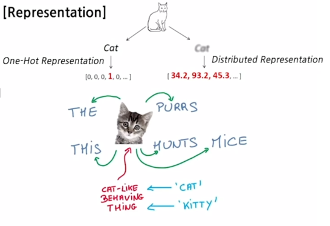

- 같은 문장에서 나타나는 인접한 단어들간의 의미가 비슷할 거라는 가정을 사용
  - The cat purrs.
  - This cat hunts mice.
- 이 두 문장에서 cat 이라는 단어를 중심으로 앞 과 뒤쪽에 나타나는 The 와 This 그리고 purrs 와 hunts mice 등의 단어들이 이 cat 이라는 단어와 
특정한 의미적으로 관련성이 높은 것으로 생각할 수 있음
- The 와 This 의 경우는 cat 을 꾸며주는 단어로서의 관계가 존재하고, purrs 나 hunts 는 cat 이 할만한 행동이라는 관계를 mapping 하고 있고,
mice 라는 것은 cat 이 hunts 라는 행동을 할 때 그 대상으로서 cat 과 관계를 가지는 그런 단어라는 것을 알 수 있음

#### Idea of Word2Vec

- "You shall know a word by the company it keeps" - J.R. Firth 1957
- Suppose we read the word "cat"
  - What is the probability P(w|cat) that we'll read the word w nearby?
  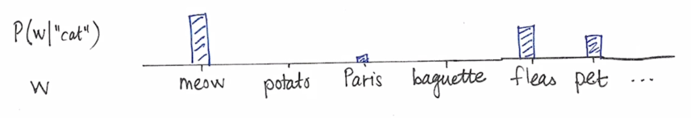
- Distributional Hypothesis: The meaning of "cat" is captured by the probability distribution P(w|cat)

- Word2Vec 에서는 한 단어가 주변의 등장하는 단어들을 통해 그 의미를 알 수 있다는 그런 사실에 착안하게 되고 주어진 학습데이터를 바탕으로
cat 주변에 나타나는 그런 단어들의 확률분포를 예측하게 됨
- 보다 구체적으로는 cat 단어를 주고 주변단어를 숨긴채 이를 예측하도록 하는 방식으로 Word2Vec 모델의 학습이 진행되게 됨
- 그림에서 보듯 cat 이라는 단어가 나오면 그 주변에 나타나는 단어들 중 meow 라는 단어가 높은 단어를 가지고 Fleas, pet 이라는 단어도 높은 확률을 가진다는 것을
Word2Vec 이 학습하게 됨

#### How Word2Vec Algorithm Works

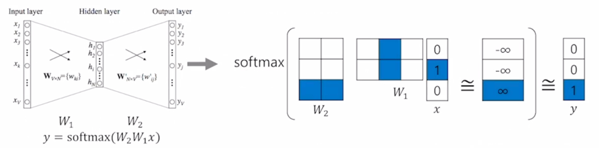

- Sentence: "I study math."
- Vocabulary: {"I", "study", "math"}
- Input: "study" [0, 1, 0]
- Output: "math" [0, 0, 1]
- Columns of , and rows of 
 represent each word
- E.g., 'study' vector:  column in 
, 'math' vector: 
 row in .
- The 'study' vector in  and the 'math' vector in 
 should have a high inner-product value.

- 먼저 주어진 학습데이터가 I study math 라는 단 하나의 문장으로 구성되어진 상황을 가정해보자
- Word2Vec 에서는 주어진 학습데이터를 Word 별로 분리하는 Tokenization 과정을 수행하고 Unique 한 단어들만을 모아서 사전을 구축하게 됨
- 각 사전의 단어는 Vocabulary 사이즈 혹은 사전의 사이즈만큼의 dimension 을 가지는 one-hot vector 의 형태로 나타내어지게 됨
- 그 다음에는 sliding window 라는 기법을 적용해서 어떤 한 단어를 중심으로 앞뒤로 나타나는 word 각각과 그 입출력 단어쌍을 구성하게 됨
- 가령 여기서 window 사이즈가 3인 경우 앞 뒤로 한 단어씩만 보는 이런 상황에서는 I 라는 단어를 중심단어라고 했을 때,
앞 뒤로 window를 적용해서 나타나는 단어 즉 왼쪽에는 아무 단어도 없고 오른쪽에는 study 라는 단어가 존재
  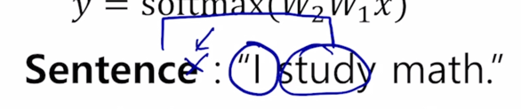
- 여기서 우리는 (I, study) 라는 입력 및 출력 단어 쌍을 구성할 수 있게 됨
- window 를 한단어 옮기면 중심단어는 study 가 되고 왼쪽에는 I 오른쪽에는 math 라는 단어가 발견되기 때문에 (study, I), (study, math) 라는 입출력 단어쌍을 얻게 됨
- 이러한 방식으로 주어진 학습데이터에 대해서 각 문장별로 이런 sliding window 를 적용하고 거기서의 어떤 중심단어와 주변단어 각각을 단어 쌍으로 구성함으로써 
저희는 Word2Vec 의 학습데이터를 구성할 수 있게 됨
- 이렇게 만들어진 많은 입출력 단어쌍들에 대해 예측 task 를 수행하는 2 layer 짜리의 neural network 을 만들게 됨
- 구체적으로는 혀재 각 단어가 vocabulary 사이즈 만큼의 해당하는 3차원의 one-hot vector로 나타나기 때문에 입력과 출력 layer 의 node 수는 3개가 되고,
이 두 입출력이 각각의 입력 및 출 단어의 행당하고 가운데에 있는 hidden layer 의 node 수는 사용자가 정하는 하이퍼 파라미터로서 word embedding 을 수행하는 좌표공간의
차원수와 동일한 값으로 설정하게 
  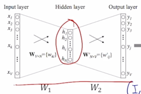

- 여기 예제에서는 embedding dimension 을 2로 세팅하게 되면 입력 노드는 3차원 출력노드도 역시 3차원으로 구성되고 hidden layer 의 node 수가 2차원으로 구성됨
  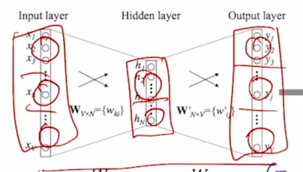

- (study, math) 라는 단어 쌍을 예로 들어서 학습과정을 살펴보자
- 먼저, study 라는 단어는 해당하는 dimension 이 1인 형태의 one-hot vector 로 나타내어지게 되고
  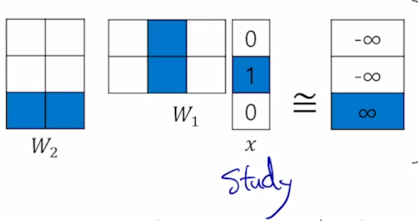
- 그 다음엔, 첫번째 layer 에 존재하는 linear transformation matrix 
그 linear transformation matrix 는 3차원 vector 를 받아서 2차원의 출력 vector 를 내어주기 때문에 그 행렬의 사이즈는 2 x 3 이라고 생각할 수 있음
  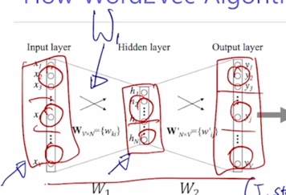
  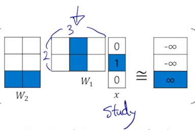
- 그 다음엔, 2차원 vector 가 출력 node 에 해당하는 3차원 vector 로 변환되기 위해서 두 번째로 존재하는  혹은
두번째 layer 의 선형 결합에 해당하는 matrix 를 곱함으로써 다시금 3차원 vector 로 변환되고 거기서 쓰이는  matrix 의 사이즈는
역시 또 3 x 2 라는 matrix 사이즈를 가지게 되는 것을 알 수 있음
  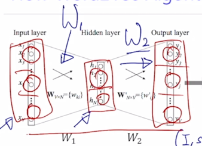
  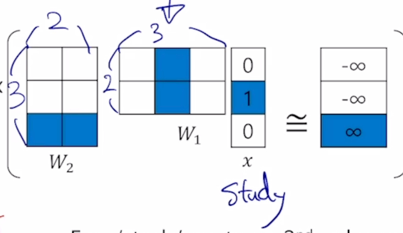

- 그 이후에는 non-linear unit 중 하나인 softmax layer 를 통과시켜 줌으로써 이 3차원 vector 가 어떤 특정한 확률분포 값을 나타내도록 바꿔주게 됨
- 그렇게 변환된 3차원의 확률분포는 ground-truth output 단어로써 주어진 math 라는 단어 그리고 그에 해당하는 one-hot vector 가 우리의 target label 이라고 볼 때,
target label 에 해당하는 one-hot vector 는 바로 확률분포의 관점에서 바로 첫번째 두번째 단어는 0% 그리고 math 에 해당하는 ground-truth 단어에 해당하는 확률이 100%로 할당된
그러한 label 이 주어진 것을 알 수 있음
  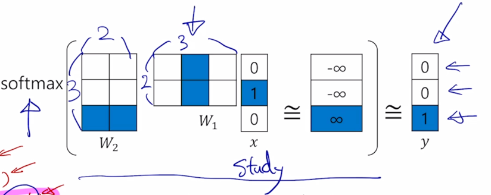

- 그러면 softmax 를 통과시켜서 나온 그 확률분포벡터와 ground_truth 로 주어지는 math 의 100% 확률을 부여한 가장 이상적인 확률분포와의 거리가 최대한 가까워지게 하는
softmax loss 를 적용함으로써 이 neural network 에 있는 , 
 이 2개의 matrix 학습을 진행하게 됨

- 행렬곱에서 일어나는 연산을 좀 더 자세히 살펴보면
- study 에 해당하는 one-hot vector 와  행렬이 곱해지는 경우에는
2번의 내적을 수행하는 것을 알 수 있음
  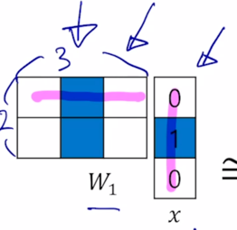
- 그러면 one-hot vector 특성상 하나의 값만 1이고 나머지는 모두 0이라는 사실 때문에, 첫번째 row vector 에서 one-hot vector 에 해당하는 그 자리의 값만을 추출하는 
그런 연산이 이루어지는 것을 알 수 있음
  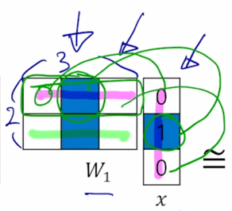

- 결국  과 x (one-hot vector) 를 곱할 땐,
one-hot vector 자리 위치에 해당하는 column vector 를 뽑아오는 과정으로 해석할 수 있음
- 딥러닝 프로그래밍을 할 때에도 one-hot vector 와 첫번째 선형변환 matrix 가 곱해지는 과정은 embedding layer 라고 부르,
이 과정에서는 실제로 행렬곱을 수행하지 않고 one-hot vector 에서의 1에 해당하는 index 그리고 index 자리에 있는 column vector 를 
선형결합 행렬에서 뽑아오는 식으로 행렬곱을 계산하게 됨
- 이 과정은  이라는 matrix 가 총 vocabulary 사이즈 만큼의
columns vector 를 가지고 있을 때 해당하는 입력 word 에 2 dimensional column vector 를 뽑아온 것으로 생각할 수 있음
- 그 다음에 곱해지는  행렬과의 연산을 살펴보면
2 dimensional vector 가  에서 뽑혀왔을 때,
그 벡터와 2번째 행렬인  에서의 각각의 row vector 와의 내적을 통해서
그 값들이 구해진다는 것을 알 수 있음
- 그리고  에서는 row vector 의 수가 vocabulary 의 단어 수만큼 존재하고
그 차원도 역시  에서 뽑힌 columns vector 와 내적이 성립해야하기 때문에 이 dimension 이
동일하게 2라는 것을 알 수 있음
- 이렇게 구해진 이  에서의 각각 row vector 와의 내적값이 이러한 
별표로 이루어진 3차원 vector 로 나타났다고 했을 때,
  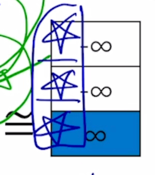
- 여기서 softmax 를 통과해서 나오는 확률분포가 ground-truth word 인 math 자리에 100% 확률이 모두 부여된 ground-truth label 과 최대한 가깝도록 혹은
최대한 유사하게 이 별표에 해당하는 내적값들이 나오려면 이상적으로는 softamx 에 입력으로 들어가는 logit 값의 측면에서 볼 때는 ground-truth 에 해당하는 이 logit 값은
+ 이고, 다른 단어들에 해당하는 다른 단어값은 모두 
 로 나왔을 때 softmax 의 결과가 ground-truth 값과 최대한
가까워지는 것을 알 수 있음
  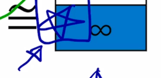

- 이 상황에서 여기에서 이루어진 내적연산을 벡터들간의 유사도를 나타내는 과정으로 생각한다면 주어진 입력단어의  상에서의 vector 와
주어진 출력단어의  상에서의 vector 간의 내적의 기반한 유사도가
최대한 커지도록 하고 동시에 주어진 출력단어가 아닌 다른 단어들에  상에서의 vector 들의 내적에 기반한 유사도는
최대한 작게 만들도록 입력단어로서의 word embedding 과 출력단어로서의 word embedding 즉  과 
 에 속하는 파라메터들을 이러한 방식으로 조금씩 조정해가며 학습을 진행하는 것이
Word2Vec 의 핵심이라고 할 수 있음
  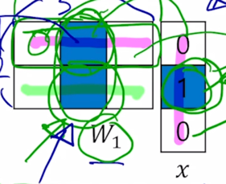

#### Another Example

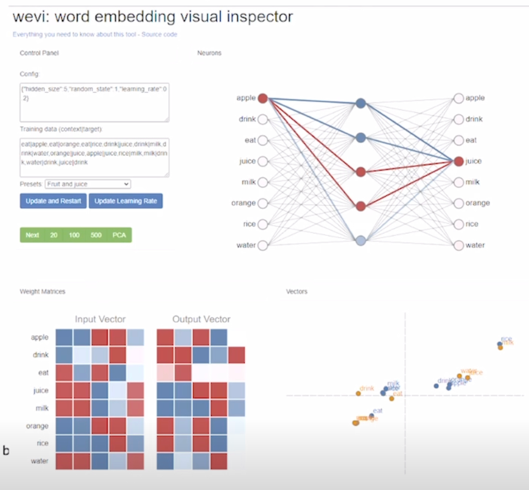

- https://ronxin.github.io/wevi/
- A vector representation of 'eat' in  has similar 
patttern with vectors of 'apple', 'orange', and 'rice' in 
- When the input is 'eat', the model can predict 'apple', 'orange', or 'rice' for output, because the vectors have high inner 
product values

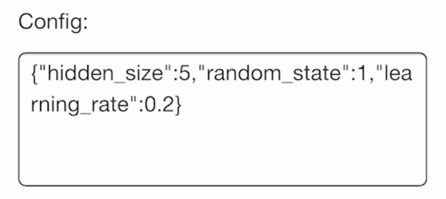

- Word2Vec 을 구동하기 위한 하이퍼파라메터

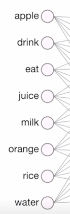

- input layer 는 8개의 node 로 구성된 것을 볼 수 있음

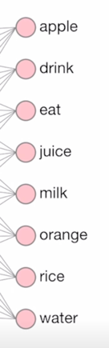

- 출력 node 도 8개로 이루어져 있음

- hidden layer 는 설정한 것처럼 5개로 구성되어 있음

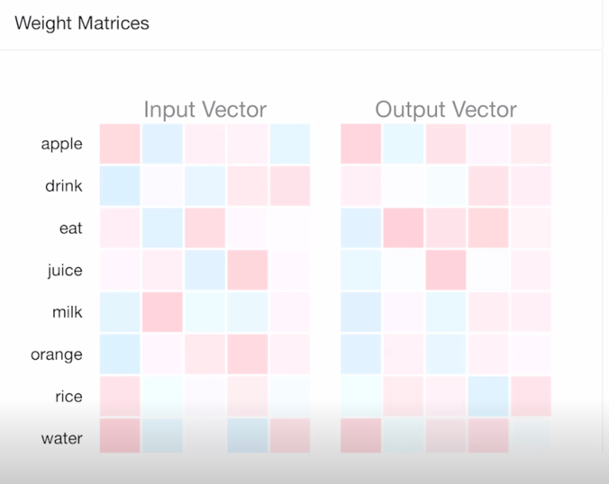

- 왼쪽 아래에는 앞서 말씀드린 두 layer 의 선형결합 행렬  과 
 matrix 를 시각적으로 보여주고 있음
-  은 행렬을 대각선으로 대칭이동을 해서 즉 행렬의 transpose 연산을수행해서  와 사이즈가 같도록 나타냈고 푸른색은 음수,
  붉은색은 양수를 나타내고, 현재는 random initialize 된 결과를 보여주고 있음

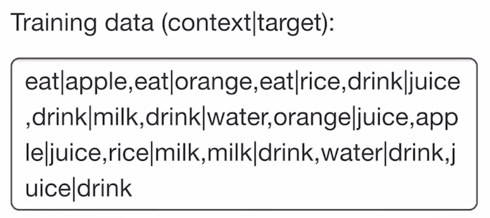

- 첫번째 data item 즉, 여기서 주어진 train data 는 eat|apple, eat|orange 등 다양한 입출력 단어들로 구성되어 있는데,
-  에서 apple 에 해당하는 그 vector 와
   에서의 eat 라는 단어 이 둘 간의 내적값이 최대한 커지도록 학습이 진행되게 됨

- 이렇게 학습데이터를 계속적으로 gradient descent 를 통해서 학습을 진행하게 되면 모델이 수렵하게 됨
- 반복적으로 학습을 진행 후 입력 및 출력 word 들의 학습된 vector 들을 살펴보면  

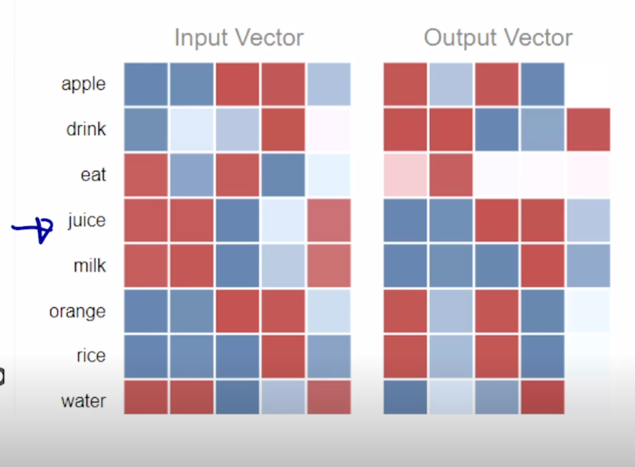

- juice 라고 주어진 word embedding vector 와 이와 같이 많이 등장한 단어인 drink 는 유사한 vector 표현형을 가지는 것을 알 수 있음

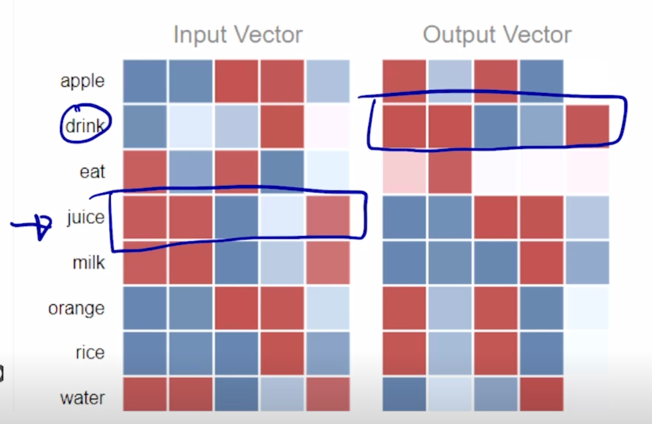

- 따라서 이 둘간의 내적값이 커질수가 있음
- 또한, drink 와 동시에 같이 등장하는 또다른 입력단어인 milk 라던가 water 의 경우에도 vector 들간의 굉장히 유사한 패턴을 가지는 것을 알 수 있음
- 또한, eat 이라는 출력단어와 함께 등장한 apple, orange 이 두개의 단어들 간에도 vector 표현형이 굉장히 유사한 것을 알 수 있음

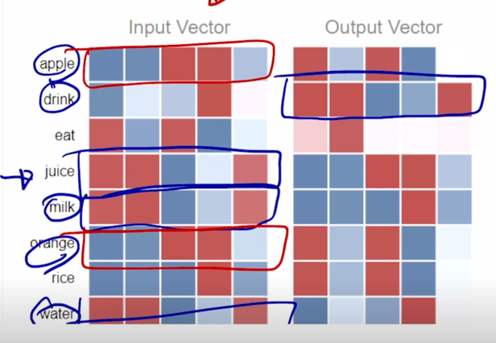

- 이 2개의 어떤 입력단어 version, 출력단어 version 의 word embedding 이 얻어진 이후에는 둘중에 어느것을 최종적인 word embedding 의 어떤 output 으로 
사용할지에 대해서는 둘 중에 어느것을 사용해도 크게 상관은 없음
- 그렇지만  즉, 입력 word 에 해당하는 word embedding vector 를 
최종결과로 사용하게 됨

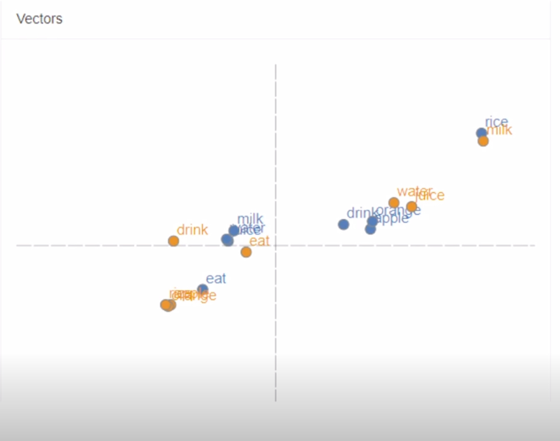

- 원래는  과  상에 있는
word 들의 원래는 5차원의 입력단어 및 출력단어 version 의 embedding vector 들을 pricipal component analysis (PCA) 를 통해서 2 dimension 으로 
차원 축소를 하고난 이후에 scatter plot 의 형태로 각각의 단어들의 vector 들을 시각화한 예시가 됨

#### Property of Word2Vec

- The word vector, or the relationship between vector points in space, represents the relationship between the words.
- The sampe relationship is represented as the same vectors.
  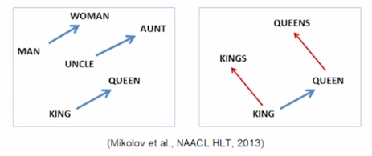
- e.g.,
  - vec[queen] - vec[king] = vec[woman] - vec[man]
  - queen vector 에서 king vector 를 빼서 나온 결과 vector 가 woman 에서 man vector 를 뺀 결과 vector
  그리고 uncle 에서 aunt 를 뺀 결과 vector 와 유사하게 일관된 vector 로서 유지가 되는 것을 보여주고 있음
  - 이러한 vector 는 남성에서 여성으로의 변화를 의미하는 그런 vector 의 관계가 word embedding 공간상에서 효과적으로 학습이 됐다라고 볼 수 있음

### Property of Word2Vec - Analogy Reasoning

- Korean Word2Vec: http://w.elnn.kr/search
  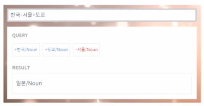

- 한국이라는 단어의 word embedding vector 에서 서울 단어의 vector 를 빼고 그러면 이 vector 가 나타내는 것은 어떤 수도에서 해당 나라로의 관계를 나타내는
vector 라고 볼 수 있음
- 그 다음엔 도쿄라는 vector 를 더하게 되면 그 얻어진 결과 vector 가 있을 것이고 그 vector 와 유클리디언 distance 가 가장 가까운 단어 vector 를 
저희의 사전 vocabulary 에서 찾으면 그 단어는 바로 일본이라는 단어로 도출되는 것을 알 수 있음
- 이 웹사이트에서는 사용자가 입력한 또 다른 다양한 단어들간의 덧셈, 뺄셈 등의 vector 연산을 통해 Word2Vec 이 학습한 어떤 흥미로운
의미론적 관계들을 확인할 수 있음

- More examples: http://wonjaekim.com/archives/50
  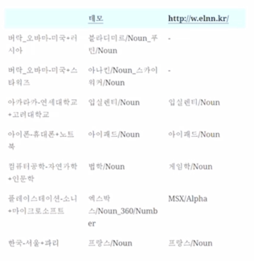

#### Property of Word2Vec - Intrusion Detection

- Example: https://github.com/dhammack/Word2VecExample
- Word intrusion detection
  - staple hammer saw drill
  - math shopping reading science
  - rain snow sleet sun
  - eight six seven five three owe nine
  - breakfast cereal dinner lunch
  - england spain france italy greece germany portugal austraila

- 여러 단어들이 주어져 있을 때 나머지 단어와 가장 의미가 상이한 단어를 찾아내는 task 
- Word2Vec embedding vector 를 활용해서 풀 수 있음
- 각 단어들로 나머지 단어들과의 유클리디안 distance 를 계산
  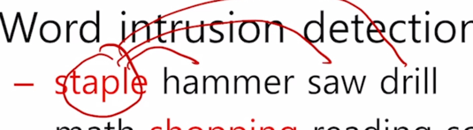
- 각 단어들간의 distance 를 계산하고 평균을 취하게 되면 이 staple 이라는 단어가 나머지 단어들과 어떤 이루게 되는 평균거리라고 할 수 있음
- 이 평균거리르 각 단어들에 대해서 모두 구한 후 이 평균거리가 가장 큰 단어를 고르게 되면 이 주어진 단어들 중 가장 의미가 상이한 단어라고 볼 수 있음

#### Application of Word2Vec

- Word2Vec improves performances in most areas of NLP
  - Word similarity
  - Machine translation
  - Part-of-speech (PoS) tagging
  - Named entity recognition (NER)
  - Sentiment analysis
  - Clustering
  - Semantic lexicon building

#### Application of Word2Vec - Machine Translation

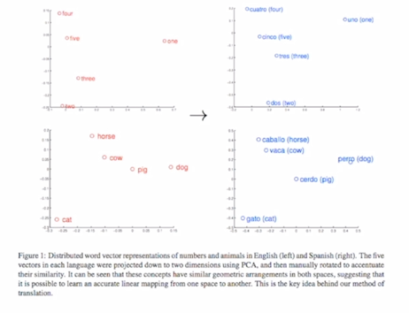

- 기계 번역에서는 서로 다른 언어간의 같은 의미를 가지는 word 들의 embedding vector 가 쉽게 정합 혹은 align 될 수 있도록 해주고
그로인해 번역의 성능을 높여주는 효과를 낼 수 있음

#### Application of Word2Vec - Sentiment Analysis

- 감정분석에서도 각 단어들의 긍부정을 보다 용이하게 파악할 수 있도록 해주는 word 들의 vector 표현형을 제공해주게 됨

#### Application of Word2Vec - Image Captioning

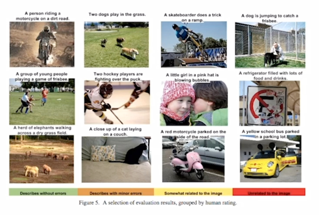

- 주어진 image 에 대한 상황을 잘 이해하고 이에 해당하는 설명글을 잘 자연어 형태로 생성할 수 있는 이러한 image captioning 이라는 task 에서도
학습과정에서 word embedding vector 를 잘 활용해서 이 task 를 효과적으로 수행할 수 있음

### GloVe: Another Word Embedding Model

- GloVe: Global Vectors for Word Representation
  - Rather than going through each pair of an input and an output words, it first computes the co-occurrence matrix, 
  to avoid training on identical word pairs repetitively.
  - Afterwards, it performs matrix decomposition on this co-occurrent matrix.
  -  
  
    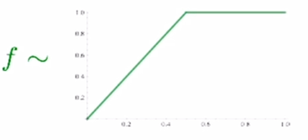
  - Fast training
  - Works well even with a small corpus

- Word2Vec 과의 가장 큰 차이점은 각 입력 및 출력 단어쌍들에 대해서 학습데이터에서 그 두 단어가 한 window 내에서 총 몇번 동시에 등장했는지를 사전에 계산을 미리하고
여기 수식에서 보이는 것처럼 그 입력 word 의 embedding vector  그리고
그 출력 word embedding vector  간의 내적값이 두 단어가 한 window 내에서 몇번 동시에
나타났는가 그 값에 log 값을 취해서 그 값에 정확하게 fitting 될 수 있도록 그 값에 내적값이 가까워질 수 있도록 하는 새로운 형태의 loss function 을 사용했다는 점임

- Word2Vec 의 경우에는 특정한 입출력 단어쌍이 자주 등장한 경우에 이러한 item 이 자연스럽게 여러번에 걸처 학습됨으로써 word embedding vector 간의 내적값이
그에 비례해서 학습이 빈번하게 될 수록 내적값이 더 커지도록 하는 이러한 학습방식을 따랐다면 
- Glove 에서는 애초에 어떤 단어쌍이 동시에 등장하는 횟수를 미리 계산하고 이에 대한 log 값을 취한 그 값을 직접적인 이 두 단어간의 내적값에 ground-truth 로써
사용해서 학습을 진행했다는 점에서 중복된 계산을 줄여줄 수 있다는 장점이 존재
- 따라서 학습이 Word2Vec 에 비해 상대적으로 더 빠르게 진행될 수 있음
- 보다 더 적은 데이터에 대해서도 잘 동작하는 특성을 가짐
- 선형대수의 관점에서 추천시스템에 많이 활용되는 알고리즘인 co-occurent matrix 의 row-rank matrix factorization 의 task 로도 이해할 수 있음

- 실제 Word2Vec 과 GloVe 는 성능이 비슷

#### Property of GloVe - Linear Substructure

- man - woman

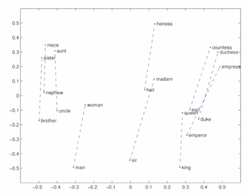

- company - ceo

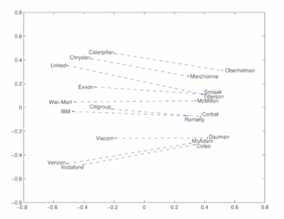

- city - zip code

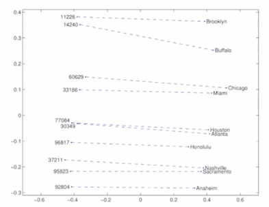

- comparative - superlative

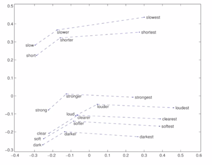

- 단어들간의 문법적인 의미와 그 관계들 까지도 GloVe 모델이 효과적으로 학습했다는 것을 알 수 있음

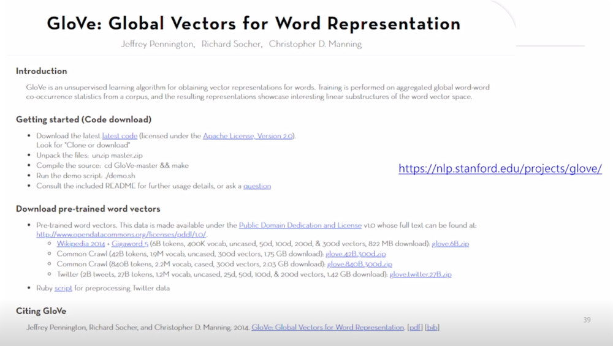

- code 도 opensource 로 공개 되어있음
- pre-trained word vector 다운로드 가능
  - wikipedia 2014 년 버전을 크롤링하고 추가로 gigaword 5 라는 텍스트 데이터셋도 학습데이터로 사용
  - 6B(60억개의) 개의 token 혹은 단어의 개수가 포함 이 중에 중복된 단어를 걸러내고 사전에 포함된 단어수는 400K(약 40만개) 단어가 포함
  - uncased : 단어들이 대소문자가 구별되어 있는 단어라 할지라도 같은 단어로 학습되었다는 표시
    - He vs he 같은 단어로 mapping 된 형태로 학습이 진행 되었음
  - 50d, 100d, 200d, 300d 는 GloVe 라는 word embedding 알고리즘을 돌렸을 때, 각각 설정한 target dimension

## References

- Distributed Representations of Words and Phrases and their Compositionality, NeurIPS'13
- GloVe: Global Vectors for Word Representation, EMNLP'14

