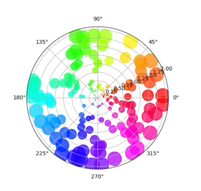
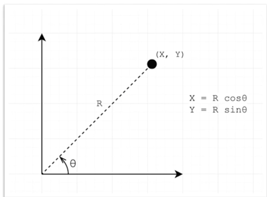
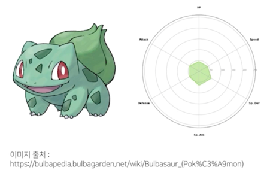
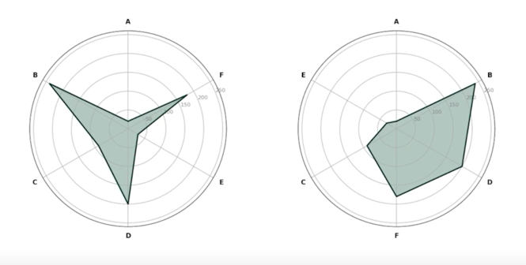
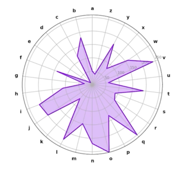

# Polar Coordinate

## 1. Polar Plot

### 1.1 Polar Plot

- 극 좌표계(Polar Coordinate)를 사용하는 시각
  - 거리(R), 각(Theta)을 사용하여 plot
- 회전, 주기성 등을 표현하기에 적합
- **projection = polar** 을 추가하여 사용
- 해당 그래프는 scatter
  - Line, Bar 모두 가능

  

- Matplotlib 로고에도 사용됨

  

  - 공식 로고는 matplotlib 으로 그릴 수 있음
  - https://matplotlib.org/stable/gallery/misc/logos2.html

### 1.2 Data Converting

- 이미 앞서 사용한 방식 (grid 등)
- 직교 좌표계 X, Y에서 변환 가능
  - X = 
  - Y = 

  

## 2. Radar Plot

### 2.1 Radar Chart

- 극좌표계를 사용하는 대표적인 차트
- 별 모양으로 생겨 Star Plot 으로 불리기도 함
- 중심점을 기준으로 N개의 변수 값을 표현할 수 있음
- 데이터의 Quality를 표현하기에 좋음
  - 캐릭터의 강함
  - 운동 선수 분석(게임 및 방송 등)
  - 비교에도 적합

  

### 2.2 Radar Chart 주의점

- 각 feature 는 독립적이며, 척도가 같아야 함
  - 순서형 변수와 수치형 변수가 함께 있다면 고려 필요
  - Ex) 자동차를 예시로 든다면?
    - 안전성 평가, 소비자 만족도 등 5점 만점
    - 최대 속도, 연비 등 절대적 수치
    - 과연 하나의 Radar Plot에 표현하는 게 맞을까?

  

- 다각형의 면적이 중요해보이지만 feature 의 순서에 따라 많이 달라짐

  

  - 데이터의 quality 가 면적 자체가 아니라는 것이 중요
  - 비교를 할 때는 각 축으로 비교를 해야지 면적으로 비교를 하다보면 같은 데이터인데도
  다르게 볼 수 있음
  - 면적 자체가 중요한게 아니라 feature 순서에 따라서 면적이 달라지니까 면적 자체가 가지는 의미가
  엄청 크진 않다

- Feature가 많아질수록 가독성이 떨어짐

  

