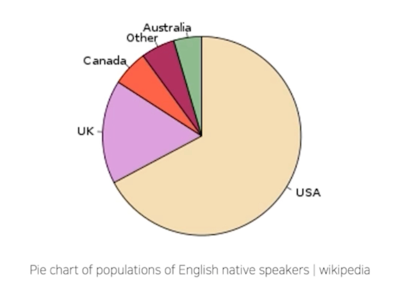
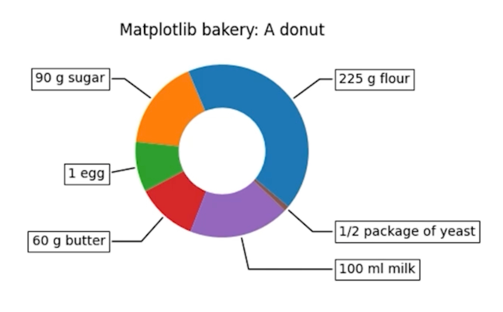
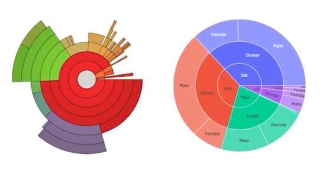

# Pie Charts

## 1. Pie Chart

### 1.1 Pie Chart

- 원을 부채꼴로 분할하여 표현하는 통ㅇ계 차트
  - 전체를 백분위로 나타낼 때 유용

- 가장 많이 사용하는 차트지만...지양...
  - 비교 어려움
  - 유용성 떨어짐
  - 오히려 bar plot이 더 유용(각도 <<< 길이)
    - 사용을 꼭 하고 싶다면 함께 사용할 것을 권장
    - 후에 waffle chart 가 더 비교에 유용
  
  

## 2. Pie Chart 응용

### 2.1 Donut Chart

- 중간이 비어있는 Pie Chart
  - 디자인적으로 선호되는 편
  - 인포그래픽에서 종종 사용
  - Plotly 에서 쉽게 사용 가능

  

- 사실 Pie Chart 보다 가독성도 떨어지고 실제로 비교하기 상당히 어렵기 때문에 데이터 분석에 있어서 
EDA를 진행한다고 하면 사용하지 않는게 좋음
- Presentation 이나 infographic 또는 storytelling 에 사용한다면 추천

### 2.2 Sunburst Chart

- 햇살(sunburst)을 닮은 차트
- 계층적 데이터를 시각화하는데 사용
  - 구현 난이도에 비해 화려하다는 장점
  - 오히려 Treemap 을 추천
  - Plotly 로 쉽게 사용 가능

  

- 가독성이 떨어지고 실제로 크게 유용성이 높지 않기 때문에 크게 추천하지 않음
