# [MeetUP <부캠에서 살아남기>]

## 부스트캠프와 공유문화

1. 부스트캠프에서 무엇을 얻어갈 것인가?
    - 부스트캠프 수료증은 취업 프리패스권이 아니다
    - 나는 부스트캠프에 왜 지원했는가? 무엇을 얻어가고 싶은가?
      - 코딩테스트 & 면접 준비
      - 추천시스템을 공부하고 싶다면 같이 할 수 있는 study 를 모집
      - 고민을 해보는게 중요!!
2. 의미 있는 무언가에 집중하자
   - 결과보다는 "무엇을 / 어떻게 / 왜" 이 3가지가 더 중요하다
     - 여기에 집중하다보면 결과는 따라오게 된다라고 생각한다.
   - 리더보드 순위도 중요한 건 맞다. 하지만...
     - 당연히 SOTA 모델 사용하면 성능이 좋을 수 밖에 없다.
     - 현실 세계는 리더보드로 표현되지 않는 경우가 많다.
     - 1등 하셨네요. 그래서 뭐 하셨나요?
   - 네트워킹데이가 너무 궁금해요! 어떤 기업이 오나요? 취업 연계는 어떻게 되는거죠?
     - 직전까지 알 수 없다.
     - 아무리 고민하고 신경써도 당장 답이 나오는 것이 아니다.
     - 그럼 다른 의미있는 무언가에 집중하자
   - 면접 스터디, ML Ops 스터디, U Stage 복습, 의미 있는 다양한 실험, P Stage 모델 서빙,
   추천 스터디 등
3. 적극적으로 공유하자
   - 새로 알게 된 것, 자료에 문제가 있는 것, 우리 팀(조)에서 스터디한 것, 그 외 다른 캠퍼에서 도움이 될 무언가
     - 정보 공유(또는 질문)를 망설이는 이유 == 부끄러움 or 두려움
   - 이런 사소한 질문을 해도 될까? 내가 너무 멍청해보이지 않을까? 별 도움 안되는 쉬운 내용을 공유하나?
     - 대부분의 질문은 나 혼자만 궁금해하는 것이 아니다. 그렇기에 사소한 질문/정보 공유는 다른 누군가에게 도움이 된다.
     그러니까 모두가 볼 수 있는 채널에 질문하고 공유하자.
   - 잘못된 정보를 공유할까 두려움
     - 오히려 좋다. 공유하지 않으면 나는 계속 그 정보가 잘못되었다는 사실 조차 인지하지 못한다. 공유를 하게 되면 그 정보가
     잘못되었다는 피드백을 얻을 기회가 생긴다.
   - 하지만 무언가를 질문하거나 공유할 때는 먼저 찾아보자

## 협업과 프로젝트(대회) 진행 꿀팁

1. P-stage에 임하는 Tip
   - 순위보다 기록에 집중하기
     - 순위는 그저 동기부여의 일부로, 정말 중요한 것은 기록하는 습관
     - 논리적 근거가 있는 실험의 밑바탕
     - 지금 만드는 기록이 곧 포트폴리오가 되고, 이 시간과 노력을 증명할 수 있는 방법!!
2. 좋은 team을 꾸리는 Tip
   - '나'를 드러내고, 랜덤 피어세션을 잘 활용하자!
     - 좋은 team? 케미가 잘 맞는 team!
     - 나와 잘 맞는 사람을 찾기 위해서는 내가 어떤 살마인지를 먼저 보여주는게 최고
     - 랜덤 피어세션, 공개 채널, slack, AI stage 토론, edwith 질문 등을 적극적인 활용
3. Teamwork를 위한 Tip
   - 피어세션 시간을 재밌게 보내기
     - 팀워크는 성과도 성과지만, 재미가 중요
     - 부스트캠프와 관련없는 이야기를 나누는 TMI 시간을 통해 아이스 브레이킹!
     - 본인의 아이디어나 상황을 잘 정리하고 참여해 효율적으로 시간을 활용하기
     - 회의록 작성하기

## 부캠과 취업하기

1. Tip #1. 자기소개서/이력서
   - 자기소개서: 작은 이야기도 좋습니다.
     - 어차피 작아요
       - 소소한 성과도 괜찮습니다
       - 기본기와 태도
       - 가독성
       - 뻥튀기는 제발..
     - 시작이 어려우시다면
       - Wrap-up 레포트를 재구성 해보기
       - 일단 적고 소리나는 대로 읽어 보기
       - 컨셉 잡고 적어 보기(NLP 애호가처럼 보여보자 등)

   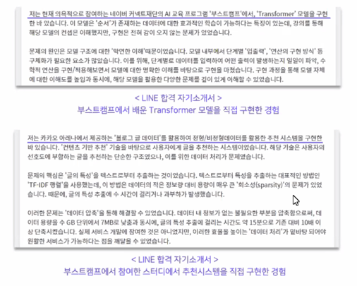

   - 이력서: ㅇ릭기 쉽게
     - 양식은 정말 다양하지만
       - 핵심만 간단히! 자세한 건 면접에서
       - 결과만 적기보다 과정을 요약
       - GitHub 링크
       - 수행 역할 명확히
     - 시작이 어려우시다면
       - 남의 이력서 템플릿 우선 채워보기
       - 나만의 이력서로 바꿔 가기
       - 노션 등 플랫폼은 중요하지 않음
       - 팀원들과 프로젝트 회고하기

   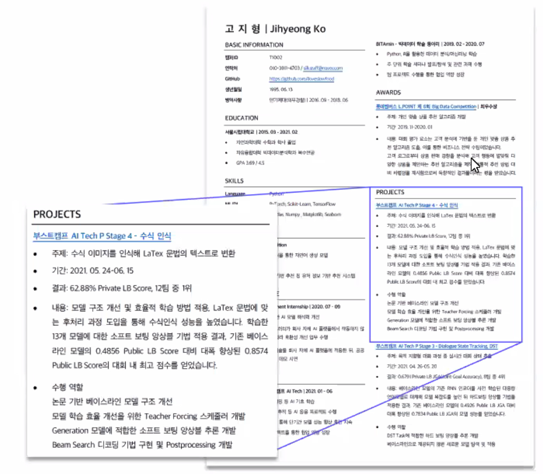

2. Tip #2. GitHub/포트폴리오

   - GitHub: 적극적으로 사용해보세요
     - GitHub가 필수느 ㄴ아니지만
       - 안 쓰면 손해
       - 정리해두지 않으면 기억에 안 남아요
       - 정리하면 한 거 많은 척 할 수 있어요
     - 시작이 어려우시다면
       - 개인 프로젝트 결과물 정리
       - CLI 작성해보기(주피터 탈출)
       - 네트워킹 데이 때 어필 포인트가 될 수 있어요
       - AI Tech 팀프로젝트 결과물 예시
   
   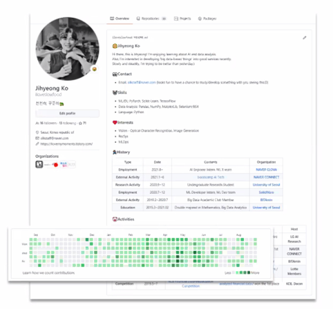

   - 포트폴리오: 정성
     - 저의 경우에는
       - 이력서에 담지 못한 것
       - 태도
       - 시각 자료는 면접관님의 프로젝트 이해에 도움
       - 정답은 없음
     - 시작이 어려우시다면
       - 팀원들에게 '내가 어떤 사람인지' 물어보기
       - AI를 모르는 사람에게 프로젝트 소개하기
       - 이력서에 담지 못해 아쉬운 점 생각해보기
   
   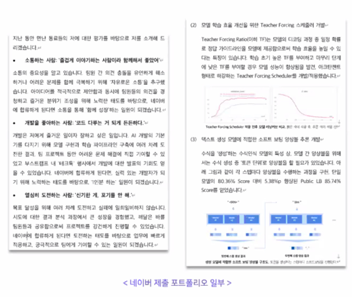

3. Tip #3. 면접

   - CrossEntropy를 정보이론의 관점에서 설명해주세요
   - Regularization 방법에는 어떤 것들이 있고 왜 하는 것이며 어떤 효과가 있나요?
   - self-attention 메커니즘에 대해 설명해주세요
   
   - 기술 질문
     - 기본적이지만 대답하기 어려운 질문
     - 답 못하면 프로젝트 질문은 더이상 안 하셨어요(광탈)
   - 프로젝트 질문
     - 프로젝트 요약 질문
     - 활용 기술을 알고 사용했는지, 왜 사용했는지
       - '사용하신 모델의 논문을 아는 대로 설명해주세요'
   - 생각 정리가 참 중요한데요
     - 면접 스터디, 산책하며 혼잣말, 무한 필기

   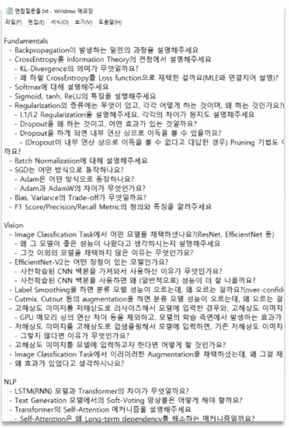

   - 시작이 어려우시다면
     - 머리로만 생각하지 않기
     - 면접 스터디가 포문을 열기 좋습니다
     - 부족한 개념 정리 해놓고, U스테이지 강의 복습하기
     - 말하기가 어렵다면 자주 적기
   
   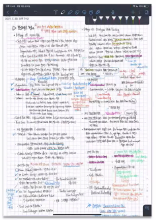

4. Tip #4. 프로젝트 수행

   - 협업
     - 네트워킹 데이에서 나온 질문은
       - '협업 어떻게 하셨어요?'
       - 협업에 대한 증거
     - 협업을 잘 하면 / 협업 도구를 잘 다루면
       - 프로젝트 몰입도 상승
       - 실험 결과 등 과거 기록 활용도 UP
       - 팀원들과 동일 코드 사용 => 작업 신뢰도 UP
     - 시작이 어려우시다면
       - 팀 내 자신의 포지션 고민해보기
       - 팀원들의 강점 파악해보기
       - 협업 도구 사용법 익히기

   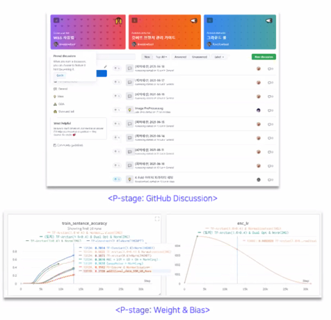

   - 다양한 시도
     - 강의 코드만 돌려보신 분들은
       - 얻은 게 없는 것 같다는 의견 다수
       - 팀이 1등 해도 자기는 안 기쁠 수도 있음
       - 주체적인 시도를 추천 드립니다
     - 시작이 어려우시다면
       - 강의 코드 안 보고 직접 구현해본 뒤 비교하기
       - 데이터 깊게 EDA 해보기
       - 논문 하나 잡고 구현해보기
       - 유용한 코드 아카이빙하기
   
   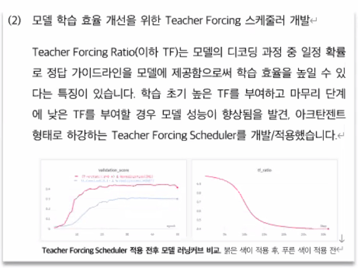

## Q&A

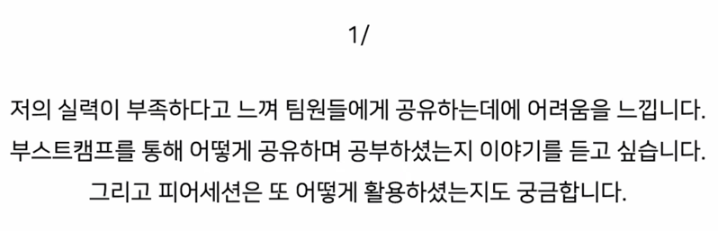

- 스페셜 피어세션에서 아이스브레이킹이 필요하다고 느낌
- 성공했던 것 뿐만 아니라 실패했던 방법을 공유하면서 피어세션을 시작 했음
- 자신의 아이디어를 공유함으로써 다른 사람들의 아이디어도 공유해주면서 아이스브레이킹이 잘 진행됐음

- 실력이 부족하다고 느끼는 감정에 공감이 되는데 
- 내가 정리한게 무슨 도움이 될까라는 생각을 했음
- 공유를 할 때 거창한 걸 할필요는 없음
- 내가 사소하게 정리한거나 내가 궁금한거는 다른 사람도 모르는 경우가 많음
- 그냥 활발하게 공유하다보면 분명히 기여하는 바가 생김
- 뭐가 됐든 얘기를 꺼내보는게 좋음

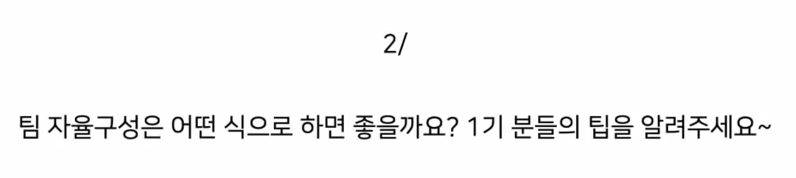

- 가장 중요한 건 목표와 성향이 비슷한 분들과 함께 팀을 구성하는게 좋음
- 대회에서 좋은 성적을 내는게 목표인지, 취준을 병행하는게 목표인지 등
- 피어세션이나 기타 스터디에 열심히 참여해서 최대한 다양한 사람들을 만나보고 자연스럽게 본인을
어필할 수 있는 모습을 보이는게 최선이라고 생각
- 원하는 팀원들의 성향을 잘 적어서 모집글을 올리면 잘 정할 수 있었음

- 실력도 굉장히 중요한 부분이겠지만 생각이 반대가 될 수 있음에도 의견 공유가 활발해서 절충안이 나올 수 있는?
의견 공유가 고집이 세지 않은 그런 분들을 만나는게 가장 중요한 것 같음
- 공유를 많이많이 하고 커뮤니티에서 댓글 많이 달고 좋아요 많이달고 질문 많이 하시면 데려간다.

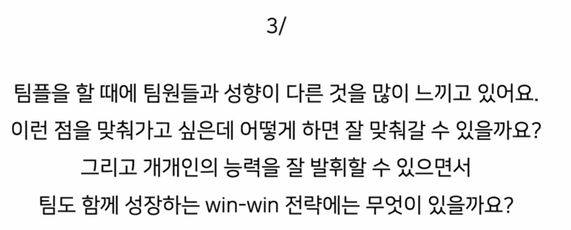

- 팀원들이 모두 같이 해야하는 노력이 아닌가 생각이 들고 TMI 시간을 갖는다던지 대회 이야기 말고도 서로
친해질 수 있는 시간을 많이 갖는게 중요함
- 개개인의 능력을 잘 발휘하는게 팀도 성장하는거라고 생각함
- 기록하는게 중요한것 같고 자기가 맡은 바를 해내야한다는 책임감을 갖는게 필요함

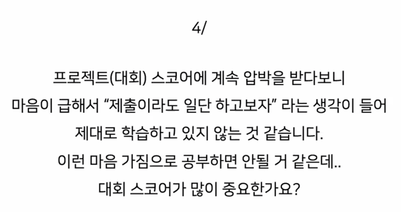

- 압박을 받지 말라고 말하기는 어려움
- 제출이라도 일단 하고보자라는 생각은 나쁘지 않음
- 그러나, 학습할 때 이유를 가지고 하는게 중요한 것 같음
- 대회 스코어가 많이 중요한가? 라는 질문에는 엄청 중요하다고 생각하진 않음
- 무언가 사용에대한 이유를 잘 기록하고 하는게 중요

- 안 중요하다는 아닌 것 같다
- 그렇지만 그것보다 중요한게 더 많다
- 20팀중에 1등하는게 엄청 대단한게 아닐 수 있음
- 세계대회인 캐글도 아니고 우리 교육생들끼리 하는거니까...
- 결국엔 무엇을 했냐가 더 중요한 것 같음
- 더 중요한걸 하자

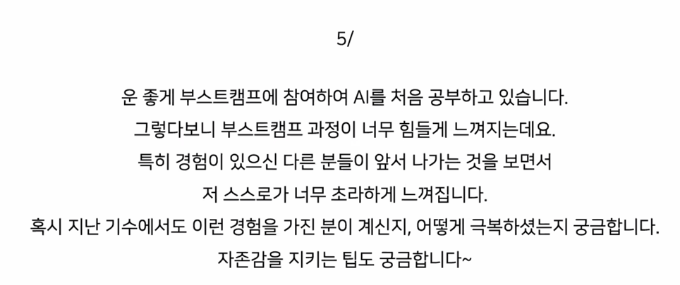

- 부캠을 하는 대다수의 분들이 겪은 거라고 생각
- 온갖 마인드 컨트롤을 해서 한시간반이 끝나고 나면 자존감이 바닥나는 그런 패턴으로 살아왔는데
- 롤러 코스터 끝에 생각해낸것은 나는 남들보다 부족하고 못나고 못한다를 인정하고 
- 중요한건 부캠에서 주어진 것들을 하루하루 최선을 다해 끝내는게 중요
- 주어진 강의나 실습들이 많다보니까 오늘 것을 다 끝내는 분들이 많지 않기 때문에
- 최대한 잘하는 분들과 함께할 기회를 만들고 옆에서 배울 기회를 만들었음
- 여기서는 가장 뒤처지더라도 부캠3기보다는 잘하겠지라는 생각으로 넘기는 것도 좋은 것 같음

- 자존감 지키는 팁관련해서 생각이 난게 있음
- 혼자 산책하면서 혼잣말을 정말 많이 하는데 자신감이 내려갔을 때 정말 많음
- 마스크를 끼고 이어폰을 끼고 걸으면서 내가 못한것이 있지만 내가 잘한거를 조목조목 따지면
- 걸으면 걸을수록 객관화가 되는 것 같음
- 이부분은 잘했는데 이부분은 못했구나 보충이 필요하구나 

- 부캠하면서 취업 준비를 병행하긴 했는데 상반기 취업공고 나와서 안내긴 아쉽더라
- 나오는거 지원은 해보셨으면 좋겠음
- 면접 경험이 진짜 중요하다고 생각함
- 작년에 면접 떨어져봤는데 처음 할 때 너무 많이 떨리고 준비도 너무 안된 것 같고
- 그래서 면접은 많이 보면 볼수록 좋은 듯
- 부스트캠프를 바라봐주는 시선이 특별한 시선이 아니었음
- 부스트캠프에 대해서 언급도 안하는 회사도 많았고 채용연계를 한 회사에서는
- 어떤걸 기여했는지 물어보면서 진행
- 아무래도 사람이 가장 큰 가치인 것 같음
- 끝나고 나서도 대회나가는 분들도 많았고 계속 스터디를 한다거나 다양한 활동을 계속
- 같이 하는게 좋은 것 같음
- 굳이 공부아니어도 계속 인연을 이어나가시는게 좋을 것 같음

- 진짜 원하는 회사 한군데만 지원했었고 나머지는 지원하지 않았음
- 그 이유는 프로젝트를 정말 잘하고 싶었음
- U-stage 나 P-stage 에서 여기서 못하면 회사가서도 잘 못할수도 있는데
- 집중해서 공부하자라는 생각
- 부스트캠프를 바라보는 시선은 특별한게 없음
- 여기에서 한 프로젝트를 어떻게 했는지 궁금해 함
- 부스트캠프에서 너무 열심히 하시는 분들이 많으니까 열심히 하다보면 자기가 바보같은 느낌이
- 들 때가 있는데 내가 이렇게 노력해도 괜찮구나라는 확신을 얻었던게 가장 큰 가치였던 것 같음

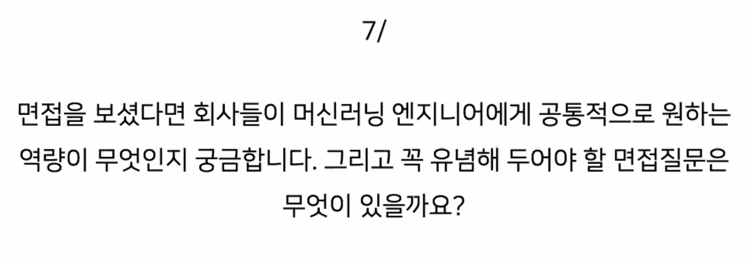

- 기술적인 것을 잘 알고 있는게 중요
- 기술이 없는 사람처럼 보이면 가치있게 바라보지 않음
- 기술적이라는게 거창한 실력을 말하는게 아니라 정말 기본적인 것들
- object function 이 어떻게 동작하는지를 알아야하는데 그런 것들
- 요새 잘나가는 모델은 어떻다 이런걸 공부하는게 아니라 기초를 공부해라
- 인성적인 부분은 기본적인 것 이후에 오는 것 같음

