# Recurrent Neural Network and Language Modeling

## 1. Basic of Recurrent Neural Networks (RNNs)

### Types of RNNs

- Basic structure

  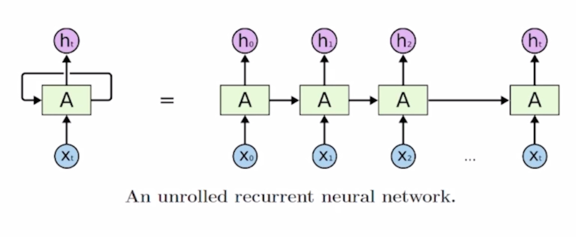

- 기본적으로 RNN은 어떤 sequence 데이터가 입력으로 혹은 출력으로 주어진 상황에서 각 Timestep 에서 들어오는 입력벡터 
 와 그 전 Timestep 의 RNN 모듈에서
계산한 hidden state vector  을 
입력으로 받아서 현재 Timestep 에서의  를 
출력으로 내어주는 구조를 가지고 있음

  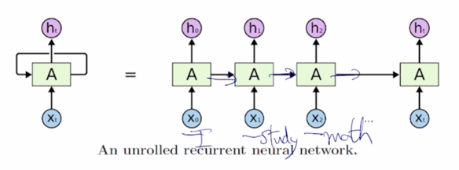

- 가령 입력이 'I study math' 라는 문장이 주어질 때, 각 word 는 여기서 보이는 것처럼 각 Timestep 의 입력으로서 순차적으로 들어가게 되고
매 Timestep 마다 RNN 모듈이 그 전 Timestep 까지 계산해둔 hidden state vector  과
현재 들어온 word 의 정보  를 결합해서 현재 Timestep 의 
hidden state vector  를 계산하는 것이 됨

- 여기서 중요한 사실은 서로 다른 Timestep 에서 들어오는 입력 데이터를 처리할 때, 동일한 parameter 를 가진 그래서 반복적으로 등장하는 모듈이라는 의미의
Recurrent Neural Network 모듈을 매 Timestep 에서 이렇게 동일하게 사용한다는 점

  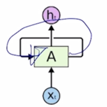

- 이 그림에서와 같이 동일한 RNN 모듈 A가 매 Timestep 마다 재귀적으로 호출되면서 A 모듈의 출력이 다음 Timestep 에 입력으로 들어가는 형태로 이해할 수 있음

### Vanilla RNN

#### Recurrent Neural Network

- Inputs and outputs of RNNs (rolled version)
  - We usually want to predict a vector at some time steps

  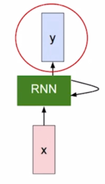

- RNN 에서 매 Timestep 에서 hidden state 를 계산한 후 Timestep 에는 우리가 하고자 하는 Task 에 맞는 출력값 y 를 계산해줘야 함
- RNN 에서의 hidden state 가 다음 Timestep 의 입력으로 쓰임과 동시에 hidden state vector 가 필요한 경우에는 이 출력값을 계산해 줄 수 있어야 함

- How to calculate the hidden state of RNNs
  - We can process a sequence of vectors by applying a recurrence formula at every time step
  -  : old hidden-state vector
    
    - 이전 Timestep 에서의 RNN 모듈에서 계산된 hidden state vector
    
  -  : input vector at some time step
    
    - Timestep t 에서의 입력벡터
    
  -  : new hidden-state vector
    
    - 이 정보들을 잘 조합해서 계산된 현재 Timestep t 에서의 hidden state vector
    
  -  : RNN function with parameters W
    
    - 이전 hidden state vector 와 입력벡터를 입력으로 받아서 W 를 parameter 로 가지는 RNN 함수
    
  -  : output vector at time step 
  
    - 최종 예측값을 계산해야 하는 경우에  를 바탕으로  도
    계산할 수 있게 됨
    - 예측값을 나타내는 output  는 매 Timestep 마다 계산해야 할 수도 있고
    아니면 마지막 Timestep 에만 계산 해야하는 경우도 있음
      - 가령 'I study math' 라는 문장이 있을 때, 각 단어별로 해당 단어의 품사를 예측해야 하는 경우 매 Timestep 마다 각 단어의 품사를 예측한 값이 나와야 함
      - 그렇지 않고 'I hate this movie' 문장이 긍정인지, 부정인지를 예측하기 위해서는 마지막 단어까지 모두 읽은 후 마지막 Timestep 에서만 긍정 혹은 부정의 값을
      예측하게 됨
  
  - Notice : The same function and the same set of parameters are used at every time step
  
    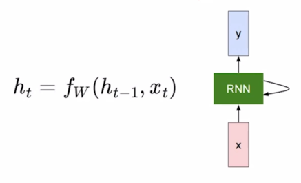

  > RNN의 가장 중요한 특징은 매 Timestep 마다 RNN 모듈을 정의하는 parameter W 는 모든 Timestep 에서 동일한 값을 공유한다는 사실

  - The state consists of a single "hidden" vector <U>**h**</U>

    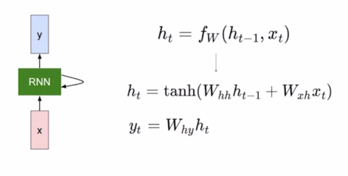

  - 가령  가 3차원 벡터 이는 예를 들어서 Timestep t 에서 들어오는 word 의
  embedding vector 가 3차원 벡터로 주어진 상황을 생각해보자.
    
    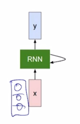

  - RNN 의 hidden state vector  이 입력으로 들어오게 되는 경우에는
   의 dimension 이 2차원인 vector 라고 가정하자

    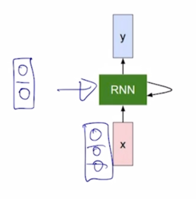

  - 여기서 hidden state vector 의 차원수는 Neural Net을 일반적으로 정의할 때 어떤 특정 layer 내의 dimension 수 혹은 node 수를 사전에 정의해야 하듯이
  RNN 에서 정의해야 하는 hidden state vector 의 node 수 혹은 layer 를 정의하기 위한 hyper parameter 가 됨

  - 그러면 3차원 vector  와 2차원 vector  을
  결합해서 이를 입력으로 받아서 어떤 하나의 fully connected layer 로 구성된  혹은 RNN 모듈을 생각해보자

  -  와  으로 구성된
    5개의 입력 node 를 통해서  를 계산하게 됨

    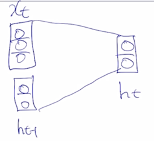
 
  -  의 dimension 의 경우에도  과
    동일한 형태의 dimension 을 공유해야 하기 때문에 여전히 dimension 이 2임
    
    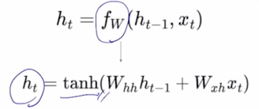

  - 그 이후에는  를 계산한 후 일반적으로 non-linear unit 을 거쳐주는 것처럼
  가령 tanh 를 거침으로써 최종적인  를 계산할 수 있게 됨

    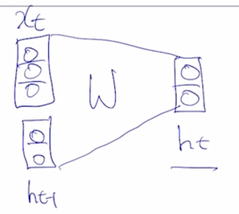

  - 여기서 fully connected layer 의 어떤 linear transformation matrix 를 W 라고 정의하면 이렇게 행렬곱을 나타낼 수 있음
  
    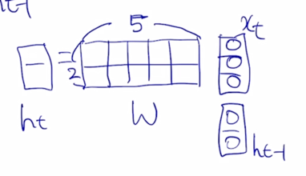

  -  가 주어지고  이
    주어져 있을 때, 5 dimensional vector 를 선형변환을 통해 나온 값이  라고 할 때,
    우리의 행렬 W 는 사이즈가 2 x 5 로 정의된다는 것을 알 수 있음
  
    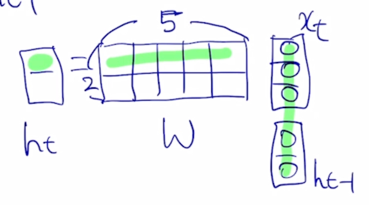

  -  의 첫번째 node 를 계산하는 연산을 생각해 볼 때,
    내적을 수행하게 됨

    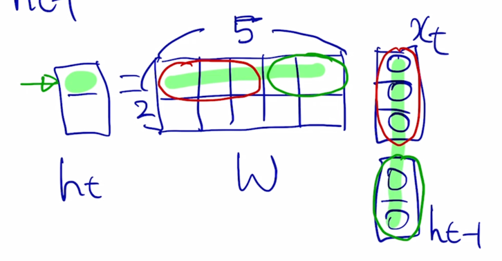

  - 5차원 간의 내적은 첫번째 부분에 있는 3차원 vector 와 입력으로 주어진  그리고 
  두번째 부분에 있는 2차원 vector 와 두번째 입력 부분으로 주어지는  과 따로따로 각각
  내적을 해준 후 그 다음에 2개의 내적값을 더해주면  의 첫번째 node 의 값을 구할 수 있

    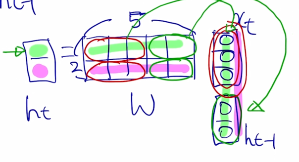
    
  - 마찬가지로 2번째 node 의 값도 구해짐

    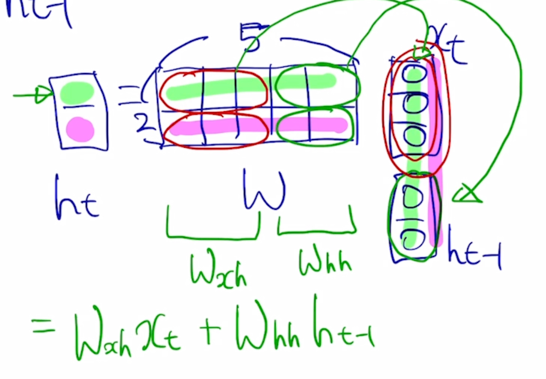

  - 앞 부분에 있는 W 를  라고 하고,
  뒷 부분에 있는 W 를  라고 부르자.
  -  으로 표현 가능
  
  - 즉 이말은,  를 계산할 때, 현재 Timestep 에서 들어온 입력벡터  를 
   와 결합해서  의 일부를 만들고,
  두번째 입력이었던  을 이에 해당하는 선형변환인  와 곱해서
  만들어진 vector 가 output 인  를 구성하는 것을 알 수 있음

    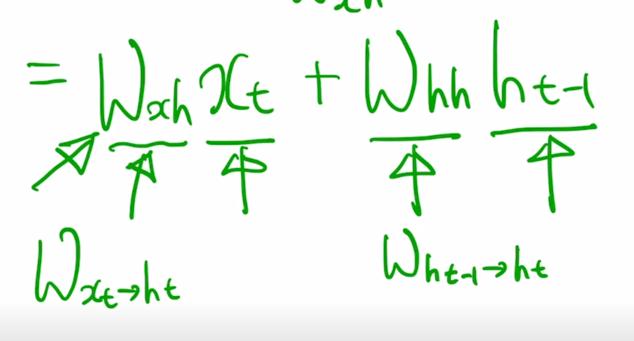
  
  -  는  를  로
    변환해주는 역할을 담당하고  는  에서  로의
    변환을 담당하는 그러한 행렬임을 알 수 있음

    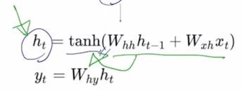

  - 이렇게 구해진  를 추가로 비선형변환 중 하나인 tanh 를 통과시켜줌으로써
  최종적인 RNN 모듈의 현재 Timestep 의 hidden state vector  를 계산할 수 있게됨

    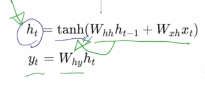

  - 현재 Timestep t 에서 task 의 예측값이 필요한 경우에는  를 입력으로 해서
  추가적인 layer 인 output layer 를 만들고 그 output layer 에 linear transformation matrix 인  를 곱함으로써
  최종 output 인  를 구할 수 있게 됨

    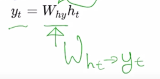

  - 여기서  도 아까와 마찬가지로  를  로
  변환해주는 역할을 하는 것으로 이해할 수 있음

  >그리고 이렇게 선형변환을 해서 얻어진 output vector 는 가령 binary classification 을 수행하게 되면 output vector 의 차원은 1차원인 scalar 값이 되고
  여기에 추가로 sigmoid 함수를 적용해서 binary classification 의 확률값을 예측값으로 계산하게 되고 multi classification 을 수행하는 경우에는  가
  클래스 개수만큼의 dimension 을 가지는 vector 가 나와서 추가로 softmax layer 를 통과해서 저희가 분류하고자 하는 클래스와 동일한 개수 만큼의 확률분포를 
  얻을 수 있게됨

## 2. Types of RNNs

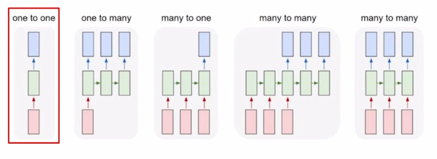

- One-to-one
  - Standard Neural Networks
  
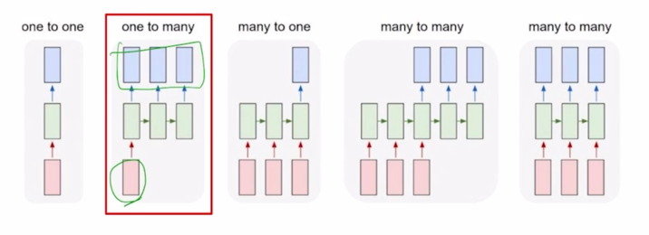  

- One-to-many
  - Image Captioning
    - 입력으로 어떤 한 image 를 주게되고 timestep 으로 이루어져 있지는 않은 단일한 입력으로 생각할 수 있음
    - Image 에 대한 설명글을 생성하기 위해서 그에 필요한 단어를 각 timestep 별로 순차적으로 생성하게 되는 output 을 생각해보면
    이 Task 는 입력은 1개 output 은 여러 timestep 으로 이루어진 one-to-many 에 해당함

  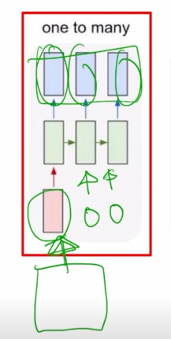

  - 입력이 첫번째 timestep 에서만 들어가는 것을 볼 수 있는데 RNN 구조에서 매 timestep 마다 입력이 주어지는 것으로 설명했는데,
  추가적으로 넣어줄 입력이 딱히 없는 경우에는 간단히 동일한 RNN 모듈에 입력으로는 같은 사이즈의 vector 나 행렬 혹은 tensor 가 들어가되,
  모두 값이 0으로 채워진 그러한 형태의 입력을 RNN 모듈의 입력으로 주게 됨

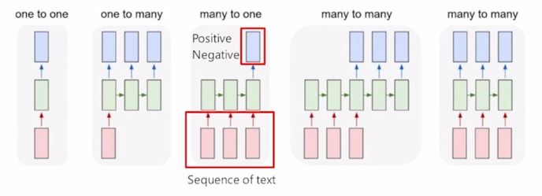

- Many-to-one
  - Sentiment Classification

  

  - 'I love movie' 라는 입력 문장이 주어지면 각각의 단어를 word embedding 형태로 입력으로 각 timestep 에서 받아서 이 RNN 모듈이 입력으로 주어지는 
  데이터를 잘 처리한 후 마지막 timestep 에서 나온  를 가지고 최종적인
  output layer 를 적용함으로써 우리가 원하는 긍정 혹은 부정에 해당하는 값을 예측하게 됨

  - 길이가 다른 'I hate this movie' 있는 경우, 길이가 달라진 만큼 RNN 셀이 그에 맞추어서 확장이 되어서 반복적으로 수행이되고 결구 그 문장을 모두 읽어드린 후
  마지막 timestep 에서 나온  를 가지고 output layer 를 적용함으로써
  최종 예측값을 얻게 됨

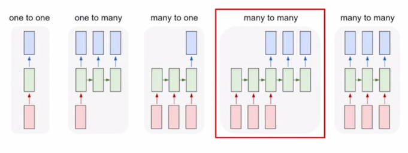

- Sequence-to-sequence
  - Machine Translation

  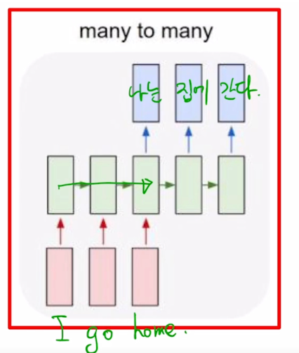
  
  - 'I go home' 이라는 문장이 주어지면 이 문장을 끝까지 다 읽은 후, 그 다음에는 마지막 timestep 에서 이 문장에 해당하는 가령 한글번역인 '나는' '집에' '간다' 라는
  한글 단어를 순차적으로 예측값으로 내어주게 됨

  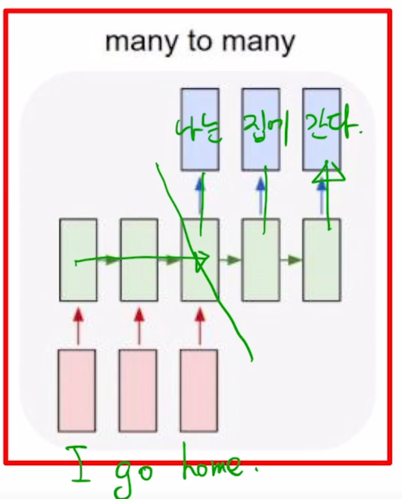

  - 이 구조에서는 timestep 이 총 5개로 이루어져있고 3번째 timestep 까지는 주어진 입력문장을 끝까지 읽었다가 그 다음에 비로소 문장을 다 읽은 후 부터 출력단어
  혹은 이 문장의 번역에 해당하는 예측 단어를 생성을 해줌

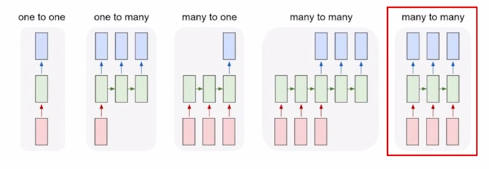

  - Video classification on frame level

  - 입력 문장을 전부 다 읽고나서 처리하는 형태가 아닌 그 입력이 주어질 때마다 예측을 수행하는 형태 딜레이가 전혀 존재하지 않는 혹은 허용이 되지 않는 형태의 task 도 존재
  - 각 단어별로 문장성분이나 품사를 예측하는 POS 태깅이라는 문제도 있을 수 있음

  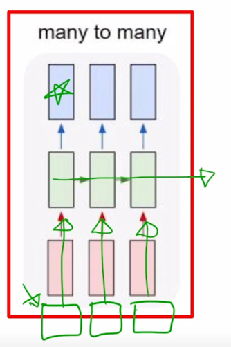

  - 또 다른 예시로서 Video classification on frame level 즉, 비디오가 시간순으로 이루어진 각각의 이미지 frame 이라고 생각을 할 때, 
    이미지가 각 timestep 마다 주어지면 해당하는 frame 이 어떤 scene 에 해당하는지를 분류하는 실시간성이 필요한 경우에 many-to-many 구조를 생각할 수 있음
  
## 3. Character-level Language Model

### Character-level Language Model

- Language Model 혹은 언어모델이라고 불리는 Task 는 기본적으로 우리에게 주어진 문자열이나 단어들의 순서를 바탕으로 그 다음단어가 무엇이지를 맞추는 
그러한 Task 
- Language Modeling 은 word level 혹은 character level 에서 모두 다 수행 할 수 있음
- 여기서는 simple 하게 character level 그리고 또 여러 단어들이 존재할 수 있는 가운데에 학습데이터로서 단 하나의 단어인 "hello" 라는 단어만이 주어져 있다고 가정하자.

- Example of training sequence "hello"
  - Vocabulary: [h, e, l, o]
  - Example training sequence: "hello"
  
    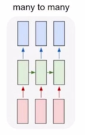

  - 첫번째로 할 일은 character level 의 사전을 구축하는 것이 됨
  - 주어진 학습 데이터로부터 찾을 수 있는 unique 한 character 를 중복 없이 다 모으면 사전을 구축하게 됨
  - 그 다음엔 word embedding 에서 배운 것처럼 각각의 character 는 총 사전의 갯수 만큼의 dimension 을 가지는 one-hot vector 로 나타낼 수 있게됨

    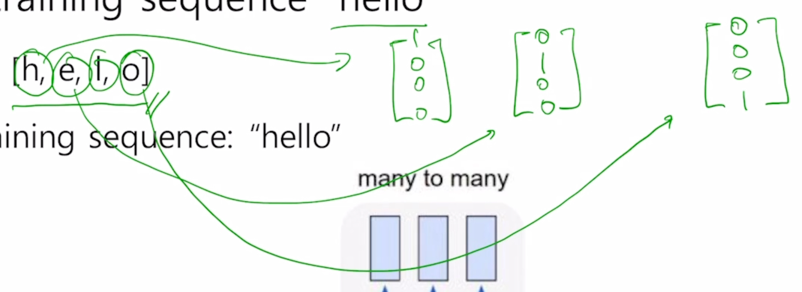

  - h : [1 0 0 0]
  - e : [0 1 0 0]
  - l : [0 0 1 0]
  - o : [0 0 0 1]

    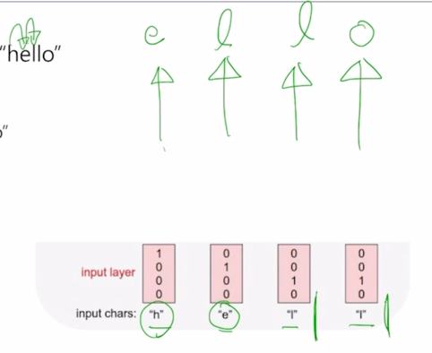

  - character 를 가지고 language model 을 수행하는 경우에는 주어진 character 의 sequence 가 h, e, l, l 의 순으로 주어지게 되면
  첫 번째 timestep 인 h 가 주어졌을 때는 바로 h 다음에 나올 character 인 e 를 예측해야 하고 두번째 timestep 에서 h 와 e 까지 주어지게 되면
  그 다음에 나타나는 character 인 l 을 예측해야 하고 마찬가지로 세번째, 네번째에는 l 까지 보면 다음 character 인 l 그 다음엔 두번째 l 까지 보면 
  그 다음 character 인 o 까지 예측하는 task 를 RNN 구조를 통해 다룰 수 있게됨

    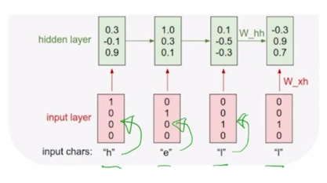

  - h, e, l, l 이 각 timestep 에서의 one-hot vector 형태의 입력으로 주어지게 되면 RNN 모듈은 매 timestep 에서 들어오는 입력벡터와 
  전 timestep 에서 주어지는  을 선형결합을 해서 
  얻어지는  를 만들어내게 됨

    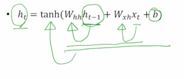
 
  - 여기서  이나  의 dimesnion 을 
  3이라고 정의해놨으면 3차원의 각 timestep 의 hidden state vector 는  에 대한
   로의 선형변환 그리고  에 대해서
   로의 선형변환을 담당하는 행렬들과 각각 곱하고 그리고 여기서는 추가적으로
  bias term b 까지 함께 고려를 하게되면 fully connected layer 로서 볼 수 있는 RNN 의 기본적인 layer 를 생각할 수 있고 다음에 추가적으로 비선형변환인 tanh 를 통과한 후
   를 얻어낼 수 있게 됨

    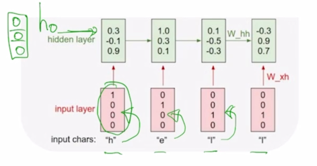
  
  - 첫번째 timestep 에서 주어지는 [1 0 0 0] 이라는  와 첫번째 timestep 에서는 
  사실  혹은 그 전 timestep 에서의 hidden state vector 가 입력으로 필요하게 되는데
  이 경우에는 그 전의 timestep 에서 RNN 모듈이 실행되지 않았기 때문에 default 로  는 
  모두 0 인 vector 를 RNN 의 입력으로 주게 됨

    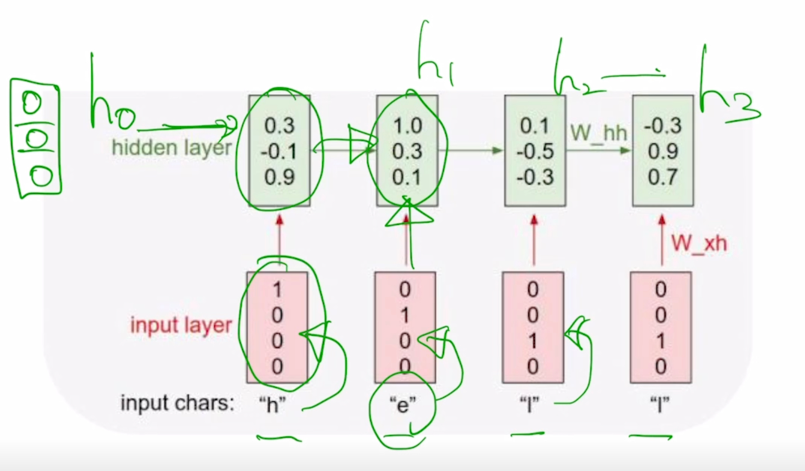

  - 그래서 계산을 수행한 후  을 계산하고 그 다음에  을 
  다음 timestep 의 입력으로 주고  를 또 입력으로 받아서 동일한 RNN 이 수행되면
  또  이 계산되고  ,  가 
  계산되는 것을 볼 수 있음
  
    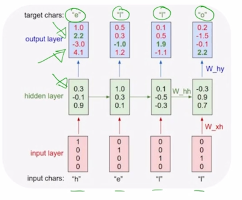

  - character level 의 language modeling 에서 각 timestep 마다 우리는 다음에 나올 character 를 예측해야되는 task 이므로 이는 many-to-many task 에 해당하고
  즉 이 output vector 를 계산하기 위해서 우리는 해당 timestep 에서 구해진  를 
  output layer 를 적용해서 최종 output 을 얻어내게 됨

    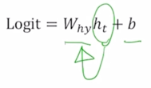

  - output layer 에서 정의된 선형변환의 parameter 를  라고 한다면
   를  와 곱하고
  그 다음에 bias term 까지 같이 고려를 해서 output vector 를 얻어내게 됨

  - 이 값이 logit 이라고 표현된 이유는 우리가 수행해야 하는 것은 사전에서 정의된 4개의 character 중 한 character 로서 다음에 나올 character 를 예측하는 
  task 를 수행해야 하기 때문에 output layer 의 node 수는 사전의 크기와 동일한 4개의 dimension 으로 이루어진 output vector 가 나오는 것을 알 수 있음
  - 선형변환을 해서 얻어진 output vector 를 multiclass classification 을 수행하기 위해 softmax layer 를 통과시키게 되면 

    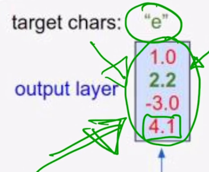

  - 여기에서는 softmax 의 입력으로 들어가는 logit 값으로서의 output vector 가 제일 큰 값을 가질 때, 해당 확률값이 가장 큰 값으로 나오게 되는 것을 알 수 있음
  - 사전에서 각각 dimension 에서 정의된 것이 아래 그림과 같다면

    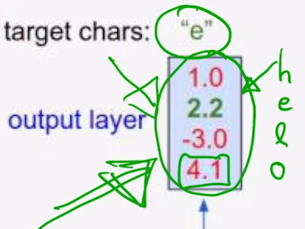

  - 이 경우에는 예측값이 o 라는 character 에 가장 큰 확률을 부여한 값으로 나오게 될 것이고 정작 ground-truth character 는 e 이기 때문에 여기에서 나오는 
  2번째 확률값을 최대한 높이도록 학습을 진행해야 하고 당연히 multiclass classification task 를 다루기 때문에 softmax layer 의 output 에 ground-truth e 라는 character
  는 [0 1 0 0] 이라는 vector 를 생각할 수 있고 이것과 softamx layer 에서 나온 값과 가까워지도록 하는 softmax loss 를 적용해서 이 network 를 학습하게 됨

  - 이 task 에서 주목할 것은 3번째 timestep 과 4번째 timestep 이 동일하게 l 로 입력이 들어가는 이 상황에서도 3번째 timestep 에서는 다음 character 로서 l 을 
  예측값으로 할 수 있어야하고 4번째 timestep 에서는 같은 l 이라는 입력이 들어왔을 때도 이번엔 o 라는 다음 character 를 에측해야 한다는 것을 알 수 있음

    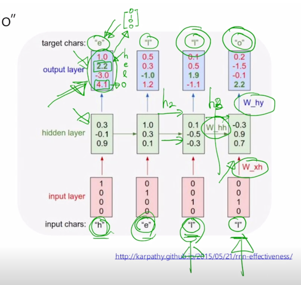

  - RNN 이 이러한 task 를 수행하기 위해서는 현재 들어오는 입력 뿐만 아니라 3번째에서는 전에 나온 character h, e 까지만 아는 정보 그리고 4번째에서는 h, e, l 까지
  나온 정보를 알 수 있어야하고 이러한 정보가 전 timestep 에서 넘어오는 hidden state vector 인  에 해당하는
  그 vector 가 해당 정보를 잘 표현함으로써 이러한 task 를 적절하게 수행할 수 있게 됨

  - At test-time, sample characters one at a time, feed back to model
  - 이렇게 학습을 끝낸 후에는 test time 에서 이 모델을 통해 inference 를 수행할 때를 생각해보자
 
    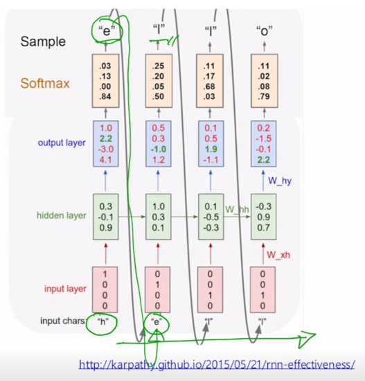

  - 이 경우, 첫번째 character 만을 입력으로 주고 그 다음엔 그 해당 timestep 에서의 예측값으로서의 다음 timestep 의 character 를 얻어낸 후
  잉 예측값을 그 다음 timestep 의 입력으로 재사용해서 또 다음 character 를 예측할 수 있게 되고 이런 과정을 거쳐 무한한 길이의 character sequence 를
  자유롭게 생성할 수 있게 됨

  - 동일한 모델로 먼 미래의 주식값도 예측할 수 있음

- Training a RNN on Shakespear's plays

  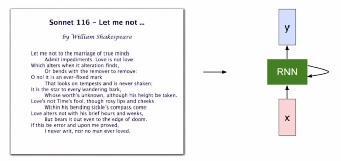

  - 단어에서 뿐만 아니라 문단에 대해서도 학습할 수 있음
  - 문단에서 나타나는 character 들의 sequence 는 RNN 을 학습하는데 사용되는 학습데이터로서 활용될 수 있음

    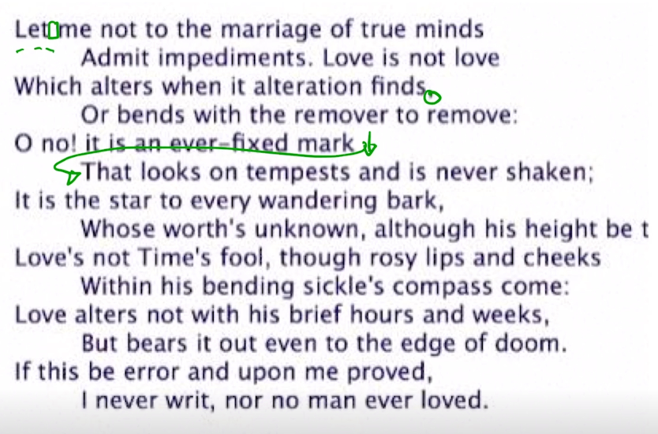

  - 이 글은 단어 하나만이 아니라 여러 단어로 이루어진 그리고 여러 문장으로 이루어진 글인데 이 경우 character level 의 language model 을 학습하기 위해서
  공백 같은 경우도 특수문자의 하나로서 vocabulary 상에 하나의 character 를 하나의 dimension 을 차지하게 되고 가령 쉼표(,) 그리고 줄 바꿈이 일어나는 경우에도 
  줄바꿈에 해당하는 특수문자를 사전(vocabulary)에 기록해두게 되면 하나의 글을 여전히 1-dimensional character sequence 로 볼 수 있고 이를 통해
  language model 을 학습할 수 있게 됨

- Training process of RNN

  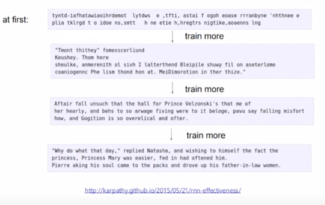

  - 학습이 거의 되지 않은 초반 interation 에서 모델을 가져와서 그걸 가지고 첫번째 character 를 주고 그 다음 character 를 예측하도록 했을때는 전혀 의미 있지
  않은 형태로 예측값이 나오는 것을 알 수 있음

    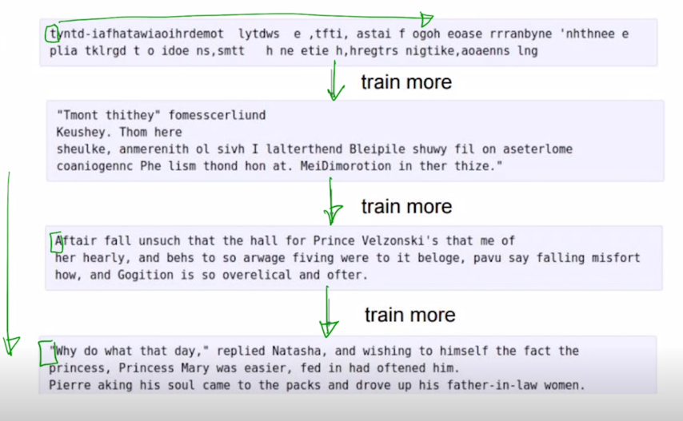
    
  - 점점 더 많이 학습을 진행하게 되면 첫번째 character 만을 주고 그 이후의 character 를 예측하게 하도록 했을 때는 학습이 진행될수록 그럴듯한 사람이 보기에도 
  어느 정도 문단으로서 볼 수 있을법한 고품질의 character 의 문자열이 생성되는 것을 알 수 있음

- 또 다른 예시
  - A paper written by RNN
  - C code generated by RNN

### Backpropagation through time (BPTT)

- Forward through entire sequence to compute loss, then backward through entire sequence to compute gradient

  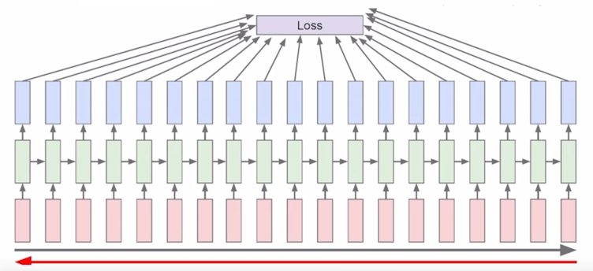

  - 매 timestep 마다 주어진 character 가 있을 것이고 거기서 발생된 hidden state vector 를 통해 output layer 를 각자 통과시켜준 후
  거기서 나온 예측값 그리고 각 timestep 에서 나와야 하는 다음 character 에 해당하는 ground-truth 와의 비교를 통한 loss function 을 통해서
  이 전체 network 가 학습이 진행됨
  - 구체적으로는 아까 말한 것처럼 입력 vector 가 hidden state vector 로 변환될 때 사용되는 ,
  그리고 전 timestep 의 hidden state vector 가 현재 timestep 의 hidden state vector 로 변환될 때 사용되는 ,
  그리고 여기서 계산된  가 output vector 로 변환될 때 사용되는 
   등의 이 행렬들이 전체적으로 backpropagatin 에 의해서 학습이 진행됨

  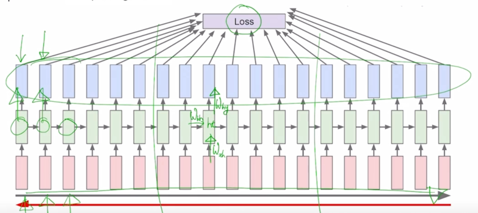

  - 이 경우 앞서 말한 한 문단, 그래서 character 의 전체 sequence 가 못해도 수십, 수백 혹은 수만 이상의 sequence 를 가지는 이런 학습데이터가 주어졌을 때는,
  한번에 우리가 GPU 를 통해서 학습해야 하는 sequence 도 굉장히 길 수 있고 그 다음엔 거기서 나오는 output 을 모두다 계산을 해서 거기에 loss 를 적용한 후
  backpropagation 과정을 수행해야 하는데 현실적으로 이 길이가 굉장히 길어지면 한꺼번에 처리할 수 있는 정보나 데이터의 양이 한정된 GPU resource 내에서의 
  memory 에 모두다 담기지 못할 수 있기 때문에 이것을 truncation 이라는 군데군데 잘라서 그에 해당하는 제한된 길이의 sequence 만으로 학습을 진행하는 방식을
  채택함

- Run forward and backward through chunks of the sequence instead of whole sequence

  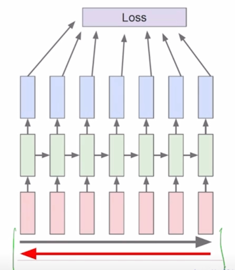

- Carry hidden states forward in time forever, but only backpropagate for some smaller number of steps
 
  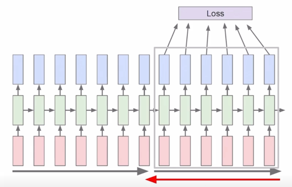

  - 만약 7개 정도로 sequence 의 길이를 한정을 했다면 우리의 학습데이터는 굉장히 길지만 처음에 7개, 그리고 두번째에 7개, 그리고 그 내에서의 forward propagation 및
  backpropagation 을 통해서 우리가 필요로 하는 RNN 의 parameter 를 학습하게 됨

### Searching for Interpretable Cells

- RNN 이 앞서 말한 다양한 사례에서 필요로 하는 지식을 어떻게 배울 수 있었는가 그리고 그 정보는 RNN 내에 어느 부분에 저장이 되는지를 다양한 방식으로
분석할 수 있음
- RNN 에서 필요로 하는 정보를 저장하는 공간은 매 timestep 마다 업데이트를 수행하는  라는
hidden state vector 라고 할 수 있음
- 공백을 2번 혹은 4번을 생성해야 하는 정보, 그리고 동시에 현재까지는 space 를 2번까지 생성을 했다라는 이런 정보들이 hidden state vector 에 담겨져야 함

  

- hidden state vector 의 차원이 3차원이라고 생각을 하면 그 필요한 정보가 3개의 숫자중 어디에 저장이 되어있는가를 역추적하는 식으로 분석을 수행할 수 있음
- hidden state vector 각각의 차원 하나를 고정을 하고 그 값이 timestep 이 쭉 진행됨에 따라서 어떻게 변하는지를 분석함으로써 RNN 의 특성을 분석할 수 있음

- How RNN works
  
  

  - 특정한 hidden state vector 의 dimension 을 고정해놓고 그 해당 dimension 의 값이 어떻게 변하는가를 그 크기가 (-)로 값이 클 때에는 파란색으로 혹은
  그 값이 (+)로 값이 커질때는 빨간색으로 나타낸 시각화의 예시임
 
    
    
  - character 를 생성하는 동안 특정한 dimension 에 hidden state vector 의 node 가 처음에는 빨간색 그리고 파란색 그리고 빨간색 이러한 값으로 변화하는 것을
  시각적으로 보여주는 예시

  - Quote detection cell

    

    - 여러 dimension 중 하나의 dimension 에서는 흥미로운 pattern 을 보이는 것을 알 수 있음
   
      
 
    - 이 경우는 " 가 열리고 " 가 닫히는 동안 항상 값이 (-)로 큰 값을 유지가 됐다가 " 가 닫히고 나서는 다시 빨간색 값으로 유지가 되는 것을 볼 수 있음
    - 이 것이 바로 RNN 내에서 hidden state vector 의 특정 dimension 이 하는 역할을 알려주고 있음
    - 그 역할은 바로 " 가 현재 열렸다 혹은 닫혔다에 대한 상태를 기억하고 있는 역할을 하는 것

  - If statement cell

    

    - C 등의 프로그래밍 언어를 학습하고 test-time 에서 sequence 를 생성했을 때 그 때에 나타나는 특정 hidden state vector 의 dimension 값을 시각화한 예시
    - if 라는 단어가 나와서 if 에서의 조건문에 해당하는 부분이 빨간색 혹은 값이 큰 형태로 나타나고 있는 것을 알 수 있음
    - 특정 dimension 이거를 하나의 cell 이라고도 부름

### Vanishing/Exploding Gradient problem in RNN

- RNN is excellent, but...
  - Multiplying the same matrix at each time step during backpropagation causes gradient vanishing or exploding

    

    -  가 반복적으로 반영이 된다는 사실때문에 등비수열과 같은
      같은 수를 계속적으로 곱하고 그런 방식 때문에 backpropagation 에서도 마찬가지로 같은 숫자가 계속적으로 곱해짐으로써 graidient 가 기하급수적으로 커지거나
      혹은 공비가 1보다 작을 때는 기하급수적으로 값이 작아지는 따라서 gradient 가 기하급수적으로 작아지거나 혹은 폭발적으로 증가하는 패턴을 보이게 됨
  
#### Vanishing Gradient Problem in RNN

- The reason whiy the vanishing gradient problem is important

  

  - 뒤 쪽에 timestep 까지 유의미한 gradient 를 전달할 수 없는 상황을 시각화
  - LSTM 같은 경우 보다 먼 timestep 까지도 gradient 가 적절한 0보다 어느 정도 큰 값으로 계산이 되어서 먼 timestep 까지 gradient 가 살아남고
  그래서 timestep 간의 거리가 먼 상황에서의 정보의 dependencies 혹은 Long term dependencies 문제를 효과적으로 개선할 수 있음
  
    

 

  
