# LSTM and GRU

## 4. Long Short-Term Memory (LSTM) & Gated Recurrent Unit (GRU)

### Long Short-Term Memory (LSTM)

- Core Idea: pass cell state information straightly without any transformation
  - Solving long-term dependency problem
  
  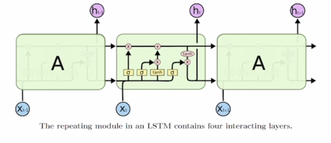

  - Original RNN 이 가지고 있던 Vanishing/Exploding gradient 문제를 해결하고 timestep 이 먼 경우에도 필요로하는 정보를
  보다 효과적으로 처리하고 학습할 수 있도록하는 즉, Original RNN 에서의 이런 문제를 개선한 모델임

- What is LSTM (Long Short-Term Memory)?

  - RNN 이 가지고 있는 매 timestep 마다 변화하는 hidden state vector 를 어찌보면 단기기억을 담당하는 기억소자로서 볼 수 있음
  - 이 단기기억을 sequence 가 timestep 별로 진행됨에 따라서 단기기억을 보다 길게 기억할 수 있도록 개선한 모델이라는 뜻에서 이름을 붙임
  - 기본적으로 RNN 이 가지는 수식을 보면 이러한 형태였음
    
    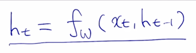

  - LSTM 에서는 전 timestep 에서 넘어오는 정보가 2가지의 서로 다른 역할을 하는 vector 가 들어오게 됨
  
    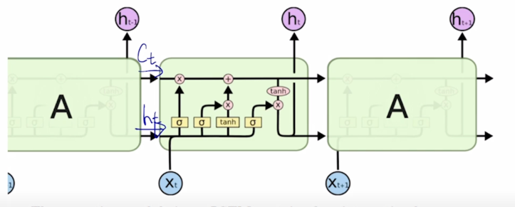

  - 위에있는 vector 는  
  - 아래쪽 vector 는  
  - 이게 각 timestep 에서 LSTM 모듈에 의해서 계산이 되고 그게 다음 timestep 의 당시에 입력 vector 와 함께 입력으로 들어가게 됨

    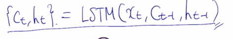

  - 이러한 형태를 가지게 됨
  - 이전 timestep 의  을 cell state vector 라고 부름
  - 추가로 이전 timestep 의  이 일반적으로 알고있는 RNN 의 
  hidden state 와 동일함
  -  과  을
    입력으로 받고 추가로  를 입력으로 받아서 현재 timestep 의  와 
    그리고  hidden state vector output 을 내주게 됨
  - cell state 정보와 hidden state 정보 중에서는 무엇이 더 핵심 정보인가?
    - cell state vector 가 좀 더 완성된 여러가지 필요로 하는 정보를 담고 있는 보다 완전한 정보를 포함하는 vector 가 됨
    - hidden state vector 는 cell state vector 를 한번 더 가공해서 그 timestep 에서 노출할 필요가 있는 정보만을 남긴 filtering 된 정보를 담는 vector 
    라고 생각할 수 있음
    - 그래서 hidden state vector 는 현재 해당하는 timestep 에서 예측값을 계산하는 output layer 등에 다음 layer 에 입력 벡터로 사용하는 특징이 있음

- Long short-term memory
  - i: Input gate, Whether to write to cell
  - f: Forget gate, Whether to erase cell
  - o: Output gate, How much to reveal cell
  - g: Gate gate, How much to write to cell

  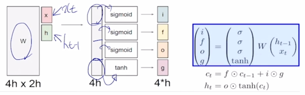

  -  와  을 먼저
    입력으로 받아서 vector 들을 선형 변환한 후에 output 으로 나타나는 vector 들이 있을 때, 그 vector 를 4개의 vector 로 쪼개고 이 각각의 vector 에 원소별로
    sigmoid 를 거치고 마지막 4번째 분할된 vector 에는 tanh 를 걸어주는 방식으로 output 값들을 생성하게 됨
    
    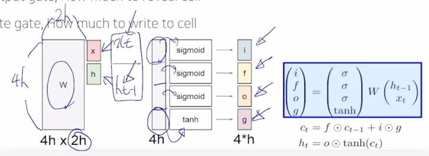

  - 이 그림에서는  와  의 각각의
  dimension 들을 모두 h 라고 가정하면 이 2개를 concat 한 vector 는 2h 만큼의 dimension 을 갖게되고 적용되는 선형변환(W)의 columns 의 개수는 2h 가 되고 
  h dimension 만큼의 vector 를 4세트 만들어줘야 하기 때문에 이 선형결합(W)의 4h 에 해당하는 row 의 개수를 가지게 됨

  - 이 4개의 vector 중 sigmoid 를 통해 나오는 처음 3개의 vector 들은 sigmoid 의 특성상 각 vector 의 원소들이 모두 0~1 사이의 값을 가지게 되고 
  sigmoid 를 통해 나오는 vector 는 어떤 다른 vector 와 elementwise multiplication 을 통해서 곱해지는 vector 가 가지던 값을 각각 0~1 사이의 값과 곱해줌으로써
  원래 값이 가지던 정보의 일부 % 만을 가지게 하는 역할을 함
    - 가령 sigmoid 의 값이 0.3으로 나왔을 때, 이 값과 곱해지는 어떤 또다른 vector 의 값이 5였다면 5 x 0.3 = 1.5 즉, 5라는 원래 값이 가지던 크기에 
    30% 만큼의 값만을 보존해주게 됨
  - 마지막 vector 였던 tanh 를 거쳐서 나온 값은 tanh 의 특성상 -1 ~ 1 사이의 값을 가지게 되고 이는 original RNN 에서 선형결합 후 tanh 를 통해서
  최종 hidden state vector 를 -1 ~ 1 사이의 값으로서 유의미한 정보를 담는 역할을 하듯이 마찬가지로 tanh 가 현재 timestep 에서 LSTM 에서 계산되는 
  유의미한 정보라고 생각할 수 있음

- A gate exists for controlling how much information could flow from cell state

  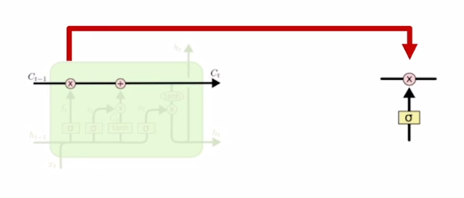

  - 이전 timestep 에서 넘어온  vector를 적절하게 변환하는데 사용

- Forget gate
  
  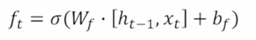

  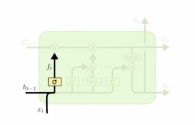

  -  이 3차원 vector 로서 [3 5 -2] 라는 값으로 주어진 경우에
    앞서 계산된 vector 4개 중 forget gate 혹은 f gate vector 와 곱해지게 되는데  와
     2개 입력을 받아서 선형결합을 해서 만들어지는 output vector 그리고 이 output vector 에
    sigmoid 를 통과해 나오는 forget gate vector 가 3차원 vector 로 나오게 되는데 이 vector 의 값이 [0.7 0.4 0.8]로 나왔다면, 이 2개의 vector 를 
    elementwise 로 곱해주게 됨
    
    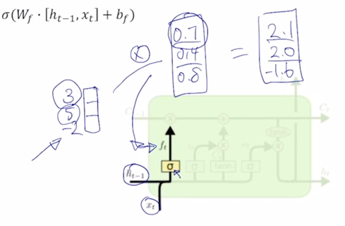

  - 그러면 이전 timestep 에서 넘어온 cell state vector 3이라는 값에서 70% 2.1 을 가지고 5라는 값에서 40% 의 값을 가져서 2.0 그리고 -2에서 80%의 값을 가져서 -1.6을 가지는
  vector 를 만들어 주게 됨 [2.1 2.0 -1.6]
  
  - forget gate 의 forget 의 의미를 볼 때, 이전 timestep 에서 넘어온 정보 중 70% 만 보존한다라는 말은 30%는 잊어버리겠다는 말과 같음
  - 그래서 f 라는 vector 를 forget gate 라고 부르게 됨 

- Generate information to be added and cut it by input gate
  
  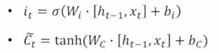

  - 앞서 계산한 4개의 vector 중 gate gate g 라는 vector 에 대해서 살표보자
  - 여기서는  이 값이 tanh 를 통해 전 timestep 의 hidden state 그리고
  현재 타임의 입력 vector 를 받아서 선형결합() 을 통해서 tanh 를 나오는 -1 ~ 1 사이의 값을 가지는
  vector 가 됨

- Generate new cell state by adding current information to previous cell state

  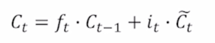

  - 이 vector 는 앞서 나왔던 4개의 vector 중 또 다른 vector 인 input gate i 와 여전히 sigmoid 를 통해서 나온 vector 와 dimension 별로
   와 dimension 별로 0~1 사이의 값과 곱해짐으로써 그 vector 를 
  변환해주게 되고 그러면 이 정보를 아까 이전 timestep 에서 넘어온 cell state vector 에 우리가 필요한 만큼의 정보만을 유지하고 필요없는 정보는 버려주고 그 일부만을
  남겨둔  에 덧셈에 형태로 vector 를 변환해서 최종적인 현재 
  timestep 에서의 cell state vector  를 나타내 줌

  - 여기서 이전 tiemstep cell state vector  즉, 현재 timestep 
  에서 만들어진 정보인 gate gate 혹은  바로 더해주지 않고 
  이 input gate  와 곱한 후 더해주는 것은 다음과 같이 이해할 수 있음
  - 한번의 선형변환만으로  에서  를 거친 후
  원하는 만큼의 정보를 더해주고자 할 때, 그 값을 바로 그냥  로 만들어서
  더해주지 않고  라는 input gate 와 또 다른 vector 를 곱해주게 되는 
  부분은 한번의 선형변환만으로  에 더해줄 정보를 만들기가 어려운 경우에는
  일단은 더해주고자 하는 값보다 좀 더 큰 값들로 구성된 그러한 정보를  혹은 
  gate gate 의 형태로 만들어 준 후 그 값에서 또 각 dimension 별로 특정 비율만큼의 어떤 정보를 덜어내서 우리가 실제로  에 
  더해주고자 하는 정보를 두 단계에 걸쳐서 만들겠다는 의미로 이해하면 좋음

  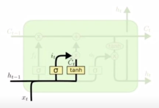

- Generate hidden state by passing cell state to tanh and output gate
- Pass this hidden state to next times tep, and output or next layer if needed
  
  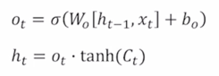

  - cell state vector  에 tanh 를 적용해서 Original RNN 에서의 hidden state vector 와
  같이 -1 ~ 1 사이 만큼의 범위를 가지는 vector 로 만들어줌
 
    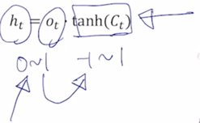

  - 그 다음에 sigmoid 를 통해 나온 forget gate, input gate 그 값들이 앞에서 쓰여졌다면 또 다른 나머지 vector 인 output gate  도
  여전히 sigmoid 를 통해서 만들어진 0 ~ 1 사이의 값이었음
  - 이 값을 -1 ~ 1 사이의 tanh 를 거친 cell state vector 에 곱해줘서 cell state 가 가지던 정보에서 hidden state vector 를 만들때는 특정 dimension 별로
  각각 적절한 비율만큼으로 이 값들을 작게 만들어서 최종적인  를 구성하게 됨

  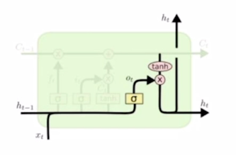

  - 여기서 다시한번  와  의 차이점
  그 서로다른 역할을 생각해보면  는 기억해야 할 필요가 있는 모든 정보를 담고있는
  그런 vector 라고 볼 수 있지만  는 현재 timestep 에서 예측값을 내는 
  output layer 에 입력으로 사용되는 vector 라는 점에서 해당 timestep 의 예측값에 직접적으로 필요한 정보만을 담은  가 가지는
  많은 정보에서 지금 당장 필요한 정보만을 filtering 한 그런 형태로 생각할 수 있음
  - 즉  는 다음 RNN 의 hidden state 로 넘어감과 동시에 위로 올라가는
  path 를 가지고 있는데 이것이 바로 현재 timestep 에서 우리가 예측을 수행할 때 가령 "I go home" word sequence 를 예측한다고 하는 경우 I 다음에 나와야 하는 단어가
  go 라는 단어여야 하기 때문에 go 라는 단어를 예측하기 위해서 output layer 의 입력으로 주는 vector 가  가 되는 것임

### Gated Recurrent Unit (GRU)

- What is GRU?
  - LSTM 과 비교할 때 GRU 는 LSTM 의 모델구조를 보다 경량화해서 적은 memory 요구량과 빠른 계산시간이 가능하도록 만든 모델
  - LSTM 에서 2가지 종류의 vector 로 존재하던 cell state vector 와 hidden state vector 이 둘을 일원화해서 여기서는 오직
  hidden state vector  혹은  만이
  존재하는 것임
  - GRU 의  는 LSTM 의  와 비슷한 역할

  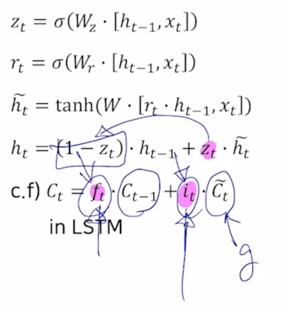

  - GRU 에서는 input gate 만을 사용하고 forget gate 자리에는 (1 - input gate) 에 해당하는 값을 사용
 
    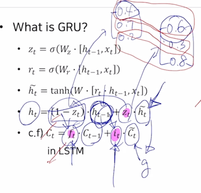

  - input gate 에 해당하는  가 [0.6 0.3 0.8] 로 구해진 경우에
    (1 - ) 는 [0.4 0.7 0.2] 로 구성
  - input gate 가 커지면 커질수록 forget gate 에 해당하는 값은 점점 작은 값이 되어서 결국 hidden state vector  는 
  이전 timestep hidden state vector  과 현재 만들어진 정보인
   가 LSTM 에서의 gate gate 혹은  와 동일한
  역할을 하게됨
  - 이 2개의 정보간에 각각 독립적인 gating 을 한 후 더한것이 아니라 두 정보간의 가중 평균을 내는 형태로 계산되는 것을 알 수 있음
  -  에서 60%의 정보를 보존한다면  에서는
    40% 만큼만의 정보만을 보존해서 2개를 더하는 것
  
  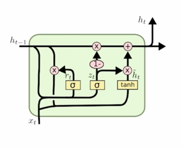

- GRU 의 특징
  - GRU 는 LSTM 에서  와  2개의 정보를  하나로
  일원화 했다는 것
  - 내부적으로 볼 때, 2개의 독립된 gate 를 통해서 하던 연산을 하나의 gate 만으로 계산하도록 함으로써 계산량과 memory 요구량을 LSTM 에 비해서 훨씬 더 줄인 경량화된
  모델이라고 볼 수 있음

> 경량화 되었지만 LSTM 에 비해서 뒤지지 않는 좋은 성능을 보여줌

### Backpropagation in LSTM? GRU?

- Uninterrupted gradient flow!

  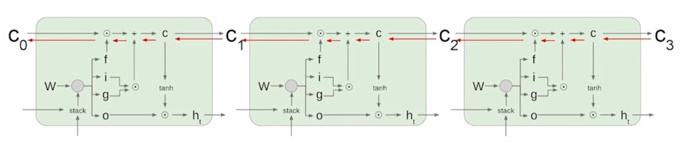

  - 정보를 담는 주된 vector 인 cell state vector 가 업데이트 되는 과정이 기존의 Original RNN 에서 동일한  라는 행렬을
  계속적으로 곱해주는 그러한 형태의 연산이 아니라 그 전 timestep 의 cell state vector 에서 그때그때 서로 다른 값으로 이루어지는 forget gate 를 곱하고 
  그 다음에 필요로 하는 정보를 곱셈이 아닌 덧셈을 통해서 원하는 정보를 만들어 준다는 이 사실로 인해서 gradient vanishing 혹은 explosion 의 문제가 
  사라진 것으로 얘기할 수 있음
  - 기본적으로 덧셈 연산은 backprogation 을 수행할 때 gradient 를 복사해주는 연산이 됨
  - 항상 동일한  가 곱해지는 Original RNN 에 비해 멀리 있는 
  timestep 까지 gradient 를 큰 변형없이 전달해줄 수 있음
  - 이를 통해 더 긴 timestep 간의 존재하는 long term dependencies 문제들을 해결할 수 있음

### Summary or RNN/LSTM/GRU

- RNNs allow a lot of flexibility in architecture design
- Vanilla RNNs are sunoke but don't work very well
- Backward flow of gradients in RNN can explode or vanish
- Common to use LSTM or GRU: their additive interactions improve gradient flow

- RNN 은 다양한 길이를 가질 수 있는 sequence 데이터에 특화된 유연한 형태의 딥러닝 모델구조
- Original RNN 혹은 Vanilla RNN 은 구조가 간단하지만 학습시에 gradient vanishing / explosion 문제가 있어서 실제로 많이 사요되지 않음
- 진보된 형태의 RNN 모델인 LSTM 이나 GRU 를 실제 많이 사용하고 그 방법들에서 cell state vector 혹은 hidden state vector 를 각 timestep 에서 
업데이트 하는 과정이 기본적으로 덧셈에 기반한 연산이기 때문에 이러한 gradient vanishing / explosion 문제를 피하고 long term dependencies 문제를 
해결할 수 있는 방법이 됨

