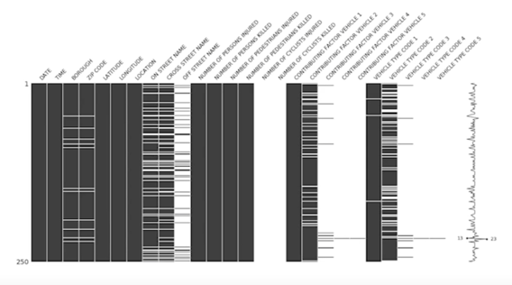
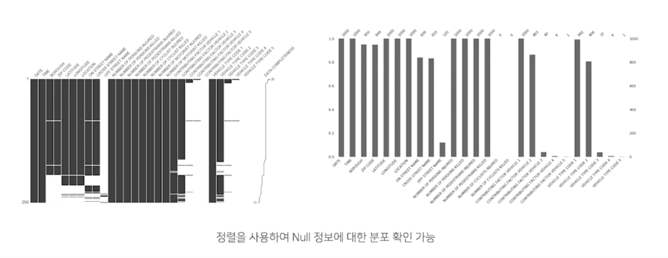
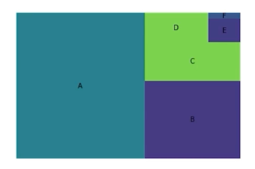
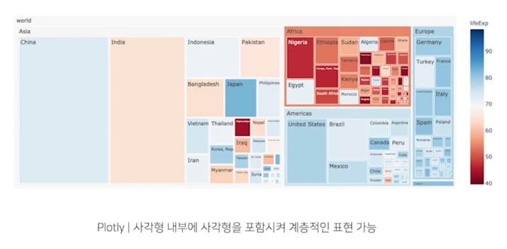
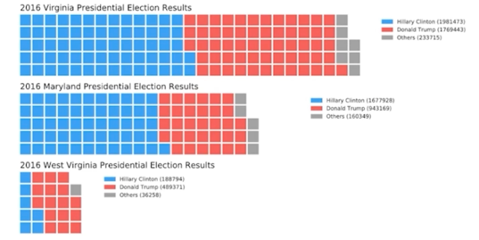

# 다양한 시각화 라이브러리

## 1. Missingno

### 1.1 Missingno

- 결측치(missing value)를 체크하는 시각화 라이브러리
- 빠르게 결측치의 분포를 확인하고 싶을 때 사용 가능

- `pip install missingno`

## 2. Treemap

### 2.1 Treemap

- 계층적 데이터를 직사각형을 사용하여 포함 관계를 표현한 시각화 방법
- 사각형을 분할하는 타일링 알고리즘에 따라 형태가 다양해짐
- 큰 사각형을 분할하여 전체를 나타내는 모자이크 플롯(Masaic plot)과도 유사

- Python에서 2가지 방법
  - `pip install squarify`
  - Plotly 의 treemap 사용

## 3. Waffle Chart

### 3.1 Waffle Chart

- 와플 형태로 discrete 하게 값을 나타내는 차트
  - 기본적인 형태는 정사각형이나 원하는 벡터 이미지로도 사용 가능

- 사용방법
  - `pip intsall pywaffle`

- Icon 을 사용한 Waffle Chart 도 가능 (Pictogram Chart)
- 인포그래픽에서 유용

## 4. Venn

### 4.1 Venn

- 집합(set) 등에서 사용하는 익숙한 벤 다이어그램
  - EDA 보다는 출판 및 프레젠테이션에 사용
  - 디테일 한 사용이 draw.io 나 ppt 에 비해 어려움

- `pip install pyvenn`
- `pip install matplotlib-venn`

