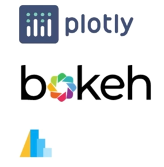
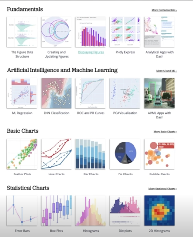
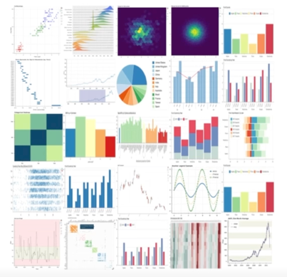
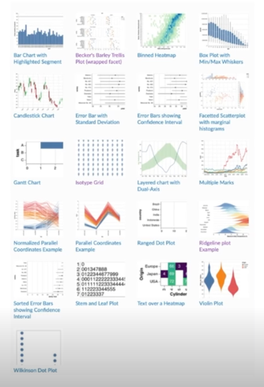

# Interactive Visualization

## 1. Interactive를 사용하는 이유

### 1.1 정적 시각화의 단점

- 정형 데이터에서 Feature가 10개 있다면
  - 각각을 살펴보는데 10개의 plot
  - 각각의 관계를 살펴보는데 10 * 9 / 2 = 45개의 plot
  - 가볍게 살펴보는 것도 약 50개의 plot이 필요
  - **공간적 낭비**가 크다!

- 각각의 사용자는 원하는 인사이트가 다를 수 있다.
  - 필요한 인터랙션을 통해 원하는 정보를 얻을 수도 있다.
  - 물론 설득을 위해서 **원하는 메세지를 압축해서 담는 것은 정적 시각화**의 장점

### 1.2 인터랙티브의 종류

- 이론에서는 ...
  - Select : mark something as interesting
  - Explore : show me something else
  - Reconfigure : show me a different arrangement
  - Encode : show me a different representation
  - Abstract : show me more or less detail
  - Filter : show me something conditionally
  - Connect : show me related items

### 1-3. 라이브러리 소개

- 대표 라이브러리 3개
  - Plotly
  - Bokeh
  - Altair

- 문법과 제공하는 방법들이 차이가 있음
  - 원하는 라이브러리를 선택!

## 2. Interactive Viz Library

### 2.1 Matplotlib

- Matplotlib 도 인터랙티브를 제공
- 단, 주피터 노트북 환경 또는 Local 에서만 실행할 수 있음
  - 다른 라이브러리들은 웹에 deploy 가능
  - mpld3를 사용하면 웹에서 D3-based Viewer 제공

### 2.2 Plotly

- 인터랙티브 시각화에 가장 많이 사용되는 Plotly
  - Python 뿐만이 아니라 R, JS 에서도 제공

- 예시 + 문서화가 잘되어 있음
- 통계 시각화 외에도 지리 시각화 + 3D 시각화 + 금융 시각화 등 다양한 시각화 기능 제공
- JS 시각화 라이브러리 D3js를 기반으로 만들어져 웹에서 사용 가능
- 형광 Color 가 인상적

### 2.3 Plotly Express

- Plotly를 seaborn 과 유사하게 만들어 쉬운 문법
- 커스텀 부분이 부족하지만 다양한 함수 제공

### 2.4 Bokeh

- 문법은 Matplotlib 과 더 유사한 부분이 있음
- 기본 Thmem이 Plotly에비해 깔끔
- 비교적 부족한 문서화

### 2.5 Altair

- Vega 라이브러리를 사용하여 만든 인터랙티브
- 시각화를 + 연산 등으로 배치하는 것이 특징

- 문법이 Pythonic 하지 않음 (오히려 js스러움?)
- 데이터 크기에 5000개 제한

- Bar, Line, Scatter, Histogram에 특화

