# Sequence to Sequence with Attention

## 1. Encoder-decoder architecture, Attention mechanism

### Recall: Types of RNNs

- Sequence-to-sequence
  - Machine Translation

  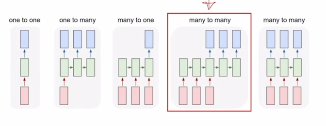

- 앞서 배운 RNN의 구조중 many-to-many에 해당
  
  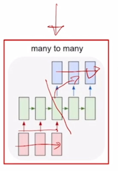

- 입력도 sequence 출려도 sequence 인 형태에서 입력 sequence 를 모두다 읽은 후 그 다음에 출력 sequence 를 생성하는 혹은
예측하는 모델이 됨
- 자연어처리에서 입력은 보통 word 단위의 문장 그리고 출력도 그에 대응하여 예측해야되는 word 단위의 문장이 됨

### Seq2Seq Model

- It takes a sequence of words as input and
gives a sequence of words as output
- It composed of an encoder and a decoder

    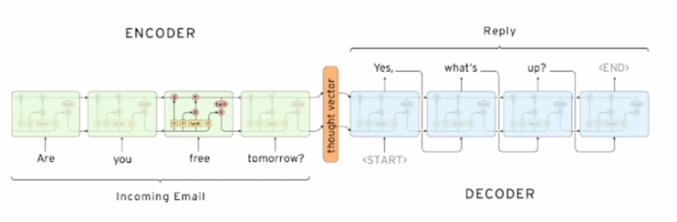

- 여기 보이는 예시에서는 dialogue system 챗봇에서 "Are you free tomorrow?" 라고 질문했을때, 그에 대응하는 문장으로서 "Yes, what's up?" 이라는
문장을 예측하여 생성하는 예를 보여줌

  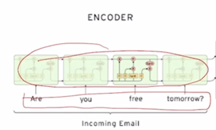

- 이 구조에서 입력문장을 읽어들이는 RNN 모델을 Encoder 라고 부름

  

- 출력문장을 단어 하나하나씩 생성하는 RNN 모델을 Decoder 라고 부름
- Encoder 부분과 Decoder 부분은 서로 share 하지 않는 parameter 로 이루어진 RNN 모듈임
- 그래서 Encoder 에서 공통된 parameter 를 매 timestep 마다 썼다면 그것과는 별개의 또다른 RNN 모델을 써서 Decoder 모델을 구성하게 됨

  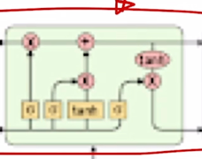

- RNN의 세부구조를 볼 때, 여기서는 RNN 모듈로써 LSTM 을 채용한 것을 알 수 있음

  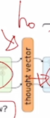

- seq2seq model 에서 Encoder 의 마지막 단어까지 읽어들인 후 그 이후에 나오는 hidden state vector 즉 Encoder 의 마지막 timestep 의
hidden state vector 는 바로 Decoder RNN 에  즉, 첫번째
timestep 의 입력으로 주어지는 이전 timestep 의 hidden state vector 로서 역할을 하게 됨

- 이 정보는 앞서 Encoder 에서 수집한 정보들을 잘 담아두고 있다가 이 정보를 바탕으로 Decoder 는 순차적으로 그에 대응하는 단어를 출력으로 예측하게 됨

  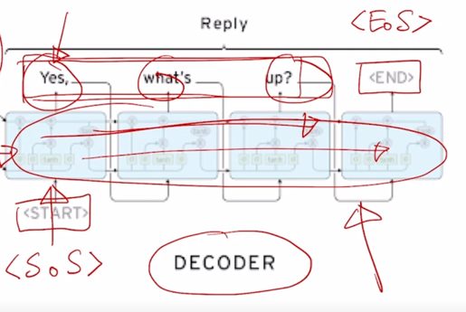

- 그리고 word 별로 문장을 생성하는 이러한 task 에서 보통 첫번째 단어로서 넣어주는 것을 <START> 토큰 혹은 <sos> start of sentence 토큰이라고도 부르는데
이런 특수한 word 를 vocabulary 상에 정의해두고 이를 가장 처음에 Decoder timestep 에 넣어줌으로써 실질적으로 생성되는 첫번째 단어부터 예측을 수행하게 됨

- test-time 에서 문장이 끝나는 시점을 언제까지 단어를 생성할지에 대해서는 마지막에 또 다른 특수문자인 <END> 토큰 혹은 <eos> end of sentence 토큰이라고 부르는데
이 토큰이 나올 때까지 Decoder RNN 을 구동하고 이 토큰이 실제로 생성되면 여기까지가 최종적인 출력으로 해서 더이상은 단어를 생성하지 않는 그런 형태로 생성을 종료하는
과정을 따르게 됨

### Seq2Seq Model with Attention

- Attention provides a solution to the bottleneck problem
- Core Idea: At each time step of the decoder, focus on a particular part of the source sequence

  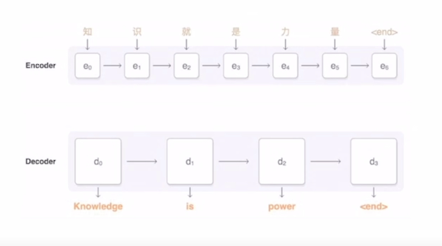

- seq2seq 구조에서 추가적인 모듈로서 attention 이라는 것을 활용할 수 있음
- attention module 의 기본적인 motivation 은 앞서 보여드린 seq2seq model 에서 우리가 사용하는 RNN 기반의 모델 구조가 sequence 의 앞에서 부터 
순차적으로 단어들의 정보를 읽어들이고 거기서 필요한 정보를 매 timestep 마다 축적해가면서 hidden state vector 를 생성하는 과정을 따르는데
이 과정에서 hidden state vector 가 항상 RNN 의 구조 특성상 hidden state vector 의 dimension 이 정해져 있다라는 그러한 특성으로 인해 입력 문장의
길이가 몇단어 안되는 짧은 문장이든 아니면 굉장히 긴 문장이든 Encoder 의 마지막 timestep 에 있는 hidden state vector 에 앞서 나왔던 많은 정보들을 
다 옮겨 넣어야 함
- 그래서 dimension 이 3차원 vector 로 구성되어 있을 때, hidden state vector 가 점점 정보를 축적함에도 결국은 고정된 숫자인 3개의 dimension 으로 이루어진
vector 내에 sequence 전체의 정보를 다 압축하여 저장하고 있어야 함
- 또한, 아무리 LSTM 에서 Long-term dependencies 를 해결했다고 하더라도 멀리있는 정보 즉, 마지막 timestep 을 기준으로 할 때, 훨씬 이전에 나타났던
그런 단어에 대한 정보는 LSTM 구조를 지나가면서 점차로 그 정보가 변질되거나 소실될 수 있음
- 그래서 앞쪽에 나타난 주어나 본동사 혹은 여기서는 동사가 나오게 됐는데 앞쪽에 나타난 단어들을 특히 정보를 저장하지 못하는 이런 현상이 벌어지게 됨

  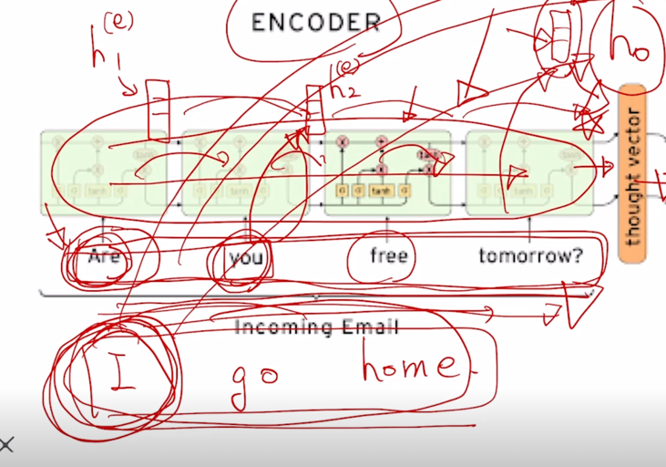

- attention 을 사용하게 되면 Encoder 의 마지막 timestep 에서 나오는 hidden state vector 하나에만 의존하는 것이 아니라
입력 문장에서 주어졌던 각각의 단어들을 순차적으로 Encoding 하는 과정에서 나오는 Encoder hidden state vector 
,  
you 까지를 Encoding 한 hidden state vector 인  는 방금 들어온
단어 you 에 대한 정보를 조금 더 주된 정보로 포함하고 있는 you 에 대응하는 hidden state vector 라고 생각할 수 있음
- , , 
,  이
4개의 vector 를 전체적으로 Decoder 에 제공해주고 Decoder 에서는 각 timestep 에서 단어를 생성할 때 그때그때 필요한 Encoder hidden state vector 를 
선별적으로 가져가서 예측에 도움을 주는 형태로 활용하게 됨

- Use the attention distribution to take a weighted sum of the encoder hidden states
- The artention output mostly contains information the hidden states that received high attention

  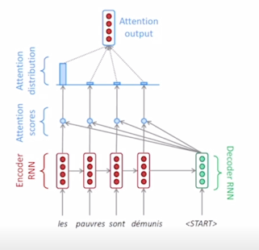

- 프랑스어를 영어로 번역하는 예를 들고 있음

  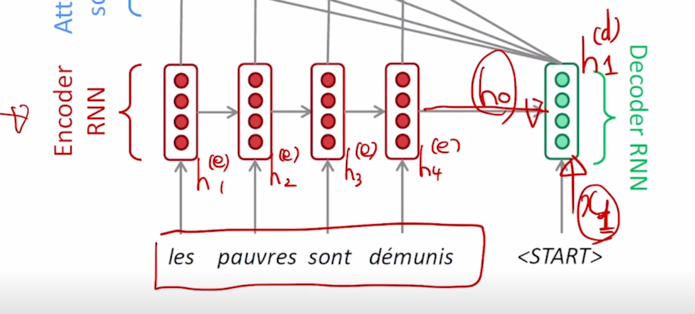

- hidden state vector 가 4개의 dimension 으로 구성되어 있다고 생각

- attention 이 없었을 때, seq2seq model 처럼 마지막 timestep 의 Encoder hidden state vector 가 Decoder 의  로서
입력으로 들어가게 됨 
-  와 <START> 토큰으로서 주어지는 그에 해당하는 <START> 토큰의 word embedding vector 가
  입력으로 주어지고 이 둘을 입력으로 받아서 Decoder RNN 이 Decoder 의 hidden state vector 를 만들어 줌

- 이렇게 계산된 Decoder 의 첫번째 timestep 의 hidden state vector 를 가지고 다음 단어의 예측을 수행하는데 사용할뿐마 아니라 이 벡터를 통해
Encoder 에서 주어진 4개의 hidden state vector 중 현재 어떤 hidden state vector 를 필요로 하는지를 선정하는 그런 역할을 수행하게 됨
- 그 과정은  가 Encoder hidden state vector 각각과
내적의 연산을 수행하게 됨

  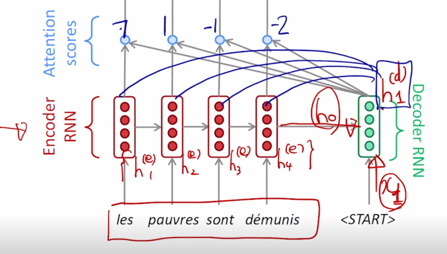

- 그 내적값이 7 1 -1 -2 라고 계산이 되었다면 이 Decoder hidden state vector 와 각 Encoder hidden state vector 간의 내적에 기반한 유사도라고
생각을 할 수 있음

  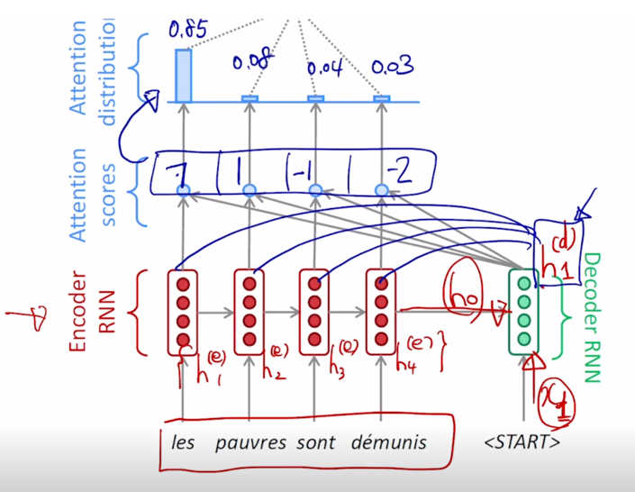

- 이 값들은 softmax 를 통과시켜서 이 값들이 각각의 Encoder hidden state vector 의 대응하는 확률값을 계산해줄 수 있는 입력벡터 혹은 logit 벡터라고 생각을하면
그 확률값은 0.85 0.08 0.04 0.03 이런 방식으로 계산될 수 있음

  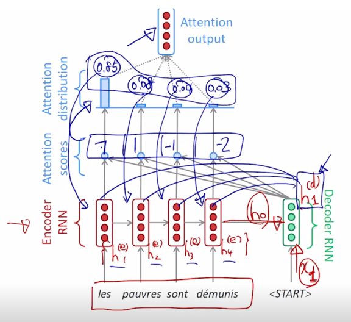

- 0.85 0.08 0.04 0.03 값은 Encoder hidden state vector 에 부여된 어떤 가중치로서 사용됨
- 4개의 Encoder hidden state vector 에 대해서 0.85 0.08 0.04 0.03 가중치 세트를 적용해서 가중 평균을 구할 수 있음
- 가중 평균으로서 나오는 하나의 Encoding vector 를 구할 수 있게됨 

- 즉, 이것이 바로 Decoder hidden state vector 를 사용해서 이 당시에 필요로 하는 정보는 첫번째 timestep 에 있는 Encoder hidden state vector 를
85% 필요로 하고 있고 두번째는 8% 세번째는 4% 네번째는 3%의 정보를 필요로 하고 있음을 의미하게 됨

  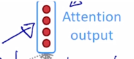

- 여기서 나온 attention model 의 output 이라고 볼 수 있는 Encoder hidden state vector 의 가중 평균된 vector 는 context vector 라고도 부름

  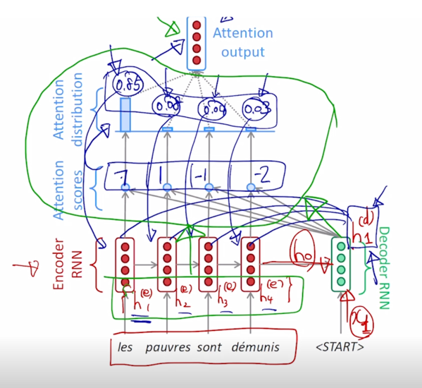

- attention module 을 정의할 수 있고 attention module 은 위와 초록색 부분과 같이 정의됨
- 입력은 Decoder hidden state vector 하나만 그리고 Encoder hidden state vector 세트가 attention module 의 입력으로 들어감
- attention module 의 출력으로 나오는 것은 Encoder hidden state vector 의 가중 평균된 vector 한개가 output 으로 나오게 됨

- Concatenate attention output with decoder hidden state, then use to compute  
as before

  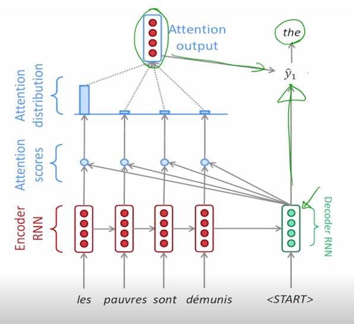

- 그러면 이렇게 만들어진 vector 는 앞서 계산한 Decoder hidden state vector 와 context vector 혹은 attention module 의 output vector 가
함께 concat 이 되어서 output layer 의 입력으로 들어가게 되고 그로부터 다음에 나올 단어를 예측을 하게 됨

- output layer 는 Decoder hidden state vector 와 Decoder hidden state 에 의해서 선별적으로 뽑아온 가중 평균 된 Encoder hidden state vector 
가 함께 사용이 되어서 Decoder 의 특정 timestep 에서의 예측값을 뽑아내게 됨

  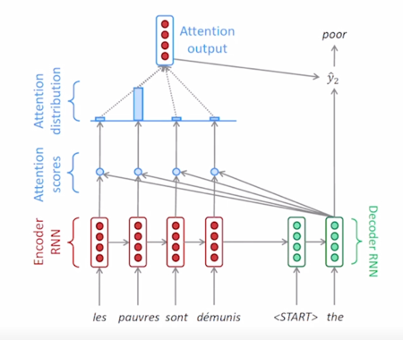

- 마찬가지로 첫번째 단어를 예측한 이후, Decoder timestep 에서 두번째 timestep 에서는 그 당시에 들어오는 입력 단어와 첫번째 timestep 에서 
넘어온 Decoder hidden state vector 를 입력으로 받아 RNN 을 통과해  가 계산됨

  

- 동일한 attention module 을 다시한번 사용하되, Encoder hidden state 와 내적을 계산할 때 사용하는 vector 로서 새로운 두번째 timestep 의 Decoder hidden state vector
를 가지고 내적을 계산해주게 됨 
- 그러면 그 때 내적값을 통해서 나오는 유사도 값은 앞선 경우와는 다르게 될 것이고 그 값을 softmax를 통과시켜서 나온 상대적으로 합이 1인 가중치값이 계산이되고 
이 가중치를 적용해서 공통의 hidden state vector 에 대해서도 서로 다른 가중치를 적용해서 가중평균으로 나오는 결과 vector 를 얻어낼 수 있음

  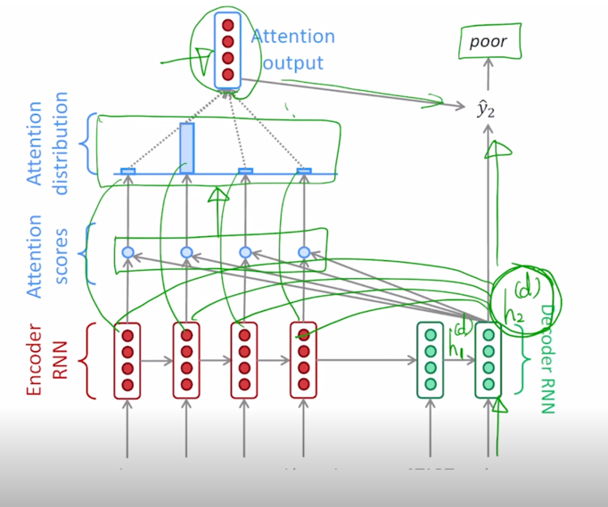

- Decoder 의 두번째 timestep 의 hidden state vector 와 context vector 가 같이 concat 되어서 output layer 의 입력으로 주어지게 되고 
두번째 timestep 에서 다음 timestep 에서 나올 단어를 예측하게 됨

  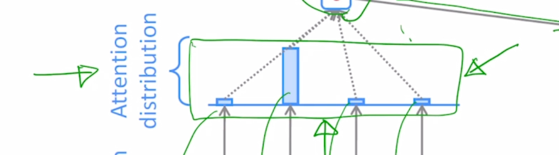

- 앞에서 말하지 않은 것 중에 합이 1인 형태의 상대적인 가중치로 나오는 softmax layer 의 output 을 attention vector 라고 부름

  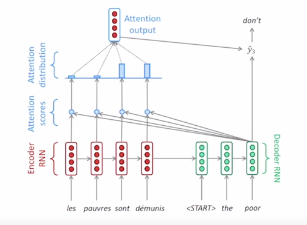

  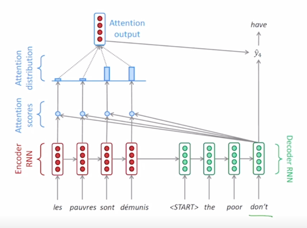

- 이와 같은 과정을 세번째 timestep 그리고 네번째 timestep 에 대해서 반복적으로 수행함으로써 그때그때 서로 다른 가중치를 Encoder hidden state vector 에 
적용해서 나오는 가중평균된 vector 를 그때그때마다 output layer 에 직접적인 입력의 일부로서 사용해서 해당 timestep 에서의 예측에 좀 더 정확도를 올리는
attention module 이 seq2seq model 에 성능을 올려줄 수 있게 됨

  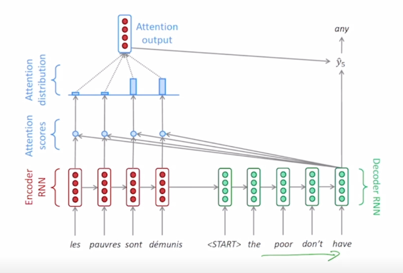

- 이렇게 timestep 을 계속 진행해가면서 완성된 출력문장을 얻어서 <eos> 혹은 <END> 토큰이 나올 때까지 생성 과정을 수행하게 됨
- 이런 방식으로 Decoder 에서 각 timestep 별로 단어를 순차적으로 예측하는 이런 과정에서의 Decoder RNN 에서의 hidden state vector 의 역할을 생각해보면
이 vector 가 해당 timestep 에서의 output 단어(다음에 등장해야 하는 단어)를 예측하는 output layer 에 입력으로 사용됨과 동시에 입력 sequence 에서 주어지는
각 word 별로의 Encoding vector 중 어떤 단어 vector 를 중점적으로 가져와야 할지 attention 가중치를 결정해주는 2가지 역할을 수행하게 됨
- attention module 의 output 이 해당 timestep 에서의 예측해야 하는 그 단어를 예측하는데 쓰이는 추가적인 입력으로 사용됨

  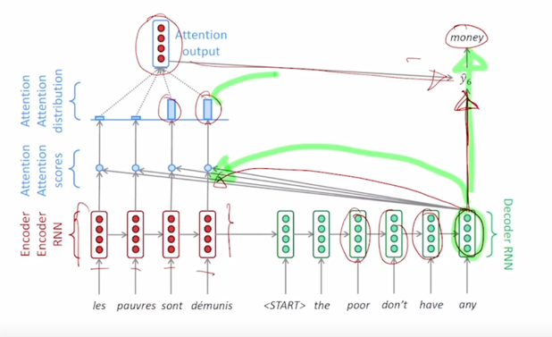

- Decoder hidden state vector 를 만드는 Decoder RNN 은 output 단어를 예측하는데에 그리고 필요한 정보를 취사선택하는데에 두 역할을 동시에 하도록
학습이 진행 됨

  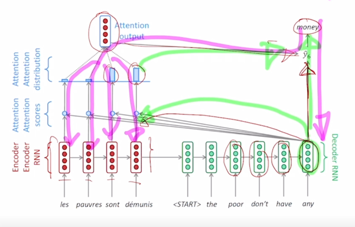

- backpropagation 의 과정에서 보면 'money' 라는 단어를 예측하는데에 있어서 Encoder 단에서 주어진 vector 의 정보를 잘 못 가져온 경우  

  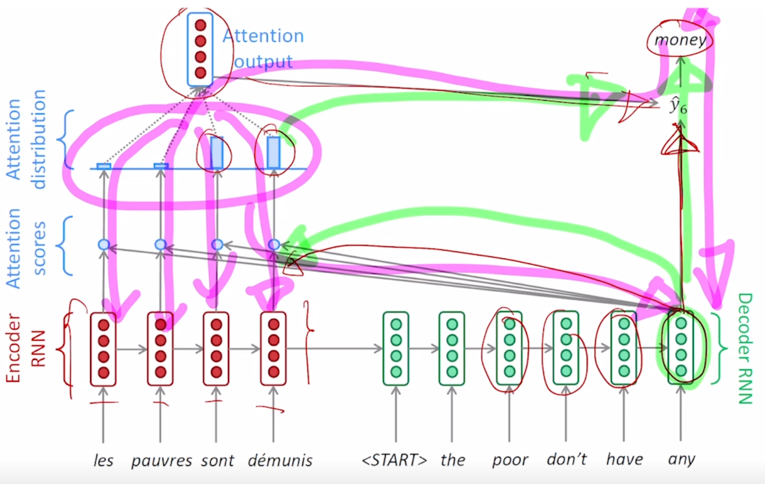

- attention 가중치를 원하는 정보가 선택될 수 있도록 hidden state vector 가 다시 backpropagation 에 의한 학습과정이 진행 됨

  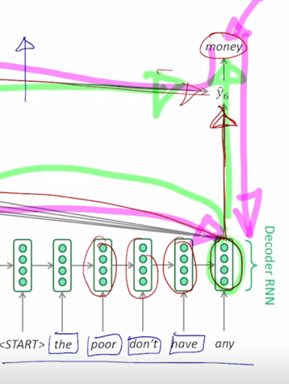

- 이러한 과정에서 Decoder 를 보시면 각 timestep 에서 우리는 실제로 다음에 등장하는 'the', 'poor', 'don't', 'have' 들은 각 timestep 마다 
ground-truth 문장에서의 단어들을 입력으로 넣어주고 있음
- 그런데 학습 초반이나 아니면 Decoder 에서 각 timestep 에서의 예측을 잘못한 경우 <START> 토큰 이후 첫번째 단어로 'the' 가 나와야 하는데 'a' 라는 단어를
예측을 하는 경우 이런 경우라고 하더라도 전단계에서 예측을 잘못했다 하더라도 다음 timestep 에서는 ground-truth 올바른 단어를 입력으로 넣어주게 됨
- 모델을 다 학습한 후 실제 예측 혹은 inference 에 이 모델을 사용하는 방식을 생각해보면 첫번째 'a' 라는 단어가 예측이 되었다고 하면 이 단어를 다음 timestep 의
입력으로 넣어주는 방식으로 inference 과정 혹은 학습이 끝나고 예측의 과정을 수행하게 됨
- 학습때는 Decoder 매 timestep 마다 예측되는 값이 그 다음 timestep 에서의 입력으로 쓰이지는 않고 있는 ground-truth 를 입력으로 주게되면 
- 첫번째 timestep 에서 이상한 단어를 예측해서 그 다음부터는 나와야 되는 단어가 이상한다어로 밖에 나올수 없는 이러한 현상을 막아줄 수 있는 
- 매 timestep 마다 그때까지는 올바른 정보들만이 입력으로 주어지는 그런 방식으로 학습이 진행하게 됨
- 이런 방식을 Teacher Forcing 이라는 방식으로 부름
- 반면, ground-truth 단어를 매 timestep 마다 넣어주는 것이 아니라 실제 예측값 그 예측값이 맞는 값이든 혹은 잘못된 단어든 그 단어를 실제로 다음 timestep 에
입력으로 넣어주는 이러한 방식은 Teacher Forcing 이 아닌 방식이 됨
- 그렇지만 Teacher Forcing 이 아닌 방식이 좀 더 모델을 학습한 후에 모델을 실제 사용했을때에 그런 상황과 가깝다는 것을 알 수 있음
- 그래서 Teacher Forcing 을 쓰는 경우에는 실제 ground-truth 를 넣어주기 때문에 학습이 좀 더 빠르고 용이하게 학습이 진행이 될 수 있는 장점이 있긴 하지만
- test-time 에서 실제로 모델을 사용할때의 상황과는 괴리를 가지는 그런 것을 알 수 있음
- 이 둘을 적절히 병합한 그러한 학습방식도 존재함
- 처음에는 Teacher Forcing 만으로 모든 배치를 구성해서 학습을 진행하다가 모델이 어느정도 예측이 정확해지고 그렇게 되면 학습의 후반부에는 Teacher Forcing 을 
사용하지 않고 실제로 예측한 값을 다음 timestep 의 입력으로 주는 식으로 실제 이 모델이 사용되는 test-time 에서의 상황에 좀 더 부합하도록 하는 그런방식으로
학습을 점점 변화시켜주는 이런 방식도 존재

### Different Attention Mechanisms

- 특정 Decoder 내의 hidden state vector 를 가지고 Encoder 의 hidden state vector 와의 유사도를 구하는 방식이 내적을 통해서 계산을 했었는데
이러한 유사도를 구하는 과정을 좀 더 확장 혹은 변형하는 attention mechanism 에 대해서도 살펴보자.

  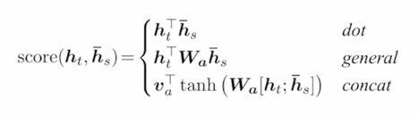

- Luong attention: they get the decoder hidden state at time ,
then calculate attention scores, and from that get the context vector which will be concatenated with hidden state of the
decoder and then predict the output

- Bahdanau attention: At time ,
we consider the hidden state of the decoder at time  - 1.
Then we calculate the alignment, context vectors as above. But then we concatenate this context with hidden state of the decoder 
at time  -1. So before the softmax, this concatenated 
vector goes inside a LSTM unit

- Luong has different types of alignments. Bahdanau has only a concat-score alignment model

  

-  가 Decoder 에서 주어지는 hidden state vector 이고,
   가 Encoder 단에서의 각 word 별로 hidden state vector 라고 할 때,
  이 둘간의 유사도 score 라는 function 으로 표시된 값을 구하기 위해서 내적을 할 수도 있고, 내적을 조금 더 확장한 형태의 generalized dot product 라는 형태의
  attention 도 존재할 수 있음

  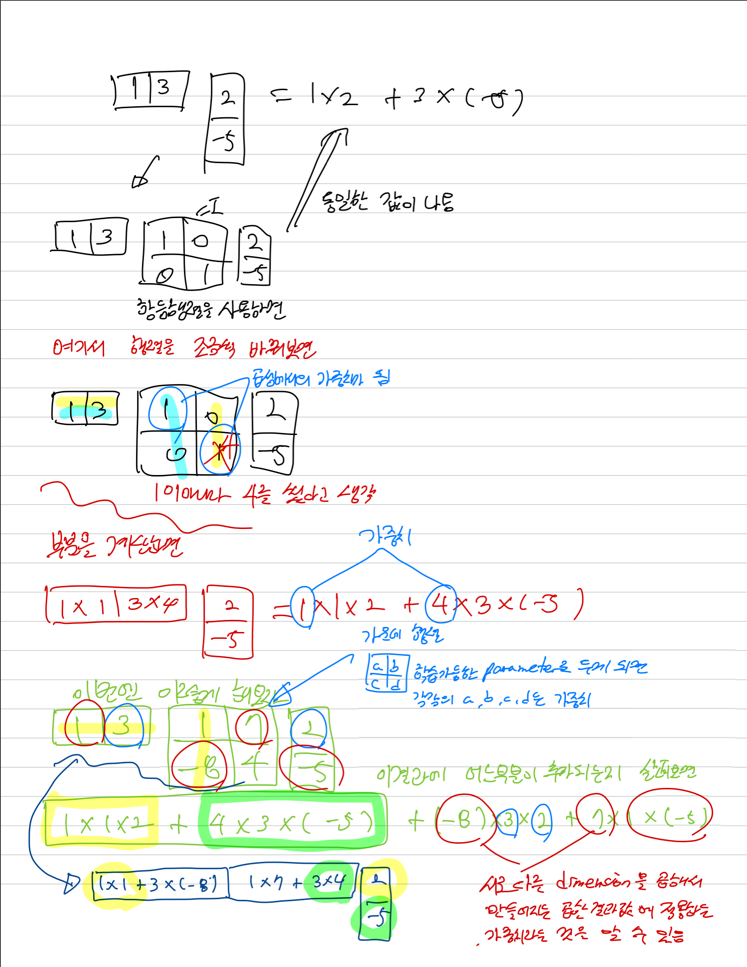

  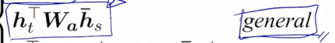

- 일반화된 dot product 라는 형태로 가운데에 있는  attention module 에서의
유사도를 결정해주는 학습가능한 parameter 의 형태로 모델이 구성될 수 있음

  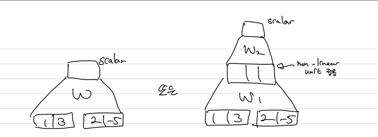

- attention score 를 구하는 세번째 방식은 concat 기반 attention 은 Encoder 의 hidden state vector 그리고 Decoder 의 hidden state vector 
2개가 있을 때, 그 둘을 내적 혹은 확장된 generalized dot product 혹은 내적의 형태로 정의하는 것과는 방식을 달리함
- concat 해서 layer 에 들어가는 형태

  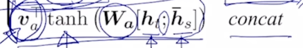

- Decoder 의 hidden state vector 와
Encoder 에서의 특정 word 의 hidden state vector  둘을
concat(;) 하고 첫번째 layer() 의 선형변환을 거치고 그 다음에는
tanh 를 non-linear unit 으로 적용해주고 두번째 layer 에서는 선형변환에 해당하는  를 거침 
  -  가 
     의 형태가 아니라 vector 의 형태로 쓰여졌냐 하면
    첫번째 layer 를 거쳐서 나온 값이 vector 이기 때문에 최종 결과물을 scalar 값을 만들려면 vector 의 형태가 되어야함
  
- 최적화가 필요한 parameter 들은 어떻게 최적화가 되는가? 의 측면에서는

  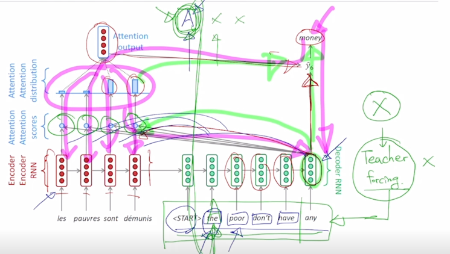

- 이 그림에서

  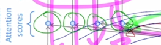

- 이부분이 이전에는 학습가능한 parameter 가 포함되지 않았던 simple 한 내적의 연산으로 되었던 것을 학습이 필요로하는 최적화가 필요한 trainable 한 
parameter 가 포함된 모듈로 바뀐 것
- 분홍색의 backpropagation 의 과정을 통해서 유사도를 구하는 모듈의 포함된 선형변환 행렬들이 학습하게 됨

### Attention is Great!

- Attention significantly improves NMT performance
  - It is useful to allow the decoder to focus on particular parts of the source
- Attention solves the bottleneck problem
  - Attention allows the decoder to look directly at source; bypass the bottleneck
- Attention helps with vanishing gradient problem
  - Provides a shortcut to far-away states
- Attenetion provides some interpretability
  - By inspecting attention distribution, we can see what the decoder was focusing on
  - The network just learned alignment by itself

- 기계번역 분야에서 성능을 굉장히 많이 올려줌
  - Decoder 의 매 timestep 마다 입력 sequence 에서의 어떤 부분에 정보를 집중해서 직접적으로 정보를 사용해서 예측에 활용할 지를 가능케 했다는 것
- information bottleneck 이라고 볼 수 있는 Encoder 의 마지막 timestep 에서의 hidden state vector 만을 사용해서 번역을 수행했어야 한다는
그래서 필연적으로 긴 문장에 대해서는 번역이 잘 되기 어려운 그런 문제를 해결
 
  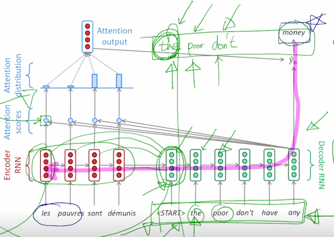

- 학습에 관점에서 gradient vanishing 문제를 해결

  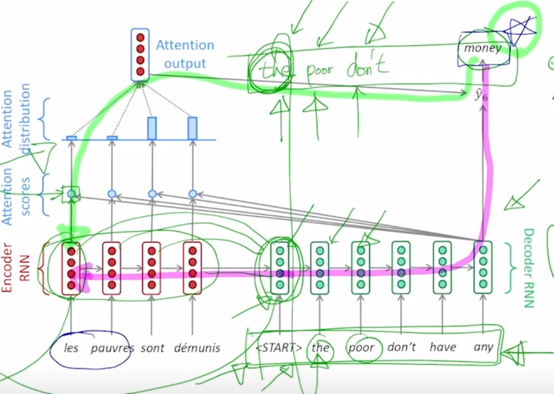

- Attention 이 없다면 분홍색 라인의 많은 timestep 을 거쳐가야 하는 long-term dependencies 먼 timestep 간의 정보의 보존을 잘 적절하게 해결하지
못한 그런 문제가 있었는데 attention 을 사용하게 되면서 정보의 지름길으로 볼 수 있는 초록색 path 가 만들어짐
- 어떤 timestep 도 거치지 않고 attention 을 계산하는 모듈을 바로 통과해서 원하는 Encoder 특정 timestep 에 hidden state vector 까지 gradient 를
빠르게 그리고 큰 변질없이 전달해 줄 수 있게 됨

- Attention 은 흥미로운 해석 가능성을 제공해 줌
  - Attention 의 패턴이 어떤식으로 나왔는지를 조사함으로써 Decoder 가 각 timestep 의 단어를 예측할 때 Encoder 상의 어떤 단어에 집중했는지를 알 수 있게됨
  - 그리고 이러한 전반적인 과정들은 모두 end-to-end learning 즉, 
    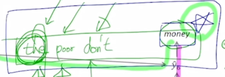
  - Decoder 에서 해당하는 예측 단어에 대한 ground-truth 를 통해 적용되는 softmax loss 만으로 내부적인 attention module 도 적절하게 학습이 됨 
  - 언제 어떤 단어를 봐야하는지를 스스로 학습하는 현상을 보여줌

### Attention Examples in Machine Translation

  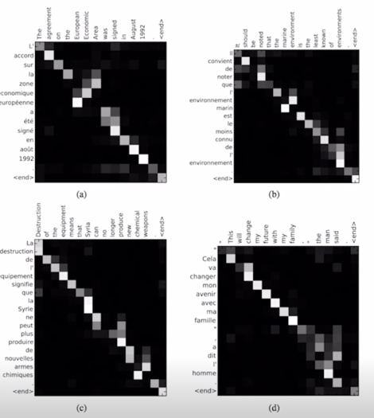

- It properly learns grammatical orders of words
- It skips unnecessary words such as an article

  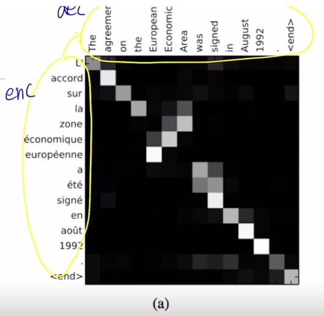

- 왼쪽에 이루어진 단어로 이루어진 문장이 위쪽에 보이는 영어 문장으로 번역이 된 사례를 보여주고 있고 위쪽이 Decoder output 왼쪽이 Encoder 입력에 해당

  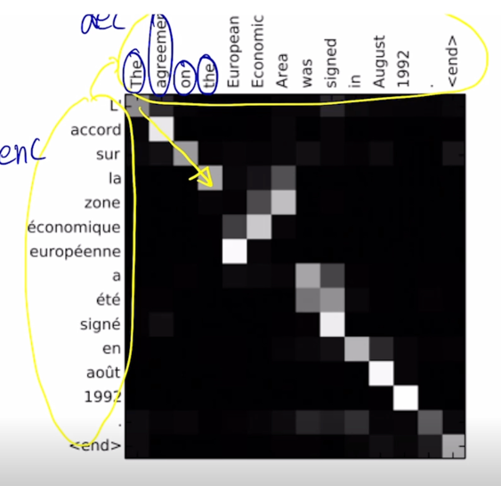

- 각각의 단어를 Decoding 할 때 혹은 예측할 때, 그에 해당하는 입력단어에 대한 attention 은 순차적으로 보면서 각 단어의 번역을 수행한다는 것을 알 수 있음

  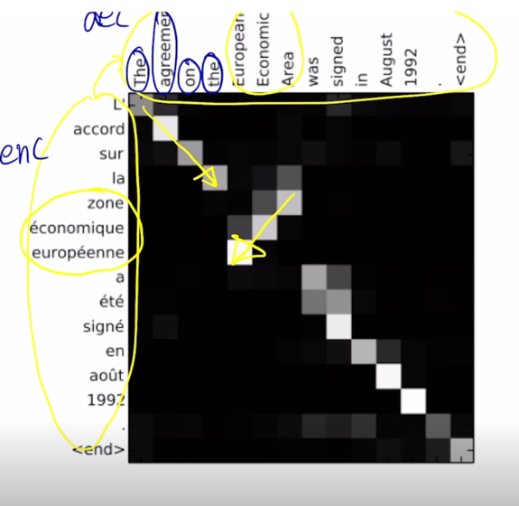

- 정작 European, Economic, Area 를 번역할 때는 실제로 Encoder hidden state vector 로서 나타나는 이 해당 단어의 순서를 순차적으로 보는게 아니라
역전된 순서로 해서 적절하게 단어별로 align 을 수행하고 해당 단어를 예측하고 있는 것을 알 수 있음

- 이는 왼쪽에 보이는 source language 에 대한 입력문장과 target language 인 영어문장간의 부분부분에 따른 어순의 차이를 위해서 이런 적절한 attention
패턴이 배워진 것으로 생각할 수 있고 이는 end-to-end learning 에 의해서 출력 단어에 대한 ground-truth 단어를 통한 softmax loss 를 통해 
attention module 에 흥미로운 그리고 유의미한 패턴들도 잘 학습이 된 것을 알 수 있음

  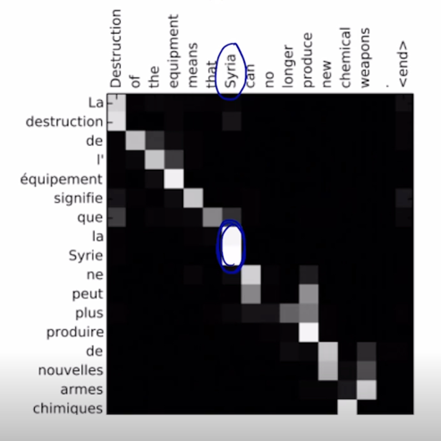

- 그 이외에는 여기서 한 단어를 Decoding 할 때, 여러개의 입력단어를 바라볼 때도 있음

  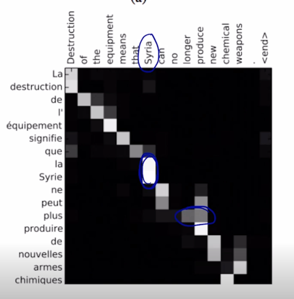

- 그리고 한 단어가 여러 단어를 Decoding 할 때에도 attention 을 받아서 Decoding 에 활용이 되는 것을 알 수 있음
