# Beam Search and BLEU score

## 2. Beam search

### Greedy decoding

- Greedy decoding has no way to undo decisions!
  - Input: il a m'mentartè (he hit me with a pie)
  - he __
  - he hit __
  - he hit a __ whoops, no going back now ...

- How can we fix this?

- seq2ses with attention 과 같은 자연어 생성 모델에서 바로 다음 단어만을 예측하는 task 를 학습하고 test-time 에서는 다음 단어 생성하는 과정을
순차적으로 수행함으로써 예측을 수행함
- 여기서 우리는 매 timestep 마다 가장 높은 확률을 가지는 단어 하나만을 택해서 Decoding 을 진행하게 됨
- 이를 Greedy decoding 이라고 부름
- 어떤 sequence 로서의 전체적인 문장의 확률값을 보는게 아니라 근시안적으로 현재 timestep 에서 가장 좋아보이는 단어를 그때그때 선택하는 이런 approach 를
Greedy approach 라고 보통 부름

  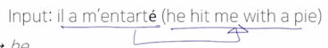

- 이러한 입력문장을 영어문장으로 번역해야 하는 경우에 
- 처음 단어는 he
- 두번째 단어는 hit 까지 잘 생성을 했고 그랬는데 세번째 단어를 생성하는 과정에서 attention 을 잘못 배정 혹은 할당 했다든지해서 잘못 단어를 예측한 상황을 보자

  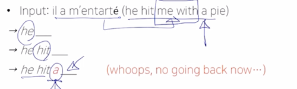

- a 가 pie 앞에 나오는데 me with 라는 부분을 건너뛰고 a 라는 단어를 이미 생성해버렸기 때문에 고정된 a 까지 생성된 결과를 바탕으로 뒤쪽을 생성해야 됨

  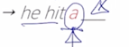

- 뒤에서 단어를 생성하려고 할 때, 비로소 뒤늦게 앞에서 단어를 잘 못 생성했다는 것을 깨달았다고 하더라도 하나씩하나씩 단어를 생성한 후 그 단어를 다 고정을해서
예측을 진행을 하는 과정에서는 뒤로 돌아갈 수 없는 결국은 최적의 예측값을 내어주지 못하는 이런 상황에 빠지게 됨
- 이를 어떻게 해결할 수 있을까?

### Exhaustive search

- Ideally, we want to find a (length ) 
translation  that maximizes
  - 
  
- We could try computing all possible sequences 
  - This means that on each step  of the decoder,
  we are tracking  possible partial
  translations, where  is the vocabulary size
  - This  complexity is far too expensive!

  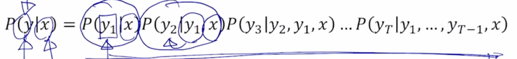

- 기본적으로 입력문장을  라고 하고 출력문장을  라고 하면
출력 문장  에서의 첫번째 단어를  이라고 
생각하고  에 대한 확률값  을 이렇게 구하고
그 다음엔  라는 입력문장과  까지의 단어를
생성한 후 2번째 출력단어를 생성하는  에 해당하는 확률  을
쭉 곱하는 식으로 주어진 문장  에 대한 출력문장 소위 joint probability 라고 부르는
동시사건에 대한 확률분포를 수식으로 쓸 수가 있음

- 그러면 이러한 확률값을 최대한 높은 확률을 가지는 출력문장  전체로서 확률값을
최대가 되도록하는 그런 답을 뽑는 것이 우리가 할 수 있는 최선이라고 볼 수 있음

  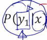

- 첫번째 생성하는 단어를  이 당시에는 가장 큰 확률값을 가지는 단어였다고 

  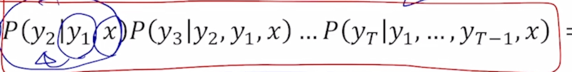

- 뒷부분에서 나오는 부분에 대한 확률값이 아무리 큰 값으로 도출했을때도 그 확률이 그렇게 크지 않을 수 있는 그런 경우가 발생될 수 있음
- 그러면 첫번째에서 제일 큰 확률값이 아니더라도 확률값이 그거보다는 조금은 작지만 뒤쪽에서 상대적으로 더 큰 확률값들을 내어줄 수 있는 그런 시나리오 혹은 그런 선택을
첫번째에서 하는 것이 전체적인 joint probability 의 값을 최대화하는데 더 좋은 결과를 낼 수도 있음

- 결국 timestep  까지의 가능한 모든 경우를 따진다면 그 경우는 매 timestep 마다
고를수 있는 단어의 수가 vocabulary 사이즈가 되고 그것을  라고 할 때,
매 timestep 마다  의 가지수 그리고 timestep  가
있으면  으로 가능한 가지수를 다 고려해야한다는 사실을 알 수 있음
- 이 경우 기하급수적으로 증가하는 경우의 수를 현실적으로 다 일일히 계산하기에는 너무 많은 시간과 계산량이 필요로 하게 됨

- 그래서 차선책으로 나온 방법이 Beam search 라고 함

### Beam search

- Core Idea: on each time step of the decoder, we keep track of the k most probable partial
tranlations (which we call hypothese)
  -  is the beam size (in practice around 5 to 10)
- A hypothesis  has a score of its log probability:

  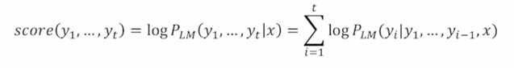

  - Scores are all negative, and a higher score is better
  - We search for high-scoring hypotheses, tracking the top k ones on each step

- 하이레벨에서는 앞서 말한 Greedy 알고리즘 혹은 Greedy decoding 과 가능한 모든 경우를 다 따지는 Exhaustive search 의 중간쯤에 있는 approach 라고
생각을 할 수 있음

- 매 timestep 마다 단 하나의 단어만을 고려하는 Greedy decoding 과 매 timestep 마다 가능한 모든 조합을 고려하는 기하급수적으로 굉장히 많은 수의 경우를
고려해야하는 이 2가지의 approach 중 그 사이의 있는 차선책으로서의 approach 가 Beam search 알고리즘이라고 함

- 핵심 아이디어는 decoder 의 매 timestep 마다 정해놓은  개의 가짓수를 
고려하고 timestep 이 진행함에도  개의 경우의 수를 유지하고 마지막까지 
decoding 을 진행한 후 최종적으로 나온  개의 candidate 중에서 가장
확률이 높은 것을 택하는 방식
-  개의 경우의 수에 해당하는 decoding 의 output 을 하나하나의 가설 혹은
  hypothesis 라고 부름
- 미리 정한  의 값은 Beam search 에서 beam size 라는 용어로 부름
- 일반적으로는 5 ~ 10개의 beam size 를 가지도록 설정
- 여기서 우리가 최대화하고자 하는 그런 값은  에 해당이 되는데
이는 앞서 보여준  수식처럼
단어를 하나씩 생성하면서 그 때의 확률값을 순차적으로 곱하는 형태로 수식을 전개할 수 있지만 여기에 log 를 붙이게 되면 이 값들은 
결국은 다 덧셈, log 버전의 확률값들을 다 더한값으로 식이 변경됨
- 여기서 사용된 log 함수는 단조증가하는 함수이기 때문에 이 확률값이 가장 큰 그러한 때는 이 log 를 취한값도 다른 경우와 비교할 때에 비해서 가장 큰 값으로 유지됨
- 매 timestep 마다 이 score 가 가장 높은  개의 candidate 을 고려하고
추적하는 것이 Beac search 의 핵심 아이디어가 됨

- Beam search is not guaranteed to find a globally optimal solution
- But it is much more efficient than exahustive search!

- 모든 경우의 수를 따져서 가장 좋은 것을 뽑는것은 아니지만 그래도 모든 경우의 수를 다 따지는 것보다는 훨씬 더 효율적으로 계산할 수 있게됨

### Beam search: Example

- Beam size: 

  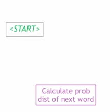

- 예를 들어서 beam size 를 2라고 설정할 때 어떤 입력문장이 주어지고 매 timestep 마다 순차적으로 이 단어를 출력값으로 예측한다고 생각해보면
<START> 토큰에서 시작을 하고

  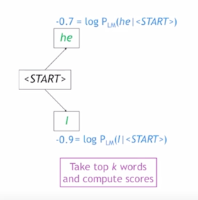

- 첫번째 단어를 예측하게 됨
- 그 예측값은 vocabulary 상에 정의된 단어상에서 어떤 확률분포로 output 이 나타나게 되고 Greedy decoding 이었다면 단 하나의 확률값이 가장 큰 그 단어를
뽑겠지만 여기서 2개의 candidate 혹은 hypothesis 를 고려하기 때문에 가장 확률값이 높은 2 단어를 뽑게됨
- 그리고 그 2개의 단어는 'he' 와 'I' 로 나타나는 것을 알 수 있음
- 여기서 log 를 취한 확률값이 - 값으로 나타나는데 기본적으로 확률값은 0 ~ 1 사이의 값을 가지게 되고 log 함수는 0 ~ 1 사이에서는 항상 - 값이 나오지만 
확률값이 커지면 커질수록 log 를 취한값도 단조증가하는 양상을 보임
- 그래서 - 값 중에서도 좀 더 큰 값을 가지는 'he' 라는 단어가 확률이 가장 큰 값으로 생각할 수 있음

  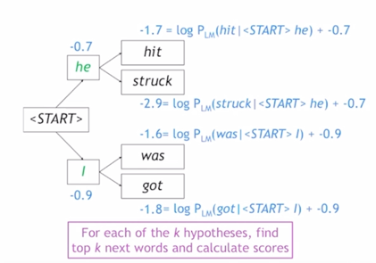

- 다음으로는 현재 가지고 있는  개 혹은 2개의 hypothesis 를 가지고
각각의 경우에 대해서 다음 단어를 예측하도록 함

  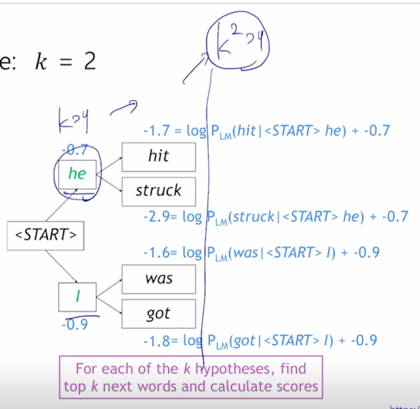

- 'he' 의 경우에 예측하는 단어로서 가장 큰 확률을 가지는 단어를 뽑게 될 텐데 여기서는 한시적으로 각각의  개에 대해서
또  개를 고려하는 총 일시적으로  개의
hypothesis 를 고려하게 됨

  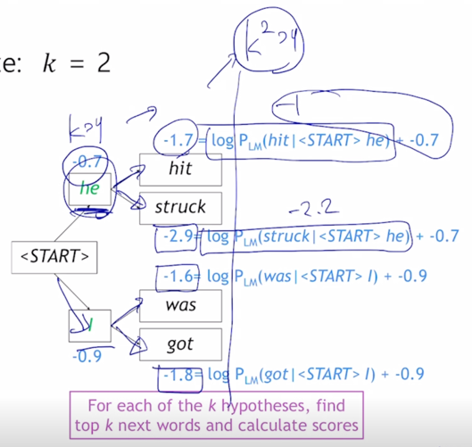

- 'he' 의 시나리오에서  개 만큼의 가장 확률 높은 단어 2개를 뽑아보고 
2번째 시점까지의 joint probability 를 계산하면 , he)"> 가
-1 이 나왔다면 -1 + (-0.7) 해서 -1.7 이 나오게 됨
- 두번째로 확률이 큰 값을 뽑았을 때에는 , he)"> 가 -2.2 가
나와서 -2.2 + (-0.7) 해서 최종적으로 -2.9 가 됨
- 두번째 시나리오에서도 역시  개의 가설을 생각해보면 각각의 log 값이 -1.6, -1.8 이 나오는 것을
알 수 있음

  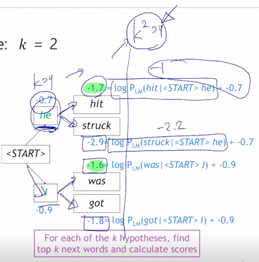

- 일시적으로  개의 결과중에서 가장 확률이 큰 초록색 부분인 -1.7 값과 -1.6 값이 가장 큰 확률값을
보이는 것으로 생각할 수 있음
- 여기서 그러면  개를 일시적으로 고려하는 가지수를 늘렸다고 하더라도
다시금 k 개만의 hypothesis 나 candidate 으로 추리게 되는 과정을 거치게 됨

  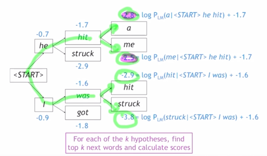

- 그러면 초록색 라인의 2개의 hypothesis 를 가지고 있게 되고 또 다음 timestep 의 단어를 예측하는 과정에서 각각의 경우의 수에 대해서  개 만큼을
또 고려하게 되고 그래서 나오는 4개지  개의 값들 중 가장 확률이 큰 값 분홍색 2개를 선택하게 됨

  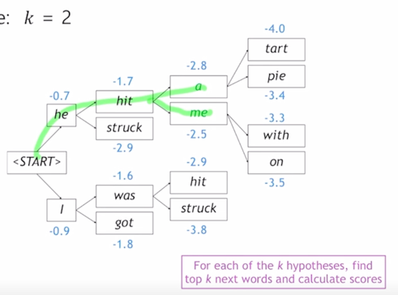

- 그러면 최종적으로 초록색 라인의 시나리오 2개가 나오고 이 과정을 반복적으로 수행해서 decoding 과정을 진행하게 됨

### Beam search: Stopping criterion

- In greedy decoding, usually we decode until the model produces a <END> token
  - For example: <START> he hit me with a pie <END>
- In beam search decoding, different hypothesis may produce <END> tokens on different timesteps
  - When a hypothesis produces <END>, that hypothesis is complete
  - Place it aside and continue exploring other hypothesis via beam search

- greedy decoding 의 경우 생성을 끝내는 시점은 모델이 <END> 토큰을 해당 timestep 에서의 예측단어로 예측했을 때 해당됨
- beam search decoding 에서는 서로다른 경로 혹은 hypothesis 가 존재하고 그것들은 각각 서로 다른 시점에서 <END> 토큰을 생성할 수 있게됨
- 그래서 hypothesis 를  개만큼 관리 혹은 추적해가면서 decoding 과정을
진행할 때 어느 hypothesis 가 <END> 토큰을 어느 시점에선가 생성했다라고 하면 그 hypothesis 의 경로에 대해서는 더이상의 생성과정을 진행하지 않게 되고 그 hypothesis 는
완료된것으로 생각하고 그것을 저장공간에 임시로 저장을 해두게 됨
- 그리고 남은 hypothesis 중에서도 계속 decoding 을 수행해서 각각의 <END> 토큰을 발생할 때 까지 decoding 을 수행하고 그 과정중에 <END> 토큰이 예측된
해당하는 hypotehsis 는 역시 임시 저장공간에 저장을 해두게 됨

- Usually we continue beam search until:
  - We reach timestep  (where  is 
  some pre-defined cutoff), or
  - We have at least  completed hypothesis (where  is
  the pre-defined cutoff)

- beam search 는 언제까지 진행되는가?
  - 우리가 정한  라는 timestep 의 최대값이 있을 때 거기까지만을 decoding 함으로써 beam search 과정을 중단하거나
  혹은 임시저장공간에 저장해둔 <END> 토큰을 명시적으로 발생해서 완료된 hypothesis 로 저장된 것이 미리 정해진  개 만큼의
  hypothesis 가 저장이 되면 beam search 를 중단하게 됨

### Beam search: Finishing up

- We have our list of completed hypothesis
- How to select the top one with the highest score?
- Each hypothesis  on our list has a score

  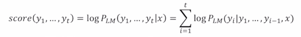

- Problem with this: longer hypothesis have lower scores
- Fix: Normalize by length

  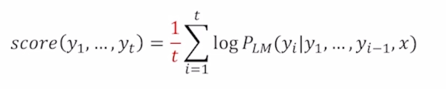

- 완성된 hypothesis 의 리스트를 최종적으로 얻게 됨
- 이 중에서 가장 높은 score 를 가지는 단 하나의 값을 뽑아야 함
- 이 경우는 앞서 beam search 를 진행하면서  개의 joint probability 가 가장 큰
것들을 유지하는 그런 과정에서 처럼 최종적으로 나온 hypothesis 중에서도 joint probability 가 정확하게는 log 버전의 joint probability 인 
 이 가장 큰
해당 hypothesis 를 최종 결과물로 예측값으로 줄 수 있게됨
- 그렇지만 이 경우, 우리가 고려하는 hypothesis 각각이 word 의 개수 혹은 sequence 의 길이가 서로 다를 때에는 상대적으로 짧은 길이를 가진 것이 더 joint probability 값이 
높을 것이고 긴 길이의 sequence 에 해당하는 hypothesis 는 상대적으로 joint probability 값이 더 낮은 값으로 나오게 됨

    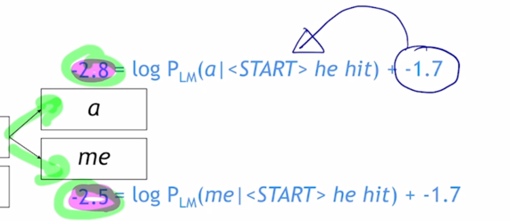

  - 이는 단어가 순차적으로 계속 생성되면서 동시사건 확률을 고려하게되고 그러면 단어를 생성할때마다 기존에 있었던 log probability 값에 항상 - 값을 더해주는 형태가 되기 때문에  
  결국은 단어가 점점 더 많이 생성 될수록 joint probability 값이 작은 값으로 나오게 됨

  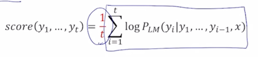

- 서로 길이가 다른 여러 hypothesis 들 간에 좀 더 공평하게 비교를해서 가장 확률이 높은 최종 답을 뽑기 위해서는 각 hypothesis 별로 그것이 가지는 단어의 개수로
joint probability 혹은 log 버전의 joint probability 를 나누어서 word 당 평균 확률값으로서 각각의 hypothesis 에 대한 score 를 부여함으로써 그리고 거기서
최대의 확률값을 가지는 hypothesis 하나를 최종 선정함으로써 beam search 의 최종 결과를 만들어 줄 수 있게 됨

## 3. BLEU score

- 자연어 생성모델에서 생성모델의 품질 혹은 그 결과의 정확도를 평가하는 척도

### Precision and Recall

- seq2seq with attention 모델을 통해서 기계번역과 같은 task 에서의 자연어 생성 task 를 통해서 target 문장을 생성하는 경우에는 이 모델을 학습하는데 
쓰이는 objective function 으로써 각각의 target 문장의 각 단어 그 단어별로 걸리는 softmax loss 즉 정답단어에 부여된 확률값이 최대한 커지도록 학습을 
진행을 하게 됨
- 학습이 완료된 후에는 모델의 성능 혹은 그 정확도를 평가할 때는 test data 에 대해서 각 단어별 역시 또 softmax loss 값을 계산하거나 아니면 각 단어의 
분류 정확도를 계산할 수도 있음
- 그러나 이 경우에는 특정 timestep 에서 특정 ground-truth 단어가 나와야하는 그런 가정하에 평가를 진행하게 되면 전체적인 문장으로 볼 때 단어를 중간에 하나 
빼먹고 생성을 했다거나 추가적인 단어를 하나 더 많이 생성을 한 경우

  

- 가령 "I love you" 라는 문장을 생성을 해야하는데 첫 단어로서 "Oh I love you" 라는 단어를
생성을 하게되면 첫번째 timestep 에서 나와야 하는 단어는 "I" 였는데 우리는 "Oh" 라는 단어를 생성했고 이렇게 단어가 하나씩 다 밀리게 되면서 이 경우는 어느 timestep 에서도
정답을 맞추지 못한 그래서 해당 정확도는 다 0%로 계산이 될 수 있음

- 이는 생성된 문장 전체를 가지고 문장들을 비교하고 유사도를 평가하는 것이 아니라 고정된 위치에서 정해진 단어 하나 그 단어가 나와야 된다는 이 단순화된 평가방식 때문임
- 그래서 생성하는 sequence 문장과 ground-truth 문장 전체적인 차원에서 평가를 진행을 해야할 필요가 있음

- 정답 문장과 예측문장이 이렇게 있다고 가정해보자
- Reference(정답): Half of my heart is in Havana ooh na na
- Predicted(예측): Half as my heart is in Obama ooh na

  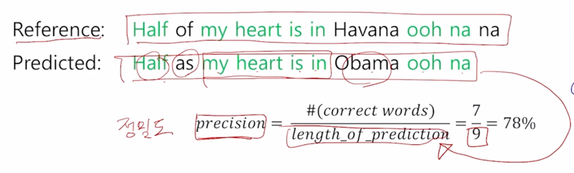

- 그러면 precision(정밀도) 은 예측한 문장의 길이 9 개의 단어를 생성했고 그리고 이중에 word 별로 위치에 상관없이 ground-truth 문장과 실제로 겹치는 단어가
몇 개 있는가를 세보면 초록색으로 색칠한 단어들이 겹치는 단어이고 까만색으로 칠한 단어들이 겹치지 않은 그래서 잘 못 생성된 단어라는 것을 알 수 있음
- 전체 9개의 생성한 단어 중 맞은 단어는 7개 그래서 정밀도는 78% 의 값으로 계산됨

  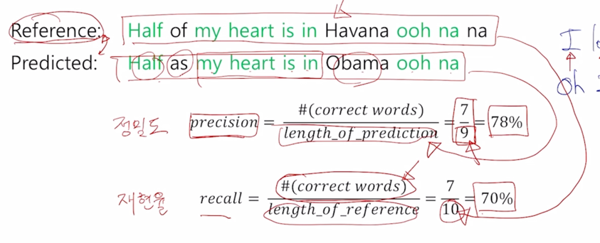

- 그리고 recall(재현율) 은 precision 과 같이 겹치는 단어를 분자에 두지만 분모는 precision 과는 달리 reference 에 존재하는 단어의 개수를 기준으로 
재현율 값을 계산함
- 그 값은 ground-truth (reference) 에서는 10개의 단어가 등장했기 때문에  으로 70%의 값이 
계산됨

- precision 과 recall 의 개념을 좀 더 직관적으로 설명하면 
- precision 은 예측된 결과가 우리에게 노출이 되었을 때 실질적으로 느끼는 정확도로 생각할 수 있음
  - 가령 정보검색 혹은 구글이나 네이버 등에서 특정한 키워드로 검색을 했을 때 나오는 결과에서의 정확도로서도 많이 사용되는 measure
  - 그 경우에는 특정 키워드로 검색해서 나온 문서들이 그 문서들을 쭉 봤을때 어느정도 우리가 원하는 의도와 부합하는 문서들이 나온 경우에는 그 검색결과가 충분히
  만족스럽다라고 생각을 하게됨
  - 이 경우 검색시스템이 예측한 결과들 그것들이 실제로 우리가 눈으로 보고 판단할 수 있는 대상이 되기 때문에 그 중에서 얼마만큼이 실제로 맞다고 느끼는가 혹은 
  맞는 단어나 문서인가의 비율이 정밀도라고 생각할 수 있음
- recall 이라는 measure 는 또 다른 측면으로 생각할 수 있음
  - 가령 검색시스템에서 키워드를 가지고 검색했을 때 실제로 그 키워드에 관련된 문서들이 10개 정도가 있는데 그 중에 우리는 7개만 검색결과로 나왔다고 하면
  나머지 3개의 실제로는 검색키워드에 부합해서 결과로 나왔어야 하는 그 문서들은 실제 우리의 결과에는 노출이 되지 않게됨
  - 그렇지만 우리에게 노출이 되지 않은 그래서 우리는 모른채 넘어갈 수 있는 그 문서들에서 실제로 우리가 필요로하는 굉장히 중요한 정보들도 있을 수 있음
  - 그래서 이 경우는 우리가 원하는 의도에 부합하는 정보의 총 문서의 개수 중에서 과연 몇개를 혹은 여기서 하나하나 다 빠짐없이 얼마나 잘 사용자에게 이 정보를
  노출시켜 주었는가 이것이 바로 recall 이라는 measure 라고 생각할 수 있음

### Recall in Starcraft

  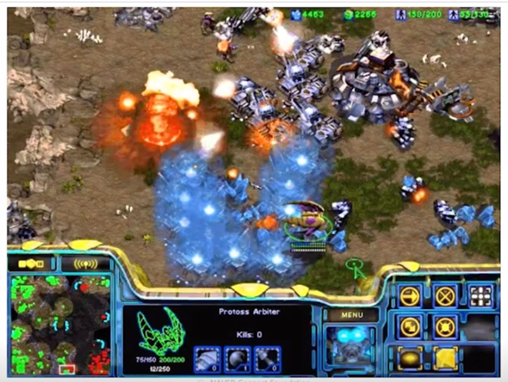

- Recall 을 흥미로운 개념으로서 직관적으로 설명하기 위해서 starcraft 라는 게임에서 실제로 recall 이라는 마법을 쓰는 프로토스 종족의 아비터를 예시로 들어보자
- 아비터가 recall 을 수행하는 경우 또 다른 단어로 소환이라고 부르는데 우리가 갖고 있는 dragon 같은 유닛들을 그들이 잘 모아져있는 곳에 정확하게 클릭을 해서 
우리가 갖고있는  dragon 이라는 유닛들을 하나도 빠짐없이 적지에 잘 소환해서 싸움을 펼쳐줄 수 있어야 소환 혹은 recall 을 잘 하는 것이 됨
- 여기서처럼 실제 소환해야하는 대상 그것이 recall 에서의 분모가 되고 거기서 몇 개 만큼을 잘 소환했는가의 개념을 가지는 것이 recall 이라는 것

### Precision and Recall

- 다시 돌아와서 서로 다른 기준으로 계산된 이 두가지 값을 종합해서 하나의 값으로 도출하는 그런 경우가 필요할 수 있음
- 심플하게 생각하면 이 두가지 값을 대표하는 값을 구하기 위해 단순한 평균값을 구할 수도 있음

  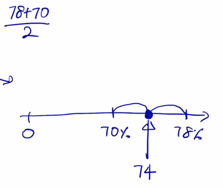

- 그 경우에는 수직선상에서 중점에 해당하는 값이 됨
- 이것을 산술평균이라고 부름
- 또 다른 방법도 있음

  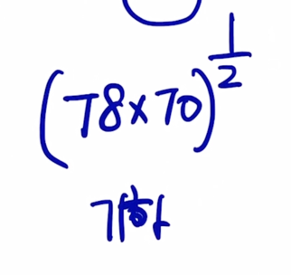

- 기하 평균
  - 두 값을 곱하고 여기에 root 를 취하는 값이 됨

  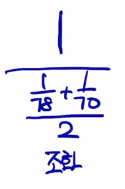

- 조화 평균
  - 주어진 값들에 대한 역수를 먼저 구하고 이 두 역수의 산술평균을 구한다음에 다시 역수를 취하는 과정을 통해서 계산이 됨

  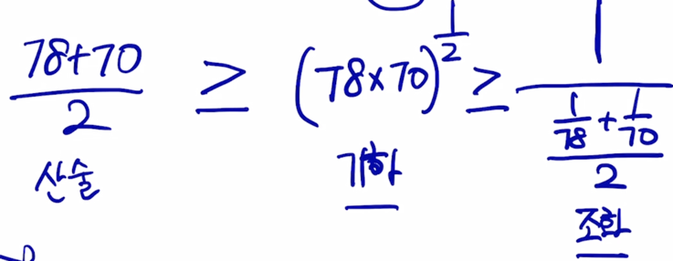

- 이 3가지 평균중에 관계가 있는데
- 산술평균이 가장 크고 기하평균이 그다음 조화 평균이 평균값을 구하는 방식 중 가장 작은 값을 내어주는 특성이 있음

  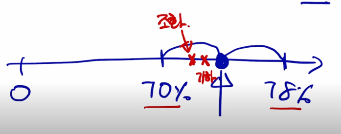

- 이 말은 수직선상에서 보면 70%과 78%에 해당하는 정확한 1:1 내분점 혹은 중점에 해당하는 것이 산술평균이 됨
- 기하평균은 이보다 작을테니 왼쪽에 있을 것이고 기하평균보다 작은 곳에 조화평균이 있을 것임

  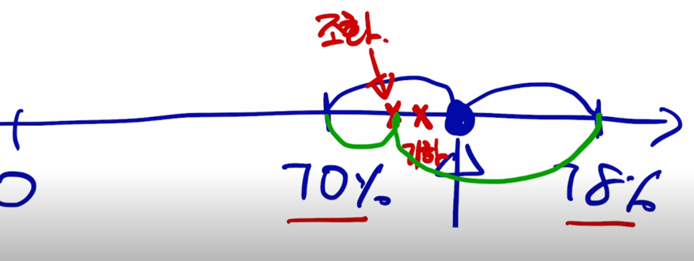

- 내분점의 관점에서 보면 기하평균이나 조화평균은 보다 더 작은 값에 가까운 쪽으로 내분점을 구해주는 방식이라는 것을 알 수 있음

- 평균을 낼 때 주어지는 값중에서 보다 더 작은 값에 더 많은 가중치를 부여하는 형태로 평균을 구하는 방식이 됨

  

- F-measure 는 precision 과 recall 의 조화평균해서 precision 과 recall 의 값 중 더 작은 값에 치중을 하겠다라는 의미

  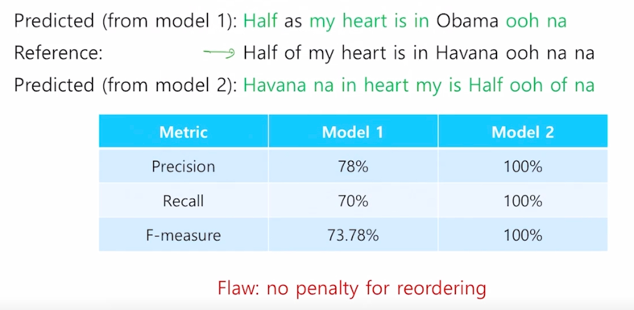

- 다시 기계번역과 같은 자연어 생성 모델에서의 ground-truth 값 대비 예측값의 정확도를 계산하는 방식을 살펴보자

  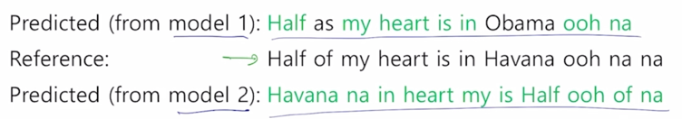

- model1 과 model2 2개의 모델이 있다고 가정하고 각가 서로 다른 예측문장을 생성했다고 생각해보자

  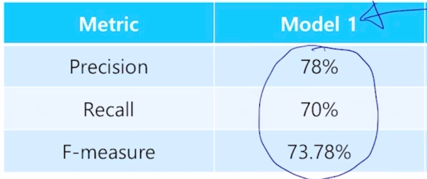

- model1 의 precision 과 recall, F-measure 을 계산하게 되면 결과가 이렇게 나오고
  
  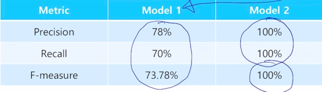

- model2 같은 경우는 전체 sequence 의 길이도 ground-truth 와 동일하고 각각의 word 들이 순서는 다를지언정 ground-truth 에 있는 단어들과 정확하게
일치하기 떄문에 precision, recall 2개를 모두 계산하면 100% 가 나오고 따라서 이 둘의 조화평균인 F-measure 도 100%가 나오는 것을 알 수 있음

- 그렇지만 model2 가 예측한 값은 전혀 문법적으로 말이 되지 않는 문장이 됨
- 이러한 이슈를 보완하기 위해서 주로 기계번역 task 에서 제안된 성능평가 measure 로서 BLEU score 를 많이 사용함

### BLEU score

- Bilingual Evaluation Understudy (BLEU)
  - N-gram overlap between machine translation output and reference sentence
  - Compute precision for n-grams of size one to four
  - Add brevity penalty (for too short translations)

    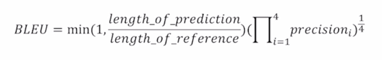

    - Typically computed over the entire corpus, not on single sentences

- BLEU score 는 개별 단어 레벨에서 봤을 때 얼마나 공통적으로 ground-truth 문장과 겹치는 단어가 나왔느냐에 대한 그 계산뿐만 아니라
N-gram 이라고 불리는 즉 단어가 하나하나 개별적으로 ground-truth 와 overlap 을 따지는 것에서 더 나아가 연속된 두개의 단어 혹은 3개 혹은 N 개의 연속된
단어로 봤을때에 문구 혹은 phrase 가 정확하게 ground-truth 와 얼마나 겹치는가를 계산해서 최종 평가 measure 에 반영하는 것이 BLEU score 에 가장 중요한
특징임
- BLEU score 는 기본적으로 번역에서 precision 만을 고려하게 됨
- 즉, recall 은 무시하게 됨
  - 이유는 precision 의 특성과 관련이 있음
    
    

  - "I love this move very much" 라는 ground-truth 문장이 있다고 생각해보자
  - 이를 한글로 번역하는 경우에 "나는 이 영화를 많이 사랑한다"
  - 이 경우는 ground-truth 측면에서는 very 에 해당하는 "정말" 이라는 단어 하나가 생략된 것을 알 수 있음
  - 그렇지만 이 단어가 생략됐다고 하더라도 이 문장이 어느 정도 충분히 좋은 정확도를 가지는 번역결과라고 볼 수 있음
  - 그래서 precision 이라는 것은 주어진 예측문장에서 ground-truth 단어와 얼마나 겹치는가 즉 재현율에 해당하는 ground-truth 에서 하나하나 다 빠짐없이
  번역을 했는가에 요소보다는 번역결과만을 보고 우리가 몸소 느낄수 있는 정확도에 해당하는 precision 만을 고려하는 measure 가 됨

    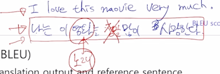

  - 여기서 recall 을 고려하지 안흔 또 다른 이유는 번역 문장이 "나는 이 노래를 많이 사랑한다." 라고 번역한 경우에 노래라는 단어는 명백하게 source 문장인
  영어문장에서 발견되지 않는 단어이고 이는 명백한 오번역으로 느껴지게 됨

- 그러면 precision 만을 고려하고 개별적인 단어 하나하나를 따로따로 계산한 precision 뿐만 아니라 N-gram 단어 2개 혹은 3개 혹은 4개 까지의 
uni-gram, bi-gram, tri-gram, four-gram 이라고 부르는데 N-gram의 N이 1, 2, 3, 4일 때의 해당하는 단어인데

  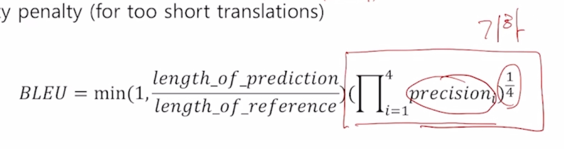

- four-gram 까지를 단위로 해서 각 경우에 대해서 precision 을 계산한 후 precision 을 모두 곱한 후 1/4 승 uni-gram, bi-gram, tri-gram, four-gram에 대해서
기하평균을 내주는 것을 알 수 있음
  - 기하평균의 의미는 4개의 서로다른 precision 값을 산술평균을 단순히 내지않고 조금은 더 낮은 값에 혹은 값이 작은쪽에 더 많은 가중치를 부여하는 그런 형태로
  평균값을 계산하려는 의도가 반영이 되어 있음
  - 조화평균을 쓰지 않은 것은 조화평균의 경우 크기가 작은 값에 지나치게 큰 가중치를 주는 특성때문

  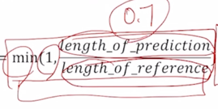

- brevity penalty 를 사용하는데 reference 문장의 길이보다 짧은 문장을 생성한 경우에 10단어 자리 정답문장에 대해 7단어만을 생성한 경우에는 값이 0.7이 되고
이 값과 1이라는 값간의 최소값을 선택하게되면 이 값은 0.7이 됨
- 그렇지만 10단어 짜리 ground-truth 문장에 대해서 10단어 혹은 그 이상의 길이를 가지는 문장을 예측값으로 생성을 했을때에는 이 값은 1보다 큰 값이 되고 결국
1과 작은값을 따지게 되면 결국 그 값은 1이 됨
- 즉, brevity penalty 라고 하는 이 항은 기본적으로 이 길이만을 고려했을 때 ground-truth 문장 길이보다 짧았을때는 짧아진 비율만큼 계산된 precision 값을 
낮춰주겠다는 의미가 됨
- 또 다른 측면에서는 우리가 생각할 수 있는 recall 의 최대값을 의미
- 즉, reference 문장에 10개의 단어가 있고 우리가 생성한 문장에 길이가 10개라고 하면 여기서 실제 recall 을 계산하기전에 10개 단어가 모두 다 매칭이 된 이상적인
상황일 때는 100% 의 recall 을 기대할 수 있게 됨
- 마찬가지로 예측된 문장의 단어수가 ground-truth 보다 많은 경우에는 ground-truth 에 있는 단어들을 모두 다 빠짐없이 소환했다는 이상적인 경우를 생각해보면 
recall 의 최댓값으로서 1이 나오게 됨
- recall 을 아예 고려하지는 않은 simple 한 형태의 brevity penalty 로서 recall 이라는 요소를 같이 고려하게 됨

  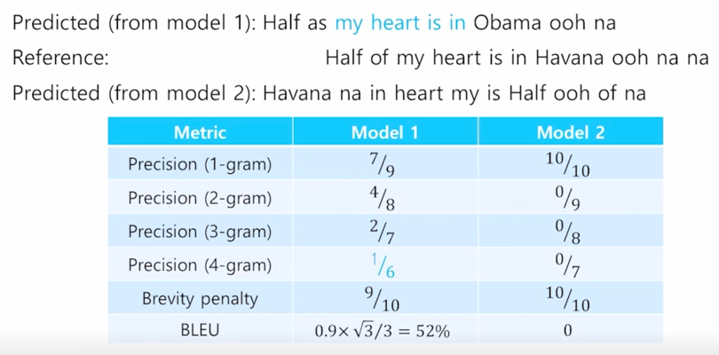

### References

- deeplearning.ai-Beam Search
  - https://youtu.be/RLWuzLLSlgw
- deeplearningai-Refining Beam Search
  - https://youtu.be/gb_z7LIN_4
- OpenNMT-beam search
  - https://opennmt.net/OpenNMT/translation/beam_search/
- CS224n-NMT
  - https://web.stanford.edu/class/cs224n/slides/cs224n-2019-lecture08-nmt.pdf
- Sequence to sequence learning with neural networks, ICML'14
  - https://arxiv.org/abs/1409.3215

