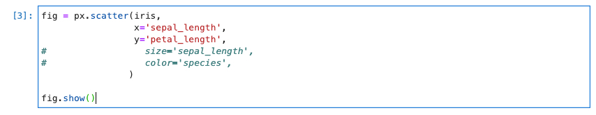
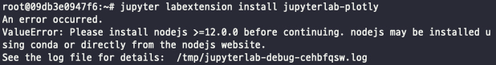
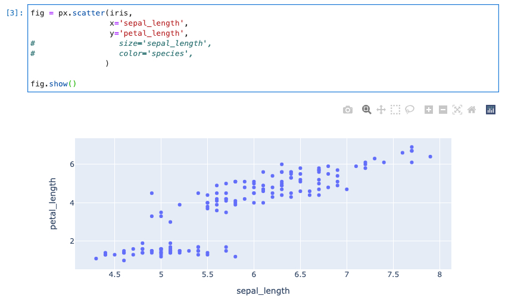

# jupyterlab_plotly_not_showing_problem_solve

> AI stage server 를 기준으로 작성합니다.

서버의 주피터랩상에서 Plotly 실습을 진행하던 도중 분명히 셀이 정상적으로 실행되었는데 아무것도 나오지 않는 현상이 나타남.....



원인을 구글링한 결과 `jupyter labextension install jupyterlab-plotly` extension 을 설치해야 한다고 함

하지만 docker server 에서 실핸한 결과...



에러발생....

nodejs 가 12.0.0 이상이어야 한다고 함

또 구글링을해서 nodejs 업데이트 하는법을 알아냄

Nodejs 업데이트는 순서대로 하면 됨

```
$ apt install npm
$ node -v  # 버전 확인
v8.10.0
$ npm cache clean -f  # cache 삭제
$ npm install -g n  # nodejs 버전 관리 플러그인 (n) 설치
$ n lts  # nodejs의 LTS 버전 (v14.17.6) 설치, n stable, n latest 명령어로 원하는 버전 설치 가능
```

이제 nodejs 의 버전이 12.0.0 이상이 되었으니

다시 `jupyter labextension install jupyterlab-plotly` 명령어를 실행해주자.

그래도 혹시 Plotly 의 그림이 나오지 않는다면

`jupyter labextension install @jupyter-widgets/jupyterlab-manager` 명령어를 실행해주자.

이제 잘 나온다.



편안

잘쓰세요!


